シャツを1着作った。

自分で着るために縫ったものだが、せっかくなので作った本人が解説してみることにした。

## なぜ自分で語るのか

自分のために服を作って、自分でその服について説明している人って、意外と少ない。
別に深い理由があるわけではないが、面白そうだからやってみる。

## （無駄）を削ぎ落としたシャツ

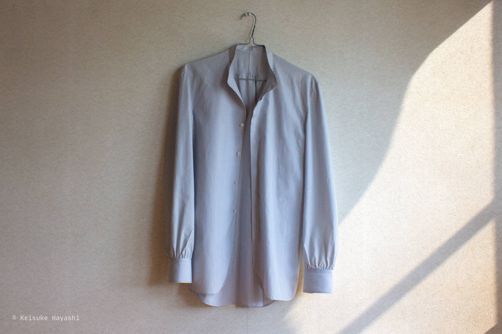

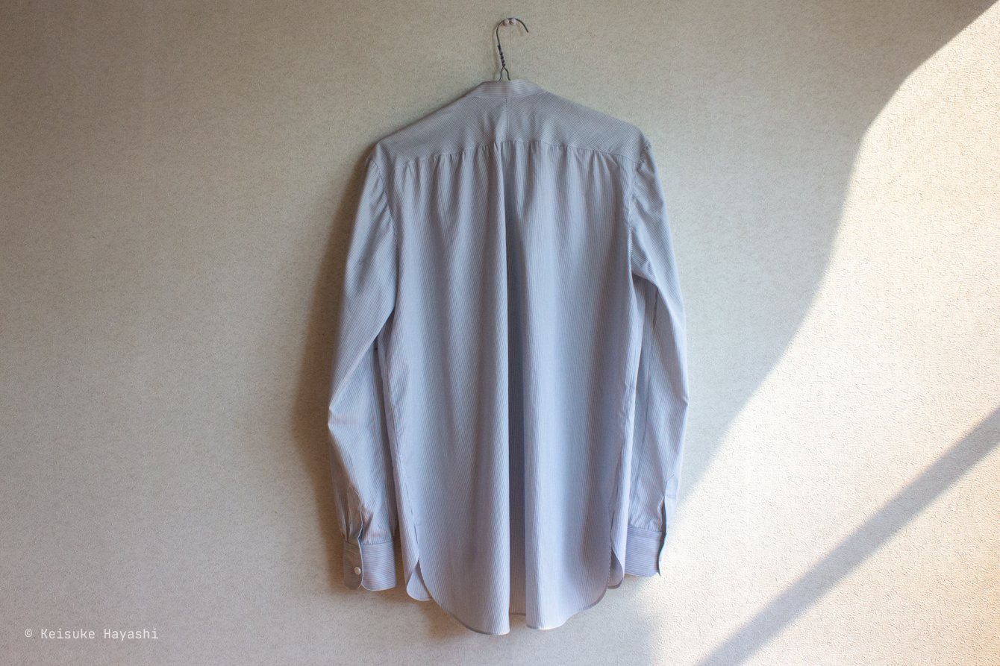

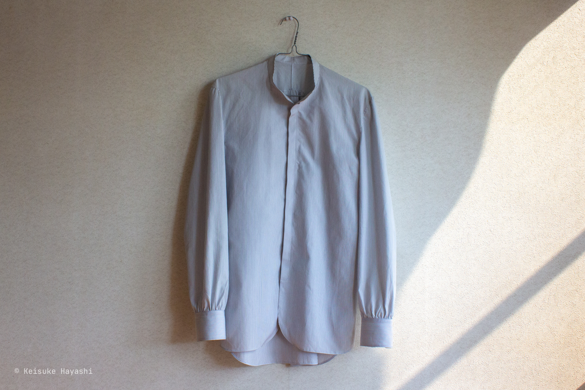

今回作ったのは、見た目にはとてもシンプルなシャツである。

### 省略したディテール

- ポケット
- ダーツ
- 衿
- 肩縫い目（前ヨーク）
- 剣ボロのボタン

「Simple is best」とはよく言うが、実際に作ってみると奥が深い。
何を残して何を捨てるかの判断が、想像以上に難しい。

僕が見出しで「無駄」と括弧付きで書いたのは、そういう曖昧さを表現したかったからである。
何をもって無駄と断じるかは、結局のところ主観的な話だ。
このシャツも何度もパターンを引き直して、ようやく納得のいくバランスに辿り着いた。

### シワという必然

多くの日本人は、シワのある服を嫌う傾向がある。
しかし人間の身体は曲線の集合体であり、直線的な部分など存在しない。
立体的に着用されることを前提とした服が、ハンガーにかけられた状態でシワだらけになるのは、むしろ当然の帰結である。

イタリアの職人が手縫いで仕立てたシャツは、吊るした状態では見事なシワが刻まれている。
それを人間が着ると、不思議なことにシワに生命が宿ったような動きを見せる。

シャツという衣服は、洋服の中でも1、2を争うほど奥深い存在だと思う。
1枚で着るかジャケットの下に着るかで、求められる性質も変わってくる。

## 見えない部分のこだわり

### ボタンが見えない比翼仕立て

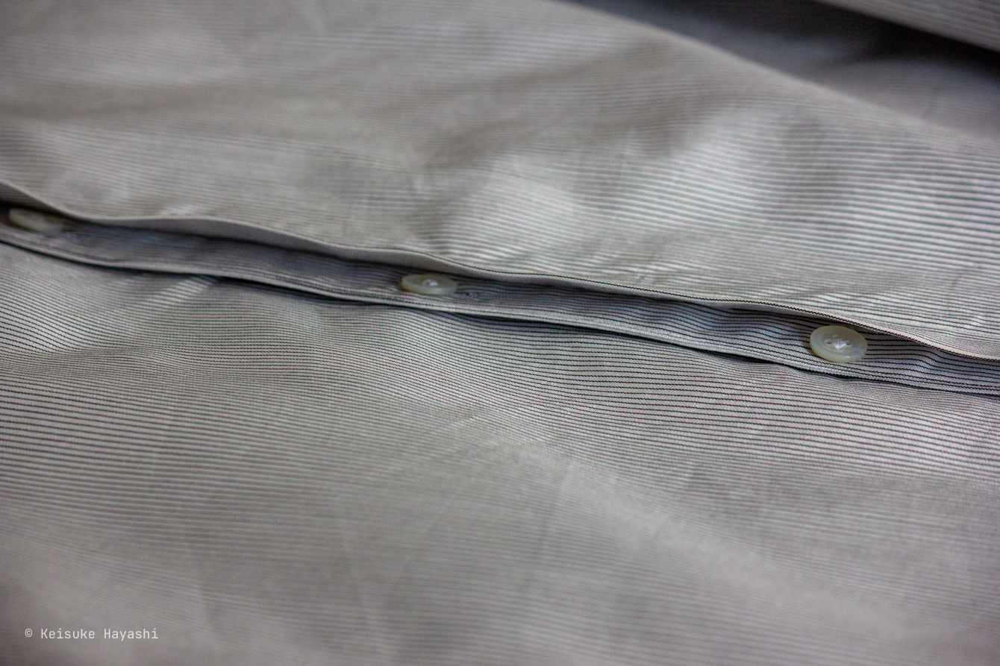

見返し付きの比翼仕立ては、普通のシャツとは異なる縫製手順を要求する。
一般的なシャツなら裾まで一直線だが、クラシカルな印象を狙って前端を丸くカットしたため、比翼を途中で終わらせる必要があった。

ボタンホール幅を考慮した最細の比翼幅に設定してある。
最下段のボタンホールだけは横向きだ。
横の動きにゆとりを生み、ボタンのかけ違いを防ぐ効果もある。

### 鳥足がけという遊び心

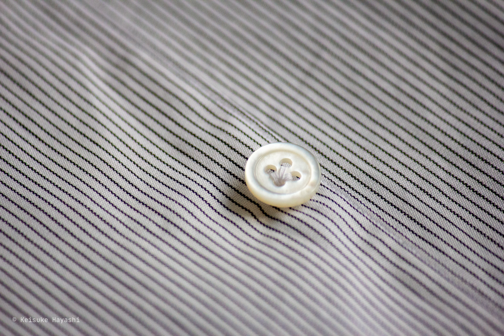

シャツのボタン付けといえば、クロス（×）か二の字（Ⅱ）が一般的である。
エルメスの一部商品ではHに見えるように糸をかけているが、今回は鳥足がけ（イタリア語でザンパディガッリーナ）を採用した。

イタリア製のハンドメイドシャツによく見られる手法で、ボタンの中心を意図的にずらすことで片側を浮かせ、掛け外しを楽にする効果がある。
特に厚手のボタンでは威力を発揮する。

この手法が一般化しないのは、専用ミシンが存在せず手縫いでしか実現できないからだろう。
意外と簡単なので、機会があれば試してみると面白い。

このシャツには全て白蝶貝のボタンを使用した。
箇所によって厚みを変えており、フロントボタンは比翼の厚みを抑えるため1.8mmで統一している。

## カラーとカフスの設計思想

### すっきりとしたバンドカラー

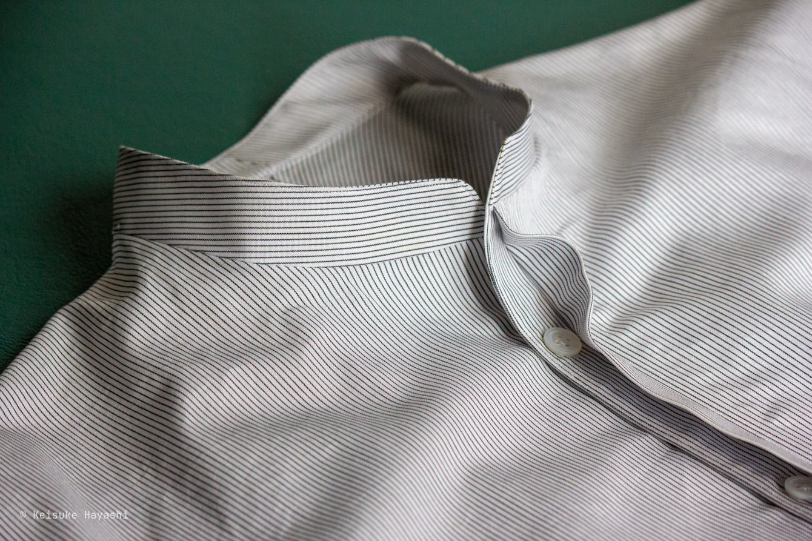

前中心の衿の高さは2cm、後ろ中心は2.5cmで緩やかなカーブを描くようにカットした。
かなり細めの部類に入るだろう。

ここ数年で急速に普及したバンドカラー（スタンドカラー）だが、元々は労働者のシャツとして使われていただけあって、カジュアルな印象も併せ持つ。

僕の中でバンドカラーシャツといえば、古畑任三郎が思い浮かぶ。
黒を中心に様々な色柄を着こなしていて、今思えば流行を先取りしていたのかもしれない。

### 極厚ボタンのカフス

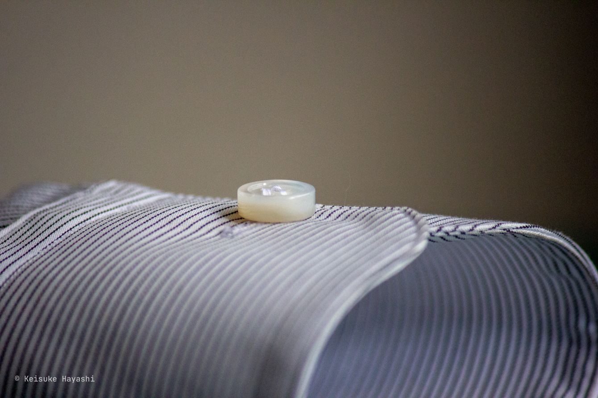

カフスの形状はラウンドカットである。
角に丸みをつけることで見た目の印象が柔らかくなり、引っかかりにくく実用的でもある。

握手やコーヒーを飲む動作など、カフスのボタンは意外と人目につく部分だ。
そこで貝ボタンの最高級品として知られる白蝶貝、しかも市場にほとんど出回らない4mm厚の極厚品を採用した。

写真を見れば分かる通り、圧倒的な存在感を放っている。

### ギャザーの分量

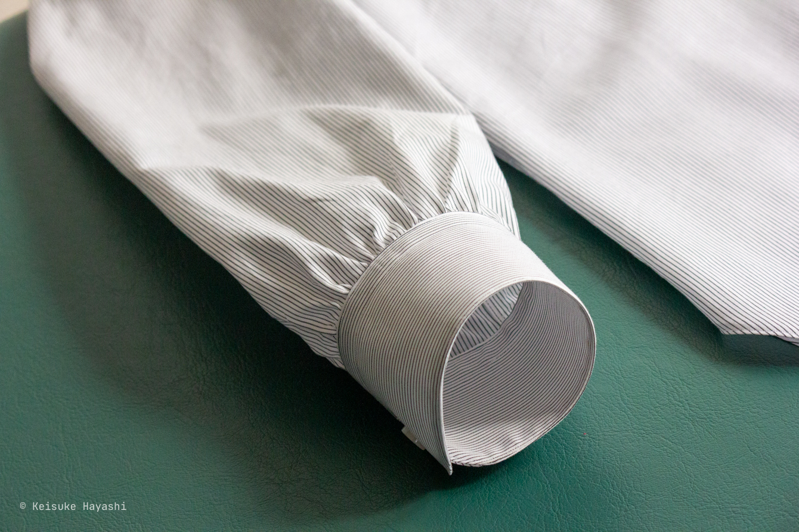

カフス幅は70mm、ギャザーも70mm分で調整した。
色々試した結果、このバランスが最も優れていると判断した（デザインにもよるが）。

ギャザーは分量が多くなるほど扱いが困難になる。
1針ずつ細かく手縫いで、できるだけ均等に寄せていくのが腕の見せどころである。

とはいえ僕は機械ではないので、多少の誤差は避けられない。
それを逆手に取り、仕上がりが微妙にアシンメトリーになるよう心がけている。

### ボタンレスの剣ボロ

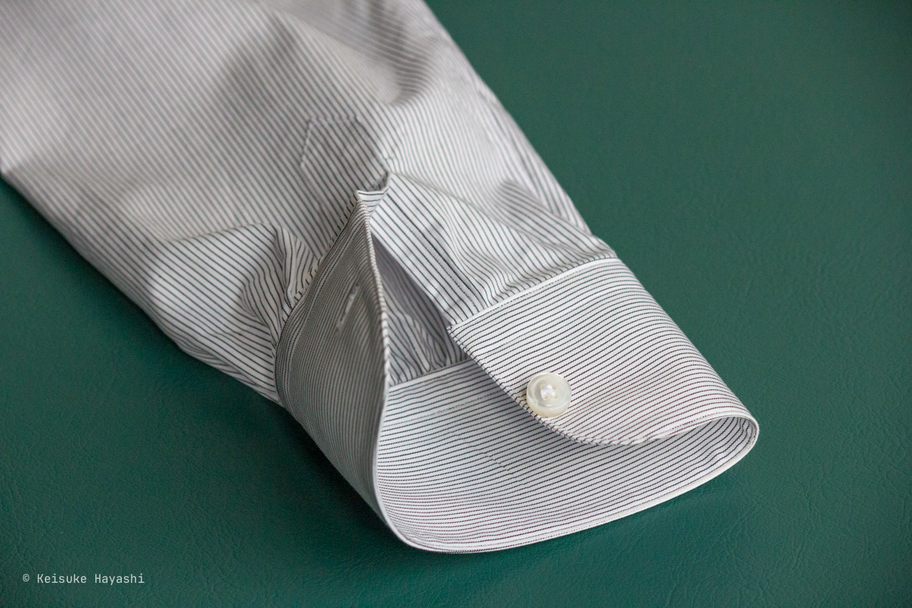

通常、剣ボロの中間には一回り小さいボタン（ガントレットボタン）が付く。
しかし十分なギャザーでゆとりを確保できると判断し、そのボタンを廃した。

それに伴い、剣ボロ自体の長さも短めの90mmに抑えた。
手の大きい僕でも問題なく通せるので、大抵の人は大丈夫だろう。

## 立体化の技術

### ふんわりとした袖付け

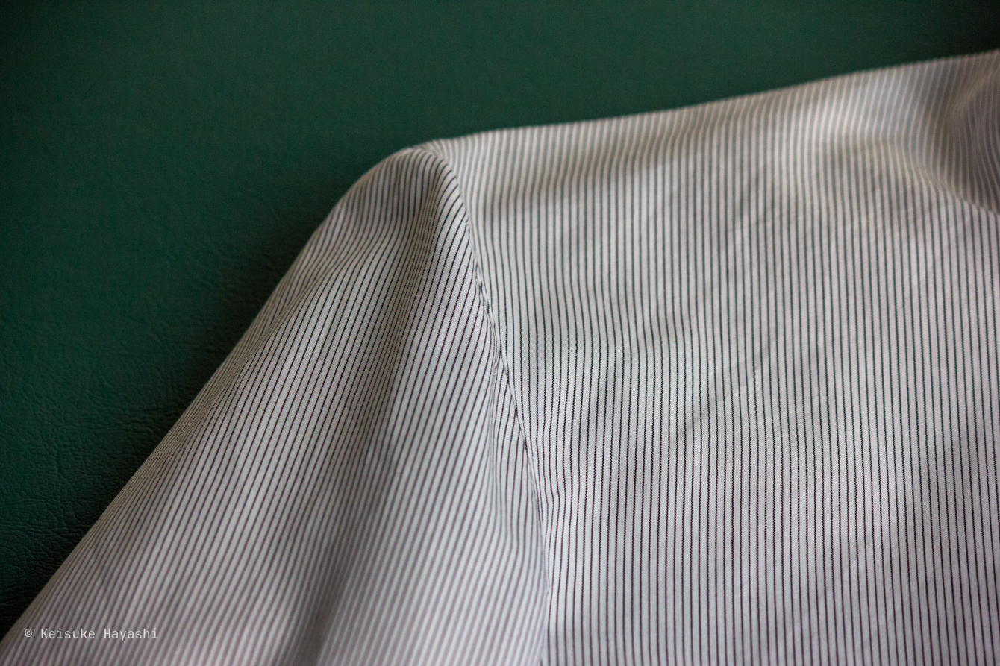

袖のいせ分量は34mmと十分な量を確保した。
適度ないせを入れることで袖山を高く設定しても、生地にゆとりが生まれ運動性能が向上する。

一般的なシャツは低い袖山で運動性を確保するが、袖山は高い方がドレッシーで格好良い。

脇を縫う前に袖と身頃を接合する方法がカジュアルシャツでは主流（縫いやすく効率的）だが、この袖はいせ込みながらふんわりと仕上げるため、身頃完成後に袖付けを行った。

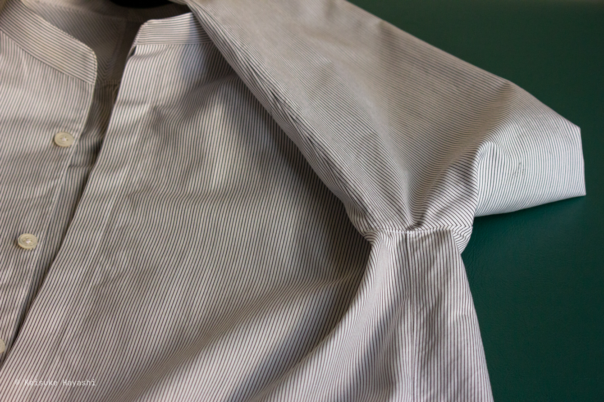

また、袖下を20mm前振りになるようずらしてある。
人間は日常動作で腕を前に出すことが多いため、その方が機能的である。

### 肩線のないヨーク

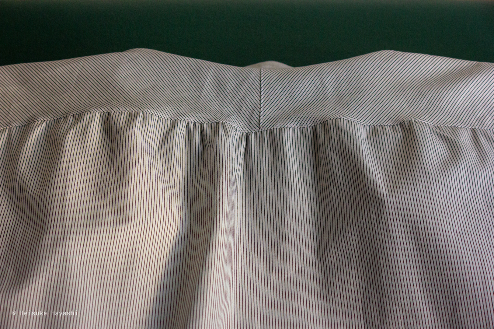

ヨークには60mmのギャザーをたっぷりと入れた。
よく見るとヨーク中心に接ぎ目があり、スプリットヨークのように見えるが、これは前身頃から続いたものである。
なのでこれをヨークと呼んで良いのかは微妙だ（前身頃の一部？）。

肩線をなくすことは縫製の手間が省けるだけでなく、様々な利点がある。
縫い目が肩に当たらずストレスフリーで、軽い着心地を実現できる。

さらにギャザー部分は生地がバイアス（斜め）になっているため伸縮性があり、前傾時に身体の動きと服が一体化する。
デメリットは生地を多く使うことくらいだ。

### 裏ヨークのない設計

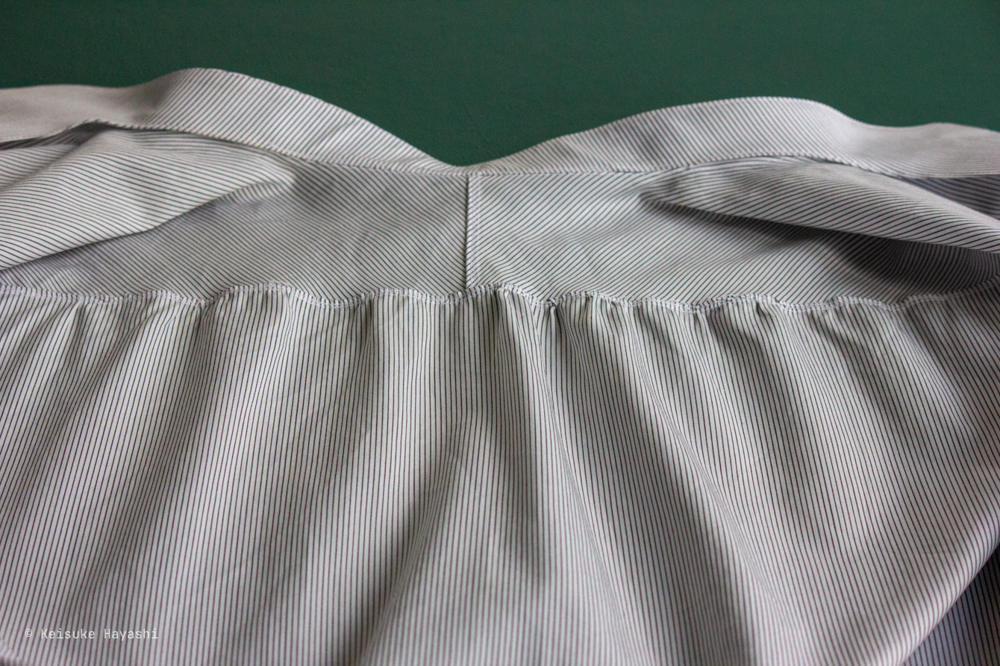

一般的なシャツのヨークは表裏2枚構成だが、このシャツのヨークは1枚のみで裏ヨークはない。
軽さを優先させた判断である。

ギャザーの縫い代は折伏せ縫いで5mm幅に抑えた。
ギャザーの折伏せ縫いは難しく、あまり用いられない手法だ。
裏の仕様なので表からは分からないが、どう処理するか考えるのは面白い。

## 独自の脇処理とヘム

### 名前のない脇処理

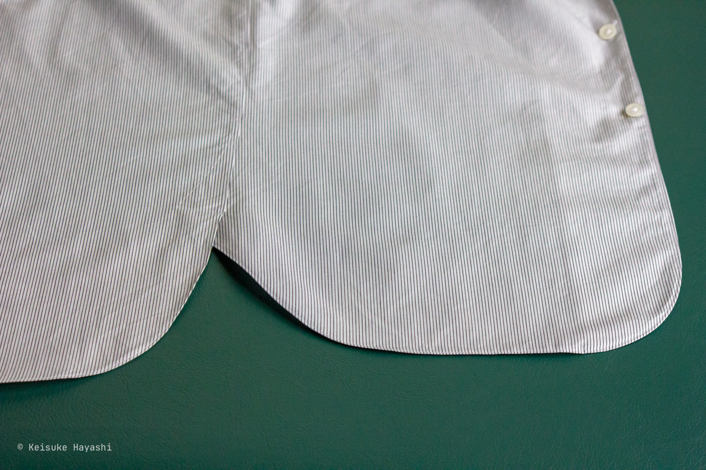

脇の処理には様々な手法がある。
ガゼットを使ったり、スリットを入れたりなど。
このシャツではちょっと珍しい脇の縫い代処理を施した。

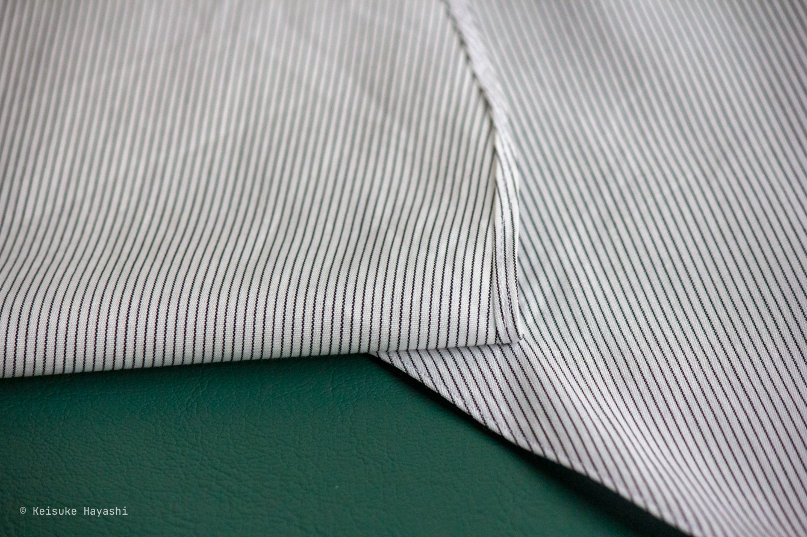

以前ネットで見つけたヴィンテージ品を思い出しながら再現したので、正式な名称は不明である。
もしかしたら形状も違ったかもしれない。

この仕立て方のメリット

- 可動域が広い
- 座る時に突っ張らない（ベンツのように）
- 前裾だけパンツに入れるといった着方が楽しめる

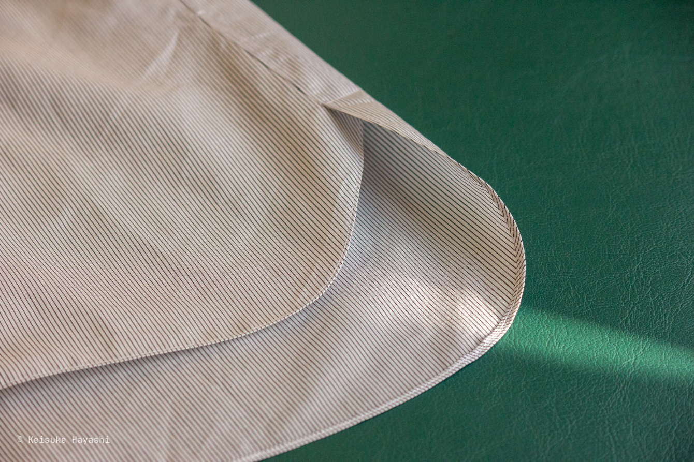

ガゼットは生地に厚みが出てしまい、個人的に好みではない。
生地を2枚重ねて返し縫いを駆使することで、ガゼットを使わずとも十分な耐久性を実現した。

そもそも現代の縫製技術なら、脇が裂けることを心配する必要もないのかもしれないが。

### 細く強いヘムライン

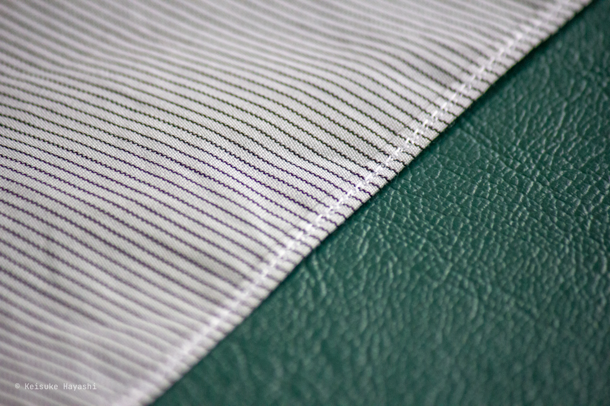

裾は4mmの3つ折りで仕上げた。
曲線が多いデザインなので、必然的に裾処理は細くする必要があった。
太く仕上げる場合は別布で切り替える手法もある。

また、折るたびにミシンをかけて裾を固定している。
面倒だが、その方が縫いやすい。
もう1つの理由として、裾にある程度の硬さを持たせることができる（立体感が出る）。

ミシンを何回もかけると、それだけ生地に硬さが生まれる。
ワーク系ウェアの衿腰などがその例だ。
もちろん素材による見極めは大事だが、選択肢の1つとして有効だと思う。

## 素材へのこだわり

生地は英国王室御用達ブランドの1つとして知られるDAKSのオーダーメイド用素材を使用した。
薄すぎず厚すぎずの絶妙な質感で、オールシーズン着用可能である。

シャツの縫製では3cmの幅に16針が一般的だが、このシャツは最も細かい箇所で3cmに33針で縫製してある。
場所により感覚的に幅を変えているので、全体を通して微妙な変化がある。

## さいごに

このシャツは試行錯誤の中で生まれた1つの答えに過ぎない。
しかし、ものづくりの魅力は必ずしも完璧を目指すことではなく、その過程で自分自身と向き合い、新しい発見を楽しむことにあるのだと改めて感じた。
