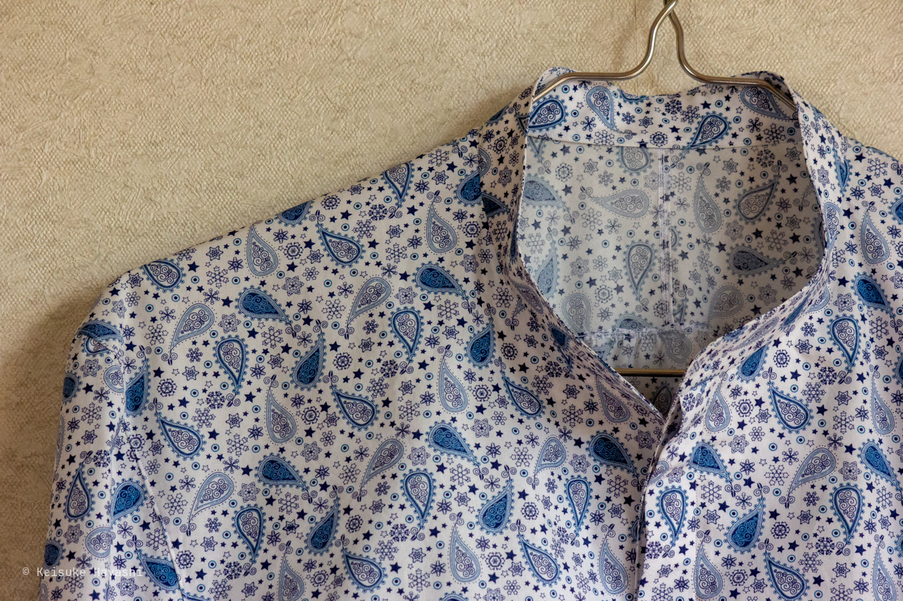

前作と基本的なコンセプトは変わっていないので、今回は手短に済ませる予定である。
詳細な制作過程については、以前の記事を参照していただきたい。

https://kkhys.me/blog/posts/b19rznx

今回は生地を変えて制作したので、まずは素材の話から始めていく。

## mila schönとの偶然な出会い

mila schönというブランドのオーダーメイド用生地を、運よく手に入れることができた。

この生地は薄手でありながら適度な張りを持っている。
ペイズリーの総柄だが、よくある総柄の押し付けがましさは皆無である。

ペイズリー柄と一口に言っても千差万別で、この生地は妙に洗練されている。
総柄にありがちな野暮ったさが不思議なほど消されており、綿100% でありながらシルクのような品がある。

## 全体像という名の答え合わせ

クレリック仕様にするかどうか迷ったが、結局総柄で押し切った。

## 細部への執着

### フロント処理の小さな失敗

比翼仕立て、つまりフライフロントで仕上げている。
前回のシャツとの違いは、最下部のボタンホールが並行になっていないことである（並行にすることで可動域が広がる）。
職業用ミシンにアタッチメントを装着してボタンホールを縫製していたのだが、向きを変えることを完全に失念していた。

### 真珠の母

特別な制約がなければ鳥足がけで処理する。
白蝶貝は別名「マザーオブパール」と呼ばれる素材である。
真珠について詳しいわけではないが、白蝶真珠を産む貝らしい。

### ボタンのないバンドカラー

襟部分にボタンを付けない設計にした。
理由は単純で、イタリアンカラーのように開襟で着用することを前提としているからである。

イタリアンカラーとは、見返しが付いた襟のことを指す。
見返しがあることで、開襟時に裏地や縫い目が表に出ない。
縫い目が見えないということは、襟がロールしやすいということでもある。

### パリッとしたカフス

カフスには接着芯を使用した。
この分野はまだまだ研究の余地がありそうである。

シャツに使用する芯の種類は以下のように様々。

- 接着芯
- フラシ芯（非接着タイプ）
- 半フラシ
- 芯なし

それぞれに長所と短所があるが、それは別の機会に詳述したい。

### 前振りにするための後付け袖

柄のせいで分かりにくいが、袖を前方に振るような角度で取り付けている。
縫い代は折伏せ縫いで処理した。
折伏せ縫いはロックミシンのようにほつれる心配もなく、頑丈でシャツには一般的な手法である。
今回のポイントとして、縫い代の幅をかなり細くしている。

縫い代を細くすると以下のような利点がある。

- 表面のステッチを細く入れられる
- 細いほど縫い代が強固になる

ただし縫い代が硬くなる欠点もあるので注意が必要である。
薄手の生地であれば問題ないだろう。

### たっぷりギャザー

ギャザーをたっぷりと入れた。
単なる装飾ではなく、ギャザーによって肩周りに可動域が生まれる。

### ガゼットの代わりに

脇線の処理は少し変わった手法を採用している。
見た目はシンプルだが、実際の作業はちょっと複雑である。
機会があれば別記事で詳しく解説したい。

### 裾は二度縫う

画像を見ると分かるが、1度目と2度目のステッチ幅を意図的に変えている。
三つ折りは細くなるほどアイロンが効きにくくなるため、ステッチで押さえるという発想である。

ステッチの役割分担:

- 1回目：生地を落ち着かせる捨てミシンのようなもの（粗い針目）
- 2回目：本来のステッチで表から見える（細かい針目）

生地が浮いて綺麗な3つ折りができない人には、この方法を推奨する。

## さいごに

制作過程での小さな失敗や工夫の積み重ねが、結果的にこの1枚のシャツを形作っている。
完璧を目指すよりも、失敗を受け入れながら進む方が面白い。
そんなことを考えながら、また次の1枚を作ってみたくなるのである。
