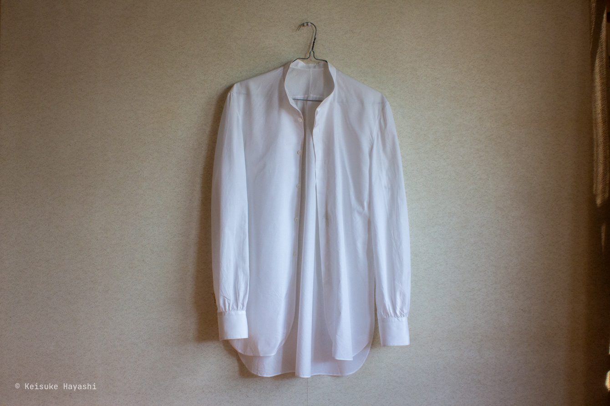
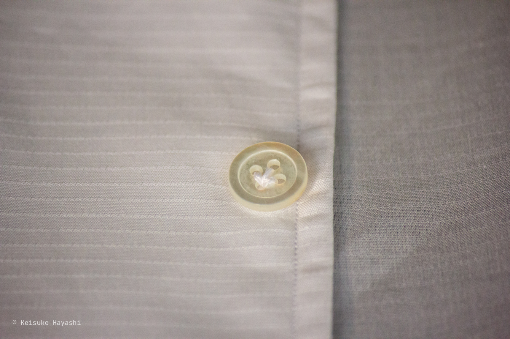
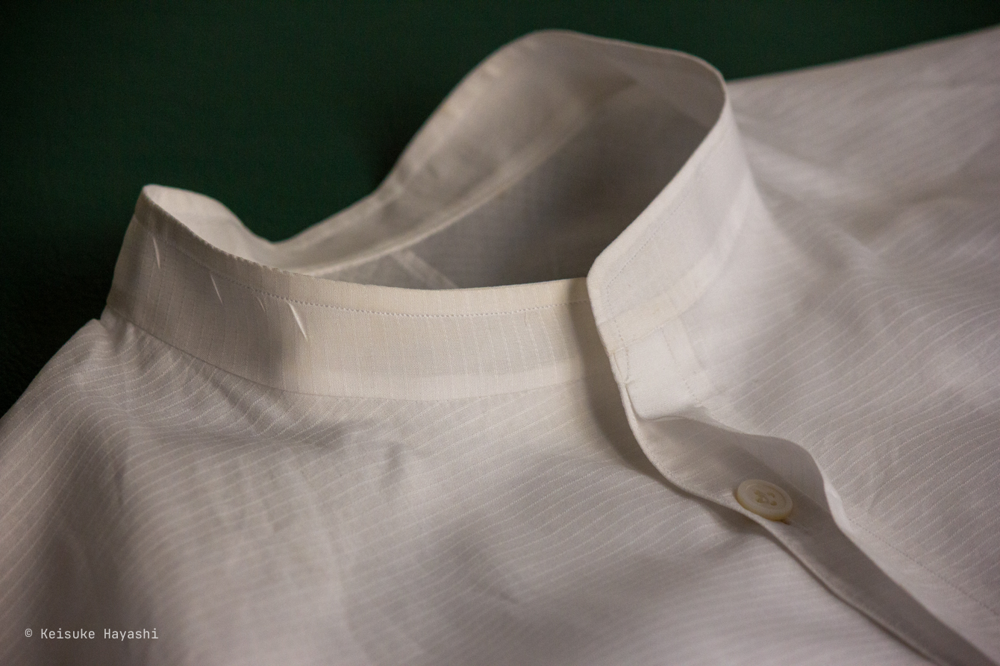

[1枚目](/blog/posts/b19rznx)、[2枚目](/blog/posts/b1sn7j4) とシャツを作ってきたが、今回製作したのはそれらに改良を加えた第三のシャツ。
いわば、この形態の最終形である。

今回はついに白シャツという禁断の領域に足を踏み入れてしまった。
白い布地ほど厄介なものはない。
わずかな汚れでも容赦なく目立つ、まさに完璧主義者泣かせの素材である。
他の色なら多少の失敗も誤魔化せるのだが、白は嘘をつかない。

案の定、制作過程でミシンオイルが付着するという凡ミスを犯してしまった。
真っ白な理想からは程遠い、ちょっと汚れた現実的な一枚となった次第である。

## ダンヒルの生地

今回使用したのはDunhill製の生地である。
イギリスの老舗紳士服ブランドが作った、シャツオーダーメイド用の上質な布地だ。
一着分がきちんと箱に収められていた様子は、さぞかし絵になったであろうに、写真を撮り忘れてしまった。

百貨店で仕立券付きの生地を買えば、当然プロが仕立ててくれる。
しかし、その仕立券の期限が切れた生地は、リサイクルショップで二束三文になってしまうのである。

これこそが私のようなDIYerにとっての宝の山だ。
実際、この手法で良質な生地を大量に確保している。
ブランドの威光は失せても、布地そのものの品質は変わらない。

## シャツの輪郭

## ディテールをサラッと

### ステッチは一筆書きで

縫製において、返し縫いという安易な手法に頼るのは美しくない。
糸が重なることで不要な厚みが生まれ、裏側に飛び出た糸端も見苦しいものである。

そこで一筆書きの要領でステッチを入れることを心がけている。
切った糸の始末も、別の縫い代の中に巧妙に隠してしまうのがベスト。

### MOP

ボタンには白蝶貝を採用した。
海外ではMOP（mother of pearl）と呼ばれているらしい。

### バンドカラーかスタンドカラーか

バンドカラーとスタンドカラーの違いは何か気になったので調べてみると、スタンドカラーという大きなカテゴリーの中にバンドカラーが含まれているそうだ。
つまり、迷ったらスタンドカラーと言っておけば間違いない。
あえて区別するなら、バンドカラーは細身のスタンドカラーと理解しておけば良いのかもしれない。

### 厚いボタン、薄いボタン

高級シャツのボタンは分厚いものが多い。
見栄えを重視した結果なのだろうが、厚くなるほど留めにくくなってしまう。

実際に何種類かの厚みで試してみた結果、見た目と実用性のバランスを考えると3mm程度が最適解だと判断した。
個人的な感覚に過ぎないが、毎日使うものなら機能性も大切だろう。

そんなわけで今回は3mmに設定した。
前回、前々回作ったシャツより1mm薄くなったおかげで、留めやすくなっている。

### 汚れちまった袖付けに

袖は後付け前振り仕様である。
特に細身の袖の場合、これは妥協できないポイント。

ステッチはコバ仕上げ（布端から1 ~ 2mmのステッチ）で、幅は基本的に細くしている。
賛否両論あるところだが、個人的には細いステッチの方が上品だと思っている。

ただ残念なことに、ミシンオイルが袖に付着してしまった。
意図的なデザインだと言い張れればカッコいいのだが、そんなことはなく、ただの失敗である。

### スプリットヨーク × 肩線なし

この部分、一見すると普通のヨークのように見えるが、実際はそうではない。
前身頃から一続きで裁断されている。
前身頃の布目をそのまま通しているため、必然的にヨーク部分はバイアスになる。
バイアスになることで、肩のラインに自然に沿うようになる。

本当にそうなのかは定かではないが。

### シャツの構造

生地が白いので構造が分かりやすい。

## さいごに

白という色は嘘をつかない。
だからこそ、作り手の実力も容赦なく暴かれてしまう。
機械油の染みも含めてDIYの良さと言えばそうなのだが、次は汚れのない真っ白なシャツを作りたい。
