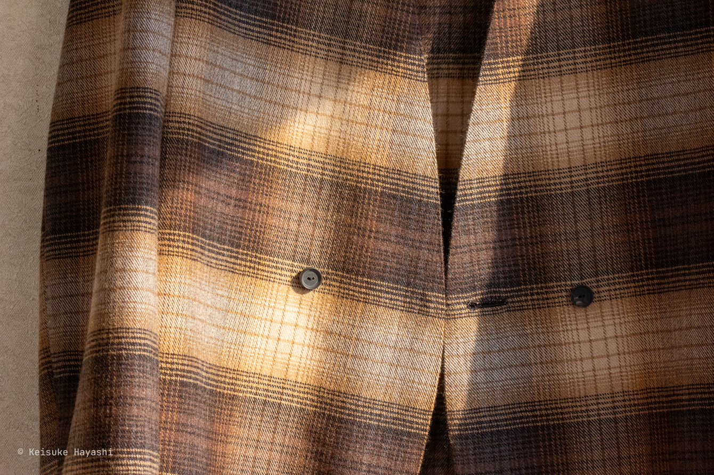

最近、ノーカラーのジャケットやシャツを着ている人が妙に多い気がする。
実際、ノーカラージャケットはラペルやノッチの形状の流行に巻き込まれないので、長く着ることができる。
これは確かに合理的な判断だ。

しかし、襟がないということでジャケット自体が無個性になりがちなのも事実である。
よく言われることだが、シンプルと無個性は表裏一体。
シンプルなデザインにしたいけどシンプル過ぎれば個性がなくなるという、永遠のジレンマとの戦いの跡をこのジャケットから感じて頂けると幸いである。

また、ところどころでミシンは使わずに手で縫ってみた。
機械の完璧さに対する、ささやかな抵抗である。

## ジャケットのあらまし

このジャケットは基本的に前を開けたまま羽織ることを前提に設計されている。
ボタンが 2 つ付いているのでダブルブレストっぽく見えるが、あくまで装飾用の飾りボタンである。

推奨はしないが、一応ボタンを留めることもできる。
（眠り穴かがりにしておけば良かったと今更ながら後悔している）

とはいえ、風の強い日などはボタンを留めないと前身頃がひらひらと翻って、実に歩きにくいのである。
その対策として、糸ループとホックを仕込んでおいた。

自然に開こうとする前身頃の動きを途中でそっと引っ掛けてやると、綺麗なシルエットが生まれる。

## ディテールについて

### ツライチなフロントライン

前端は前身頃と見返しの縫い代を先に折り込んでから「ツライチ」で合わせ、まつり縫いで仕上げてある。
毛抜合せとも呼ばれる技法である。
分かりにくいかもしれないが、要するにミシンを一切使っていない。

ミシンを使うと、悲しいかな生地が硬い表情になってしまう。
生地本来の柔らかさを活かそうと思えば手間はかかるが、手縫いこそが最適解なのである。
仕上げに、生地に埋もれて見えないが、端の膨らみを抑えるために緩めの星止めを施してある。

### レトロチックな水牛ボタン

ボタンはアンティーク加工が施された水牛ボタンを採用している。
直径 1.5cm と小ぶりなサイズだが、存在感としては十分。

### 手作り感満載のボタンホール

鳩目付きボタンホールは手かがりで仕上げた。
ミシンで縫われるボタンホールと比べて、柔らかさが持ち味である。
これでも以前と比べると上手くなった方だが、手作り感は否めない。

### 贅沢な？大見返し

これは一般的に大見返しと呼ばれる仕立て方である。
裏地を使わずに見返しを大きく取っている。
裏地がつかないので見た目的に軽やかで、カーディガンのような着心地がする。
ちなみに、半裏仕立ての方が重量的に軽いのは内緒である。

また、勘の良い人は気づいたかもしれないが、この服は通常のジャケットで使われる接着芯が一切使われていない完全芯なしジャケットである。
イタリア語ではセンツァインテルノと言うらしい。

芯を使わないことには一長一短がある。
ペラペラに見えたり、耐久性に乏しかったり。
しかし、うまく使えばそれを補って余りある魅力が芯なしにはある。

肩肘張らずに着れる、日常に根差した服。
そういった雰囲気を持たせるための 1 つの選択肢として、芯を使わないというのもありだと思う。

作る方としては、芯がある方がより立体的なシルエットを形作ることができるので比較的楽である。
芯なしの場合は骨組みがないまま家を建てるようなもので、繊細なアイロンワークと縫製技術が必要となる。
手間はかかるが、その分だけ着る人に寄り添った服になるのである。

### （大）衿ぐり見返し

衿ぐりの見返しは、首回りが安定するように大きめにカットした。
また、余計な段差をつけたくないので前見返しとは渡しまつりという手法でドッキングしている。

### 縁の下の力持ち

力ボタンにはキャッツアイの黒蝶貝 10mm をセレクトした。

### 布端を彩るパイピング

パイピングは裏地をカットして使用した。
裏から見ても裁ち端が剥き出しではないのがポイントである。
また、シャンブレー（経糸と緯糸に異なる色を用いた平織物）なので見る角度により玉虫色に変化する。

裏地の構成は以下の通り。

- 【経糸】シルパール（ポリエステル） 100%
- 【緯糸】ベンベルグ（キュプラ） 100%

珍しい構成だが、紳士服の裏地では一般的。

### 味のある袖口

袖口の裏地付けは安価な服（一部のプレタポルテも例外ではない）の場合、どんでん返しという手法が用いられる。
どんでん返しとは表と裏を別々に縫い合わせてから、前端、襟の外回り、裾と続けてミシンをかけ、後ろ裾の一部を縫い残し、そこから表に返す仕立て方である。

どんでん返しだと楽だが、後から補正したいときにミシン目を解くのが大変だし、何より裏地にとって必要不可欠なゆとりを十分に入れることができないと思う（裏地はいせにくいから）。

この袖裏は、手でゆとりを入れながらまつっている。
それは見えない部分だし、ミシンの方が綺麗に仕上がるのは間違いないと思う。
しかし、なんとも言えない味があるのは確か。

### 優れた服には、優れた袖裏あり

袖裏があるのとないのとでは、腕の通しやすさが天と地ほど違う。
インナーにも依るが、袖が引っ掛かるといくら良い服でも萎える人は少なくないだろう。
今回使用した袖裏はそんな悩みを解消してくれる優れものである。

キュプラは比較的高級な服の裏地として使われていることが多いので、ご存知の方も多いと思う。
ただ、意外にどのようにして作られているのか知っている人は珍しいのではないだろうか。

実はあれって、元を辿ればコットンなのである。
綿を取った後の実についた細かい繊維を集めて酸化銅アンモニア溶液に溶かし、ポンプで押し出したものがキュプラになる。
少しも自然の恵みを無駄にしないエコの精神が感じられる。

捨てられるはずのものが、高級服の裏地に生まれ変わる。
なんとも皮肉な話だ。

### コインポケット付きのサイドベンツ

かなり短めのサイドベンツである。
もはやノーベントと言っても良いかもしれない。

裾は額縁仕立てで、その隙間にコインポケットを作った。
このコインが重りとなることで、ベンツがストンと落ちて綺麗なシルエットを作り出す。

ただ、ここまで書いておいてアレだが、重さを残しておくなら額縁仕立てにする必要はない。
というのも、額縁にする際に（重りとなる）余分な布をカットしなければならないからだ。

なので、仕立て屋さんはわざわざ額縁にすることはほとんどなかった気がする。
縫い代をカットしたら補正もできないし。
見た目は綺麗だけど。

このコインポケットは「もしものとき」のために、と覚えておいた方が良いかもしれない。

## 味わい深い Sacai の生地

[Sacai](https://www.sacai.jp) の生地を運よく手に入れることができた。
味わい深い生地感でアイリッシュなムードを感じる。
少し表面にシャギー加工が施されている。
カジュアルというより綺麗な印象の織り地で、上質な手触りが Sacai らしい。
表と裏で微妙に表情が異なる。

表地の繊維組成は以下の通り。

- ウール 70％
- ポリエステル 17％
- アルパカ 12％
- ポリウレタン 1％

見たことのない繊維組成で面白い。

## さいごに

大量生産・大量消費の時代だからこそ、手縫いで自分の服を作るのは意義があるなと思った。
このノーカラージャケットはヘビロテできそうなので、生地を変えて作り直すのも良さそう。
