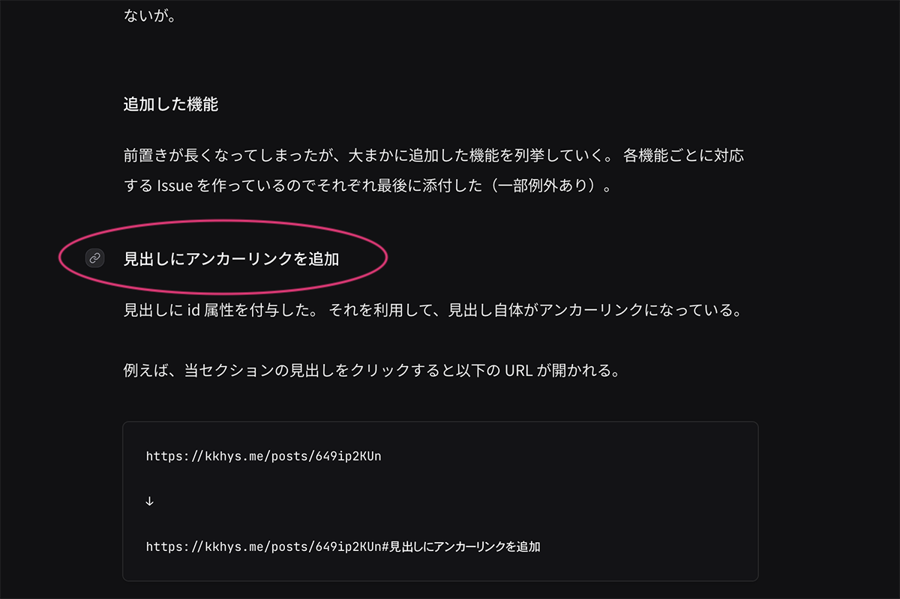
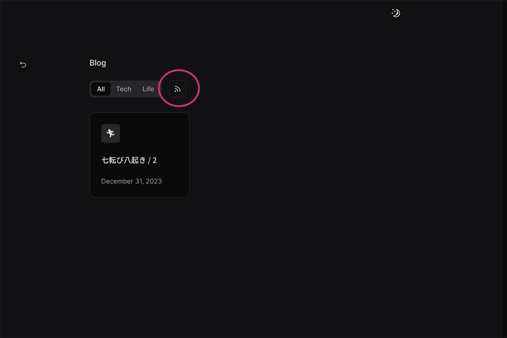

> [!WARNING]
> この記事はNext.js版の内容です。現在はAstroで構築し直したため、情報が古い可能性があります。
> 当時のリポジトリは [こちら](https://github.com/kkhys/me.v2) にあるので参考にしてください。

ブログを公開してまだ2記事目だけど、早くもバージョン1.4.0をリリースした。

https://github.com/kkhys/me.v2/releases/tag/v1.4.0

機能を追加するよりもまずはコンテンツを充実させていくべきではあるが、文章を書いてプレビューしたり、技術的な情報に触れていると色んなことを試してみたくなる。
このサイトはある意味、実験場のような場所なので、妥協はせずに面白い機能を追加していく予定だ。

そこで、いつの間にかサイトの構成が変わっていたりするとびっくりさせてしまうので、マイナーバージョンごとにリリースノートを書くことにした。
パッチバージョンについてはキリがないため書かないが、一般的ではない知見を共有できそうだったら個別に記事化する予定である。

## バージョン管理について

バージョンはGitHubのリリース管理機能を使っている。
この機能を使うとコードをzipまたはtar.gz形式にパッケージ化してダウンロード可能にできる。
ただ、ライブラリではないため、単純に今のバージョンを明示するためとリリースノートを記録するために使用している。

https://docs.github.com/ja/repositories/releasing-projects-on-github/about-releases

バージョンの形式は [Semantic Versioning 2.0.0](https://semver.org/lang/ja) に基づいて表記している。
当サイトの場合は以下のバッカス・ナウア記法（BNF）で表されるルールで運用していくことにした。

```text
<valid semver> ::= <version core>

<version core> ::= <major> "." <minor> "." <patch>

<major> ::= <numeric identifier>

<minor> ::= <numeric identifier>

<patch> ::= <numeric identifier>

<numeric identifier> ::= "0"
                       | <positive digit>
                       | <positive digit> <digits>

<digits> ::= <digit>
           | <digit> <digits>

<digit> ::= "0"
          | <positive digit>

<positive digit> ::= "1" | "2" | "3" | "4" | "5" | "6" | "7" | "8" | "9"
```

GitHubのリリースはGitタグに基づいて作成される。

```text
git tag -a v1.4.0

git push origin v1.4.0

# or

gh release create v1.4.0
```

真面目にすると ↑ みたいなコマンドを打てば良いのだが、毎回打つのも面倒なので [semantic-release](https://semantic-release.gitbook.io/semantic-release) というライブラリをCIに組み込んでリリースを自動化している。

semantic-releaseはコミット時の書式を [Conventional Commits](https://www.conventionalcommits.org/ja/v1.0.0) に準ずることで自動的にバージョンのタグ付けとリリースを行ってくれる。

コミットの形式は以下のとおり（BNF）。

```text
<valid commit> ::= <commit core>

<commit core> ::= <type> "(" <scope> "): " <subject>

<type> ::= "feat" | "fix" | "docs" | "style" | "refactor" | "pref" | "test" | "build" | "ci" | "chore" | "revert"

<scope> ::= <letter>

<letter> ::= "a" | "b" | "c" | "d" | "e" | "f" | "g" | "h" | "i" | "j"
           | "k" | "l" | "m" | "n" | "o" | "p" | "q" | "r" | "s" | "t"
           | "u" | "v" | "w" | "x" | "y" | "z"

<subject> ::= <letter and symbol>

<letter and symbol> ::= "a" | "b" | "c" | "d" | "e" | "f" | "g" | "h" | "i" | "j"
                      | "k" | "l" | "m" | "n" | "o" | "p" | "q" | "r" | "s" | "t"
                      | "u" | "v" | "w" | "x" | "y" | "z" | "." | "," | "(" | ")"
                      | "'" | "/" | "#" | "@"
```

暇なときもあれば忙しいときもあるため（誰でもそうか）、定期的なバージョンアップは難しい。
もし、今の進捗に興味があればGitHubでプロジェクト管理をしているので覗いてみてほしい。

https://github.com/users/kkhys/projects/3

今思えばv0.1.0みたいに開発段階からバージョン管理しておけば、あとあと振り返りやすかった。
とはいえ、開発スピードが遅くなるなど、トレードオフの関係を考慮しなければならないが。

## 追加した機能

前置きが長くなってしまったが、大まかに追加した機能を列挙していく。
各機能ごとに対応するIssueを作っているのでそれぞれ最後に添付した（一部例外あり）。
ただし、ちょくちょくコードを変えているためmainブランチを見たほうがいいかも。


### 見出しにアンカーリンクを追加



見出しにid属性を付与した。
それを利用して、見出し自体がアンカーリンクになっている。

例えば、当セクションの見出しをクリックすると以下のURLが開かれる。

```text
https://kkhys.me/posts/p1rklfz

↓

https://kkhys.me/posts/p1rklfz#見出しにアンカーリンクを追加
```

よくある機能なので真新しさはないが、以下の点にこだわった。

- 見出しホバー時、見出しの左側にアイコンを表示する
- 見出しをクリックしたとき、ページ上部に十分なスペースを確保する
  - `scroll-margin-top`というCSSプロパティを使用した
  - `margin`を調整して、見出しの上には何も表示されなくする
- 見出しをクリックしたとき、アイコンがactiveな状態になる
- スクロールダウンするとactiveな状態のアイコンを非表示にする
- スクロールアップするとactiveな状態のアイコンが表示される

また、見出しのこだわりとして、`h2`と`h3`のみ使用している。
`h4`まで必要な場合はそうそうないのと、ある場合は記事が重くなっている可能性があるため記事自体の分割を考える。

そして、`h2`と`h3`では見た目上のスタイルを同じにしている。
これに関しては完全な実験である。見出しを1つに統一しても読みやすさにさほど差はなさそうな気がしている。

https://github.com/kkhys/me.v2/issues/345

### Atomフィード



ブログの更新情報を配信するためにAtomフィードを実装した。
記事一覧ページにボタンを追加している。

RSS 2.0かAtomかどちらにするか迷ったが、IETFが仕様を管理しているAtomを選んだ。
正直、どちらでも良いと思う。

恥ずかしながらRSS / Atomフィードは今まで使ったことがなく、どのように表示されるか分からないので使ってみないといけない。
それによってプロパティの値も変えていきたい。

https://github.com/kkhys/me.v2/issues/321

### タブ切り替え時にパラメータを付与

記事一覧ページにカテゴリー切り替えタブがある。
v1.4.0以前はタブを切り替えるとUIが変わるのみでURLには変化がなかった。

ブログを閲覧するだけなら特に問題ないが、今はSNSの時代である。
そのため、シェアするとき用にカテゴリーごとのURLを生成する必要がある。

例えば、Techカテゴリーを選択すると以下のようにURLが変わる。

```text
https://kkhys.me/posts

↓

https://kkhys.me/posts?category=tech
```

`?category=tech`が付与されたURLにアクセスするとTechタブが選択された状態で表示される。
また、存在しないパラメータ（`?category=hoge`みたいな）にアクセスすると、そのカテゴリーは存在しませんよと表示するようにした。

https://github.com/kkhys/me.v2/issues/320

### humans.txt

検索エンジンのクローラーに対して、サイトのどのURLにアクセスしてよいかを伝える`robots.txt`というファイルがある。
これはSEO対策の一環として大抵のサイトで実装されている。

その`robots.txt`に対抗してかは知らないが`humans.txt`を置いていこうという試みがあるらしく、面白いので当サイトでも実装してみた（[リンク](/humans.txt)）。

ちなみにGoogleにも`humans.txt`は置いてある（[リンク](https://www.google.com/humans.txt)）。

最終更新日時を載せたかったのでNext.jsのRoute Handlersで生成している。

https://github.com/kkhys/me.v2/issues/342

### コードブロックをリッチに

すでに何回か登場しているが、コードブロックの見た目をリッチにした。

以下のようにタイトルを付けることもできる。

````md
```ts title="Currying sample by TypeScript" showLineNumbers
const curriedAdd = (x: number) => (y: number) => x + y;

const add10 = curriedAdd(10);
const result = add10(5);

console.log(result); // 15
```
````

<p className='text-center'>↓</p>

```ts title="Currying sample by TypeScript" showLineNumbers
const curriedAdd = (x: number) => (y: number) => x + y;

const add10 = curriedAdd(10);
const result = add10(5);

console.log(result); // 15
```

記事はMDXで書いており、独自のスタイルを追加したい場合はrehypeまたはremarkで要素を書き換える必要がある。
コピー機能を付ける際の処理がややこしかったので別の記事にまとめたい。

差し当たり、[poimandres](https://vscodethemes.com/e/pmndrs.pmndrs/poimandres) というカラーテーマを使っているがグレースケールにしてもカッコ良さそう。
その代わり見にくくなりそうなので検討中である。

https://github.com/kkhys/me.v2/issues/322

### 外部リンクをリッチに

こちらも何回も登場しているが、リンクカードの見た目をリッチにした。
デザインは [Zenn](https://zenn.dev) や [Notion](https://www.notion.so/ja-jp) を参考にしている。

OGP画像とサイトアイコンのBlur画像（データが読み込まれる前に表示されるぼやけた画像）を組み込んでいることがポイント。
ただ、元の画像サイズが小さいのでなかなか見られないかも。

よくある実装例としてSSRでOGPデータを取ってきてレンダリングするパターンがある（ZennやNotionはこれ）。
このブログではデプロイ前のビルドでOGPデータを取ってこられるのでSSRではなく ビルドしたときにリンクカードを生成している。
SSGの方がパフォーマンスはいいため、できるだけSSRする箇所を少なくしたい。

今のところ、[GFM](https://github.github.com/gfm) のAutolinks記法に引っかかれば問答無用で同一のリンクカードを生成しているが、内部リンクやGitHubのリンクであれば専用のリンクカードを表示するようにしたい。
特にGitHubはAPIが充実しているので面白いことができそう。

https://github.com/kkhys/me.v2/issues/327

### 画像の最適化

せっかくNext.jsを使っているので画像最適化機能を使っている。

現在はVercelのProプランに加入しており、最大で5,000枚まで利用できる。
当分の間はこれでいくとして、最大枚数をオーバーしたら自前で最適化処理を加えなければならない。

節約するためにリンクカードの画像は最適化させていない。
そもそも画像サイズが小さいので必要はない。

記事にある画像の中でも元のサイズが小さいPNG画像などは最適化をオプトアウトできる機能を追加する予定である（画像サイズで自動的に判定してくれたら楽そう）。

ちなみにリンクカードと同様に、ビルド時にBlur画像を生成して組み込んでいる。
これがあるかないかでユーザ体験が全然違うのでおすすめ。

ちなみに [1つ前の記事](/blog/posts/b1e0lpm) に投稿した「海辺にいた白猫」のBlur画像は 以下のようになる。


https://github.com/kkhys/me.v2/issues/364

修正版（別のPRにプッシュしてしまった） ↓

https://github.com/kkhys/me.v2/issues/327

## v1.5.0へ向けて

記事を公開するための最低限の実装は完了したので、あとはコンテンツを増やしていきたい。
とは言っても、パッチバージョンという名目でちょっとした機能追加は行う予定である。

v1.5.0をリリースするのは10記事ぐらい公開したあとになるかな。
記事数が多くなればなるほど目的の記事を探しにくくなるので、それをカバーするための機能（回遊率UPのための施策）を中心に追加したい。
