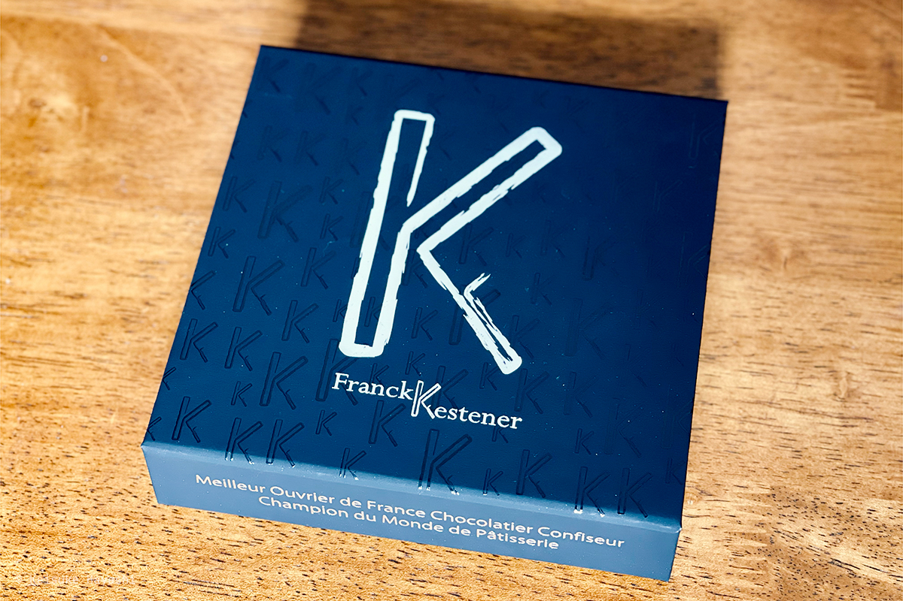
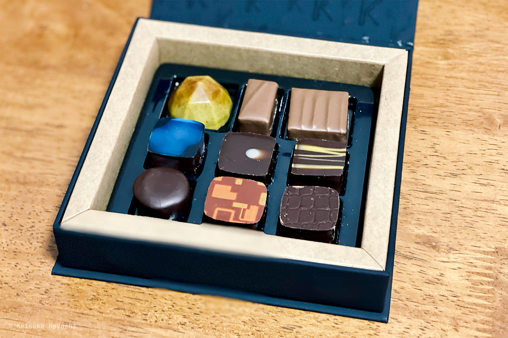
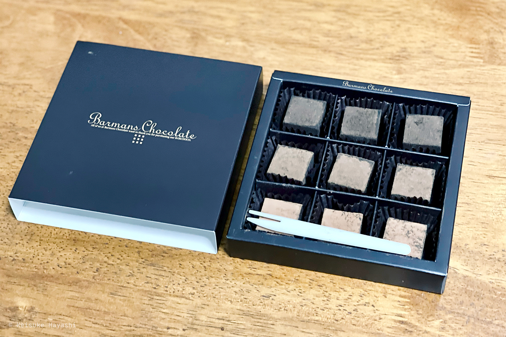
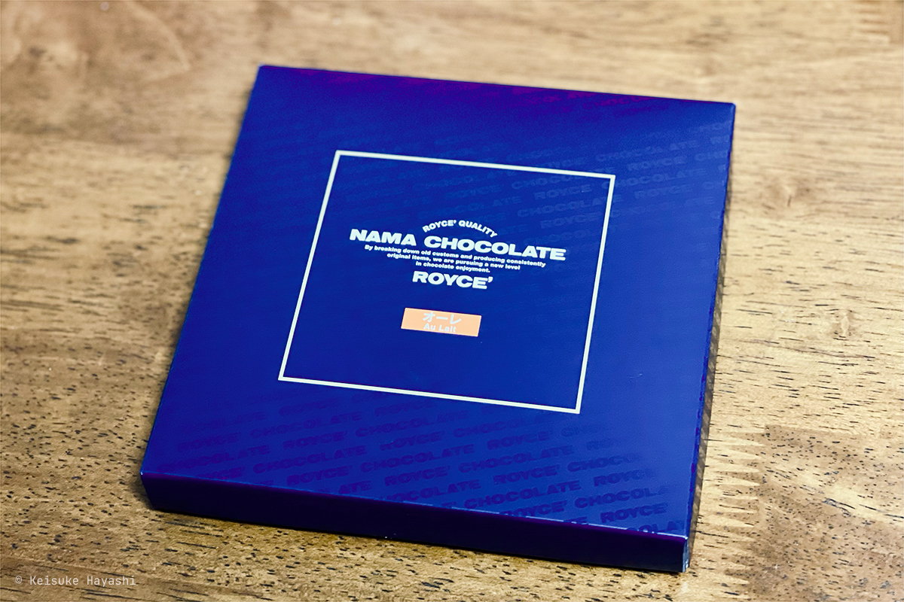
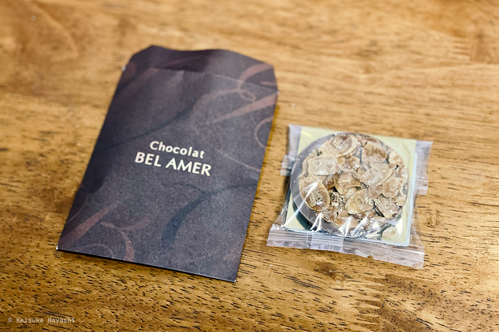

ありがたいことに、恋人からいろんなチョコレートをもらった。

コーヒーが大好きな私にとってチョコレートは最高のお供！と言いたいところだが、コーヒーと一緒に食べるにはもったいない味ばかり。

一年の内でチョコレートをコーヒーと食べないのはこの時期だけ。大切に食べよう。

## 追記

お酒入りのチョコレート、コーヒーと合わせるとアイリッシュコーヒーっぽさがあってすごく美味しい。
Franck Kestener のチョコレートは全部半分こして食べた。面白い味だったなあ。
