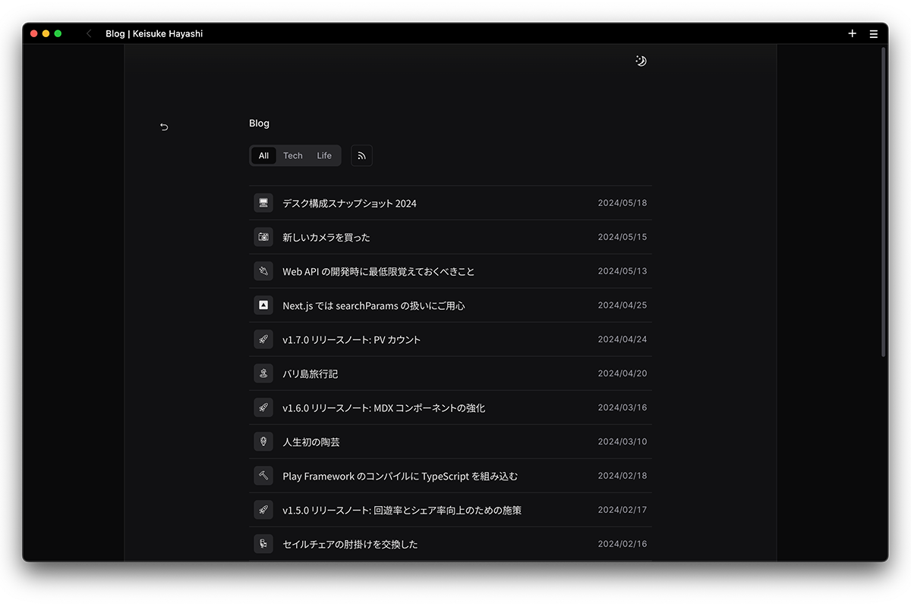
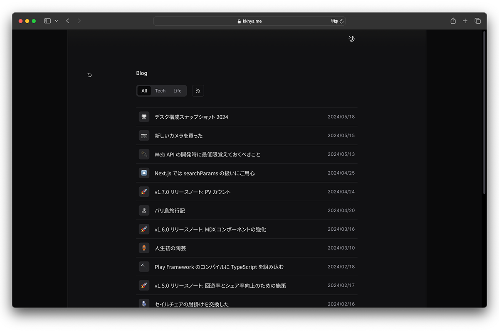
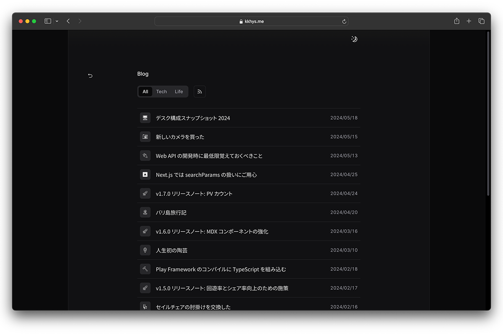

> [!WARNING]
> この記事はNext.js版の内容です。現在はAstroで構築し直したため、情報が古い可能性があります。
> 当時のリポジトリは [こちら](https://github.com/kkhys/me.v2) にあるので参考にしてください。

よくあるブログだと記事にアイキャッチ画像を添付するケースが多いと思う（例えばnoteとか）。
良い画像があれば特に迷うことはないのだが、ちょっとした記事を書くだけなのに毎回用意するのは正直言って面倒くさい。

なので、このブログでは以下のようにFrontmatterに絵文字をセットするだけでアイキャッチ画像を生成するように実装した。
このアイデア自体は [Zenn](https://zenn.dev) やGitHub Discussionsで採用されているものなので特に真新しいというわけではない。

```md title="index.mdx"
---
title: "Noto Emoji を SVG 化する API を作る"
emoji: 🔄
category: Tech
tags: []
status: published
publishedAt: 2024-05-19
---
```

そして、[こちらの記事](/blog/posts/b1fw2ts#h1ne0dv)で述べているように [Noto Emoji](https://fonts.google.com/noto/specimen/Noto+Emoji) をfont-familyとして指定することでサイトのモノクロな雰囲気に合うように絵文字の表示を変えていた。
記事一覧ページを [min](https://minbrowser.org) ブラウザで見ると以下のようなデザインである。



ただ、Safariで記事一覧ページを見ると以下のように表示されてしまう。



ちなみにChromeでは問題ない。
なぜかSafariでのみ変換されない絵文字がある。

## なぜNoto EmojiがSafariで表示されない？

調べてみたのだが、[ZWJ Sequences](https://emojipedia.org/emoji-zwj-sequence) が関係しているっぽい。
絵文字は端末で見ていると1つでも実際は複数の絵文字で構成されているパターンがある。
例えば絵文字 👩‍❤️‍💋‍👨は 👩❤️💋👨 をゼロ幅接合子（Zero Width Joiner）で繋げることで構成されている。
Windowsにしかないパターンもあったりとこれら全てに対応するのはさすがに時間がかかり過ぎるため諦めた。

代案としてImg要素からSVGに変換された絵文字を読み込むことを考えた。
それならクロスプラットフォームにも対応できる。

このサイトではNext.jsとVercelを使って構成されているのでNext.jsのRoute HandlersとVercelのEdge Runtimeを使うことにした。
Edge Runtimeにキャッシュさせておけばパフォーマンス面でも問題なさそう。

（基本的な原理がわかっていればCloud FunctionsやCloudflare Workersのようなサーバレス環境でもOK。今回はVercelを使いたかっただけ。）

## 絵文字SVGを返すAPIの実装

今回は以下のようなエンドポイントを作成する。
試しにアクセスしてみてほしい。
画面左端上部にモノクロの絵文字が表示されると思う。

```text
https://kkhys.me/api/noto-emoji/🐟.svg?theme=light
```

上記では 🐟 を指定しているが、ここはどんな絵文字でも問題ない。
逆に絵文字以外が入力されていたり、svgが抜けていれば適切なエラーを返すようにする。

また、このサイトはダークモードとライトモードに対応しているため、クエリパラメータでテーマを選択可能にしている。
`theme=dark`を指定すればダークモード用のSVGが返される。

絵文字のSVG化にはVercel製のライブラリ [satori](https://github.com/vercel/satori) を使用した。

実装自体はシンプルで、以下のようになっている。

```tsx title="app/api/noto-emoji/[slug]/route.tsx" showLineNumbers
import type { NextRequest } from 'next/server';
import emojiRegex from 'emoji-regex';
import satori from 'satori';

export const runtime = 'edge';

export const GET = async (request: NextRequest, { params: { slug } }: { params: { slug: string } }) => {
  const rawText = slug.endsWith('.svg') ? slug.replace('.svg', '') : '';

  if (!rawText.length || !isEmoji(rawText)) {
    return new Response('Invalid URL', {
      status: 400,
    });
  }

  const firstEmoji = Array.from(rawText)[0];

  const notoEmojiRegular = await fetch(
    new URL('../../../../../assets/fonts/NotoEmoji-Regular.ttf', import.meta.url),
  ).then((res) => res.arrayBuffer());

  const searchParams = request.nextUrl.searchParams;
  const theme = searchParams.get('theme') ?? 'light';

  const svg = await satori(
    <div
      style={{
        fontSize: 21,
        width: '100%',
        height: '100%',
        display: 'flex',
        alignItems: 'center',
        justifyContent: 'center',
        fontFamily: 'Noto Emoji',
        fontSmooth: 'antialiased',
        color: theme === 'dark' ? '#e6e5e5' : '#0a0a0b',
      }}
    >
      {firstEmoji}
    </div>,
    {
      width: 24,
      height: 24,
      fonts: [
        {
          name: 'Noto Emoji',
          data: notoEmojiRegular,
          style: 'normal',
          weight: 400,
        },
      ],
    },
  );

  return new Response(svg, {
    status: 200,
    headers: {
      'Content-Type': 'image/svg+xml',
      'X-Content-Type-Options': 'nosniff',
      'cache-control': 'public, immutable, no-transform, max-age=31536000',
    },
  });
};

/**
 * Checks if a given string contains an emoji.
 *
 * @param str - The string to check for emoji.
 * @returns Returns true if the string contains an emoji, false otherwise.
 */
const isEmoji = (str: string) => emojiRegex().test(str);
```

25行目でGoogle FontsからダウンロードしたNoto EmojiのTTFファイルへのパスを指定している。
ここは相対パスでなければいけないので注意が必要。
ここを変えればいろんなフォントに対応できる。

77行目に絵文字かどうかを判別するための関数がある。
絵文字かどうかは正規表現を使えばわかるのだが、けっこう複雑なので [emoji-regex](https://github.com/mathiasbynens/emoji-regex) というライブラリに頼っている。

そして、ここで最も重要なのは66行目の`cache-control`である。
ここで`max-age=31536000`を指定することで一度SVG画像を読み込めばブラウザのキャッシュに保存するため2回目以降サーバにリソースの再要求を行わない。
キャッシュ時間はかなり長めにとっているが、絵文字が変わることはおそらくないので問題ない。

## フロント側の処理

フロント側ではImg要素を使ってSVG画像を読み込んでいる。

```tsx title="ui/post/eye-catch/index.tsx" showLineNumbers
export const EyeCatch = ({
  emoji,
  className,
  size,
}: { emoji: string; className?: string } & VariantProps<typeof eyeCatchVariants>) => {
  const { theme, systemTheme } = useTheme();
  const [imageSrc, setImageSrc] = React.useState('');

  React.useEffect(() => {
    const selectedTheme = theme === 'system' ? systemTheme : theme;
    setImageSrc(`/api/noto-emoji/${emoji}.svg?theme=${selectedTheme === 'dark' ? 'dark' : 'light'}`);
  }, [theme, systemTheme, emoji]);

  return (
    <span className={cn(eyeCatchVariants({ size }), className)}>
      
    </span>
  );
};
```

[next-themes](https://github.com/pacocoursey/next-themes) を使ってダークモード対応をしているため、ページ読み込み時に`useEffect`を使い、現在のテーマ状態を取得して適切なSVG画像に切り替えている。

10行目が肝である。
このサイトでは初期状態はシステム設定の外観モードを読み取るため、このような処理が必要になる。

これらの処理をした上でSafariを確認するとちゃんと全ての絵文字がNoto Emojiで表示されていた。
テーマの切り替えも問題なさそう。



今回の修正PRはこちら。

https://github.com/kkhys/me.v2/pull/1035

## さいごに

フォント、特に絵文字の取り扱いは難しい。
