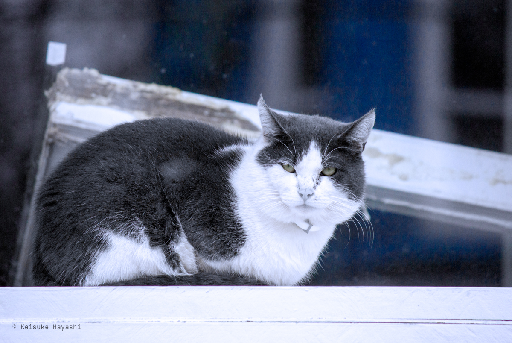
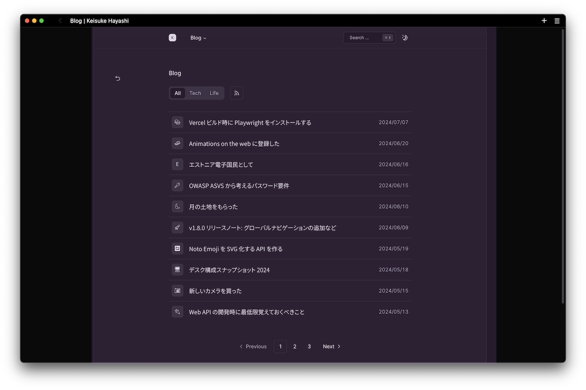

> [!WARNING]
> この記事はNext.js版の内容です。現在はAstroで構築し直したため、情報が古い可能性があります。
> 当時のリポジトリは [こちら](https://github.com/kkhys/me.v2) にあるので参考にしてください。

v1.8.0リリース時にFramer MotionのShared layout animationsを使ってMedium風の画像ズーム機能を追加した。

https://kkhys.me/blog/posts/b1c8jpk

この機能は画像をクリックまたはタップすると画像が画面全体に広がり、背景が暗くなるというものである。
これにより、ユーザは他のコンテンツに気を散らすことなく、画像に焦点を当てることができる。

ズームアウトするには画面をクリックまたはタップする。
PCの場合はスクロールしてもズームアウトが可能である。
このときに画像が元の位置とサイズに戻り、背景が元の状態に戻る。

ローカル環境では問題なく思えたためデプロイしたが、Chrome以外のブラウザで操作したときに画像が若干チラつく現象があり、満足できるクオリティではなかったため一旦廃止した。

そして、実装し直して再度リリースしたというわけである。

https://github.com/kkhys/me.v2/releases/tag/v1.9.0

## 動作例

どんな感じに動作するのかという一例。



## react-medium-image-zoomを使った実装に切り替える

ズーム機能を調査する中で [react-medium-image-zoom](https://github.com/rpearce/react-medium-image-zoom) というライブラリが良さそうだったのでFramer Motionを使った実装から切り替えた。

そもそもパフォーマンスの観点からFramer Motionを使わずに実装できるのであればそれが一番良い。
react-medium-image-zoomのコードを見ると余計なライブラリを使わずに実装されている。

使い方は簡単で以下のように`Zoom`コンポーネントで対象の要素をラップするだけである。

```tsx showLineNumbers
import React from 'react'
import Zoom from 'react-medium-image-zoom'
import 'react-medium-image-zoom/dist/styles.css'

export const MyImg = () => (
  <Zoom>
    
  </Zoom>
)
```

基本的には上記の方法で問題ないのだが、画像をズームするたびにUIのガタつきが発生したため、スタイルの修正が必要になった。
そのときの記録をまとめておく。

## TL;DR

1. 前提条件: `position: fixed`と`width`を使ってUIを作成している
2. Radix UIを使ってルート要素のスクロールを一時的に無効化するコンポーネントを使用する
3. 2実行時にスクロールバーの幅分のレイアウトシフトが発生する
4. 2実行時に1の`width`からスクロールバーの幅を引くと問題は解決する
5. 画像ズーム時もスクロールバーの幅分のレイアウトシフトが発生する（3とは別理由）
6. 画像ズーム時にスクロールバーの幅を取得して1の`width`から引くことで解決する

## Radix UIのスクロールバーの挙動

当ブログでは基本的に [shadcn/ui](https://ui.shadcn.com) を使ってUIコンポーネントを作成している。
そのshadcn/uiは内部でヘッドレスUIライブラリの [Radix UI](https://www.radix-ui.com) を部分的に使用している。

Radix UIの中には状態がアクティブになるとスクロールバーを削除するようなコンポーネント（ex. DialogやDropdown Menu）がある。
そのようなコンポーネントを使ったときにスクロールバーが切り替わる結果としてレイアウトシフトが発生してしまった。
Radix UIを使っていれば [公式のサンプル](https://www.radix-ui.com/primitives/docs/components/dialog) を見ればわかるとおり、レイアウトシフトは発生しないはずであるのだが。

このブログの場合だと、CSSで`position: fixed`を使用、かつ、横幅を持たせている要素に限ってレイアウトシフトが発生することが分かった。
具体的には黒とグレーで色を分けているコンテナ部分とヘッダである（写真参考）。



モーダルでルート要素のスクロールを一時的に無効化したい場合は`overflow: hidden`を利用する方法が一般的だが、その切り替えを行ったときにスクロールの幅分レイアウトシフトが起きて画面のガタつきが発生してしまうのはよく知られている問題である。
以下の記事で非常にわかりやすく解説されている。

https://medium.com/react-camp/how-to-fight-the-body-scroll-2b00267b37ac

今回のケースもそれだろうと思って調べると`overflow: hidden`の他にも以下の見慣れないコードが追加されていた。

```css
body[data-scroll-locked] {
    --removed-body-scroll-bar-size: 16px;
}

body[data-scroll-locked] {
    overflow: hidden !important;
    overscroll-behavior: contain;
    position: relative !important;
    padding-left: 0px;
    padding-top: 0px;
    padding-right: 0px;
    margin-left: 0;
    margin-top: 0;
    margin-right: 16px !important;
}
```

Radix UIの実装を確認するとスクロールバーの削除に [react-remove-scroll](https://github.com/theKashey/react-remove-scroll) というライブラリが使われていた[^1]。
このライブラリはスクロールバーを削除しつつ、スクロールバーのギャップを保持するという役割を担っている。

[^1]: [使用箇所をGitHubで検索](https://github.com/search?q=repo%3Aradix-ui%2Fwebsite+RemoveScroll&type=code)

なるほど、確かにとても便利なライブラリではあるが、`position: fixed`を使っている場合は調節が必要らしい[^2]。

[^2]: [参考になるセクション](https://github.com/theKashey/react-remove-scroll?tab=readme-ov-file#positionfixed-elements)

スクロールバーを削除したときにその空白分がずれてしまうのであれば、`position: fixed`を使っている箇所でスクロールの幅分`width`から引いてあげれば良い。

```tsx title="apps/web/src/ui/global/layout/index.tsx" showLineNumbers
export const Layout = ({ children }: { children: React.ReactNode }) => (
  <div className='fixed inset-0 flex w-[calc(100%-var(--removed-body-scroll-bar-size,0px))] justify-center sm:px-8'>
    {/* ... */}
  </div>
);
```

`--removed-body-scroll-bar-size`はreact-remove-scrollがスクロールバーの幅を算出して付与してくれるCSS変数である。
このCSS変数は便利なので画像ズーム時にも利用する。

## react-medium-image-zoomのスクロールバーの挙動

react-medium-image-zoomを使って画像ズームをした際はRadix UIと同様に`body`タグに`overflow: hidden`が付与される。
しかし、当然だが`--removed-body-scroll-bar-size`は付与されないため自分で画像ズーム時に設定しなければならない。

幸いにもreact-medium-image-zoomには`ZoomContent`というズーム時にカスタムコンポーネントを渡せるプロパティがあるためこれを利用する。

```tsx title="apps/web/src/ui/post/blocks/image-block/index.tsx" showLineNumbers
type ModalState = 'LOADED' | 'LOADING' | 'UNLOADED' | 'UNLOADING';

// eslint-disable-next-line @typescript-eslint/no-explicit-any
const CustomZoom = ({ img, _modalState, gap }: { img: React.ReactElement | null; _modalState: any; gap: number }) => {
  const modalState = _modalState as ModalState;

  React.useEffect(() => {
    if (modalState === 'LOADING') {
      document.body.style.setProperty('--removed-body-scroll-bar-size', `${gap}px`);
    }

    if (modalState === 'UNLOADED') {
      document.body.style.removeProperty('--removed-body-scroll-bar-size');
    }
  }, [gap, modalState]);

  return <>{img}</>;
};
```

上記コードでは画像をクリックしてズームしたときに`--removed-body-scroll-bar-size`をセットすることでガタつきを防いでいる。
そして、画像ズームが終わったタイミングで`--removed-body-scroll-bar-size`を取り除いているので全くレイアウトシフトは発生しない。

この`CustomZoom`コンポーネントは以下のように`Zoom`コンポーネントの`ZoomContent`プロパティに指定する。

```tsx title="apps/web/src/ui/post/blocks/image-block/index.tsx" showLineNumbers
import { getGapWidth } from 'react-remove-scroll-bar';

const ZoomImage = ({ src, children }: { src: string; children: React.ReactNode }) => {
  const isDesktop = useMediaQuery('(min-width: 768px)');
  const { gap } = getGapWidth();

  return (
    <Zoom
      zoomImg={{ src }}
      zoomMargin={isDesktop ? 45 : 10}
      ZoomContent={({ img, modalState }) => <CustomZoom img={img} _modalState={modalState} gap={gap} />}
    >
      {children}
    </Zoom>
  );
};
```

肝心のスクロールバーの幅を表す変数`gap`は [react-remove-scroll-bar](https://github.com/theKashey/react-remove-scroll-bar) というreact-remove-scrollの軽量版ライブラリ（作者は同じ）を使用して算出している。

`ZoomContent`プロパティの引数である`modalState`は現在のモーダルの状態を表す。
この値だけを取得できるHooksがあれば、わざわざ別のコンポーネントを作らずに済んだのだがなかったため`modalState`を取得するためだけに`ZoomContent`を利用している。

ざっとこんな感じで`overflow: hidden`を使ったときに発生するレイアウトシフトを解決した。
不具合がライブラリに依存していたため、思っていたよりも原因究明までに時間がかかってしまった。

ライブラリに依存しないのであれば [scrollbar-gutter](https://developer.mozilla.org/en-US/docs/Web/CSS/scrollbar-gutter) を使えば楽に解決できる（Safariには対応していないが）。
以下の記事が参考になった。

https://ics.media/entry/230206

HTMLやCSSは簡単なように見えて奥が深い。
マークアップやスタイリングを完璧にしようと思うと、見た目以外にも、適切に [セマンティクス](https://developer.mozilla.org/ja/docs/Glossary/Semantics) を使わないといけないとか、[WAI-ARIA属性](https://developer.mozilla.org/ja/docs/Web/Accessibility/ARIA/Attributes) を漏れなく定義してアクセシビリティに配慮する必要があったりとか当たり前にしなければならないことが多すぎる。

そういったことに時間をかけるのはあまり本質的ではないと考えているので、それらがあらかじめ定義されているUIコンポーネントライブラリを使っている。
しかし、それでも今回のようなことが起き得るから、結局はライブラリの実装自体を理解する必要があると感じた。

極論だが、ライブラリ内部でどのような処理が行われているのかも分からずに使うぐらいならフルスクラッチで書いたほうがむしろ良いのかもしれない。

## 今後のリリース予定

今のところ以下の機能を追加していく予定（順不同）。

- お問い合わせ機能
- Aboutページ作成（せっかくならいろんなAPIを使いたい）
- 統計ページ作成（グラフを色々使いたい）
- Notion風の目次を作成
- PWA化とプッシュ通知機能の実装
- 記事更新時に各種SNSへ自動投稿
- メールマガジンの実装
- Stripeを使った投げ銭機能の実装
- Fediverse対応

特にFediverseは興味があるので早いうちに調査して実装できたらと思っている。
MastodonやMisskeyなどのFediverseにいる人がこのブログをリモートフォローやリアクションができるようになれば面白い。

それと、最近Notionに目次機能が追加されたのだが、これがまさに求めていたUIだった。
今までありそうでなかったデザイン。
こんな感じで実装してみたい。

{/* https://x.com/NotionHQ/status/1796287840713892328 */}
