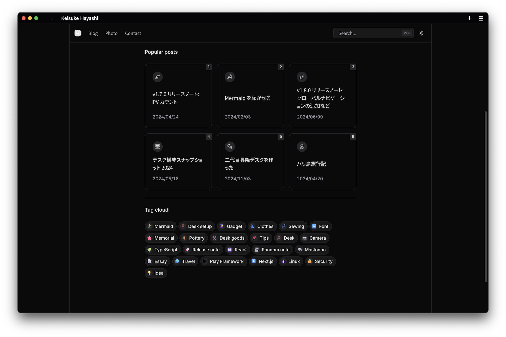
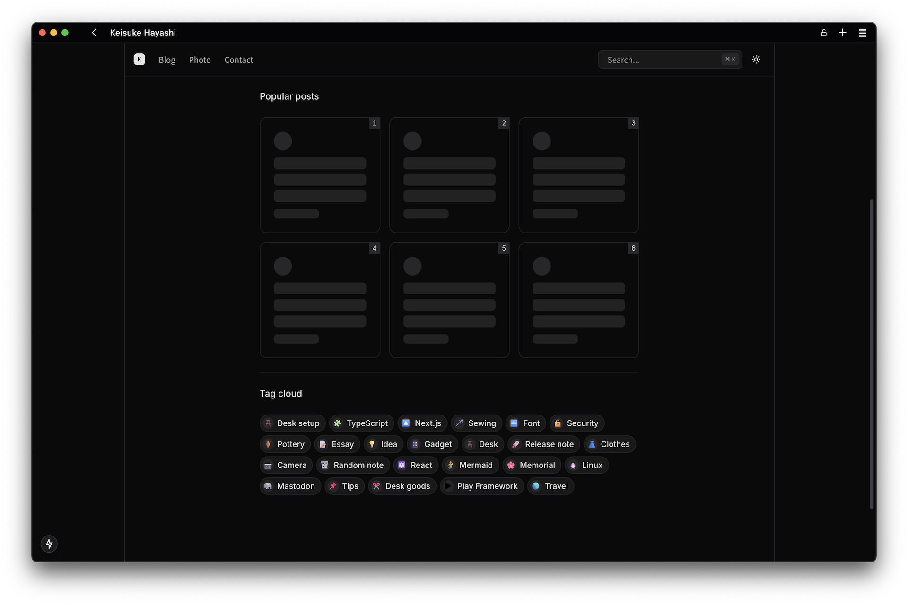

> [!WARNING]
> この記事はNext.js版の内容です。現在はAstroで構築し直したため、情報が古い可能性があります。
> 当時のリポジトリは [こちら](https://github.com/kkhys/me.v2) にあるので参考にしてください。

記事数が増えてきたため、トップページに人気記事一覧を追加した。
実装自体はシンプルだが、いくつかポイントがあるので整理しておく。

最近はホームページに充てられる自由時間が限られていることもあり、タスクを2 ~ 3時間で完了できる単位に細分化し、気が向いたときに進めるようにしている。
そのおかげもあって、良い感覚で継続的にリリースできている。

https://github.com/kkhys/me.v2/releases/tag/v2.4.0

## PVの集計方法をざっくり振り返る

PV機能を最初に実装したのはv1.7.0。

そのときはRDBMSを使ってPVを管理していた。
詳しくはこの記事に書いてある。

https://kkhys.me/blog/posts/b1v9jvx

しかし、運用していく中でいくつか気になる点があったため、より適した方法としてRedisを導入。

https://kkhys.me/blog/posts/b1ydlf6

現在はRedisベースでPVを管理している。

Redisの実装では以下がポイント。

- `pageviews:${NODE_ENV}:${slug}`の形式でキーを保存している
- インクリメント時はIPアドレスをハッシュ化して保存し、n秒間重複して計測されないようにチェックしている
- n秒経過すると、そのキーバリューは消滅する

キーに環境変数を含めることで、ローカル環境やプレビュー環境、本番環境のPVがごっちゃにならないというメリットがある。

## PVの多い順に取得する方法

人気記事を取得する方法はシンプル。

1. キーに紐づくデータを全て取得（`mget`）する
2. `sort`で昇順に並び替える

これだけ。

```ts title="apps/web/src/app/posts/_lib/queries.ts" showLineNumbers
const getAllPageViewsSorted = async () => {
  const prefix = `pageviews:${env.NODE_ENV}:`;
  const keys = postMetadataForEdge.map(({ slug }) => `${prefix}${slug}`);

  if (keys.length === 0) {
    return [];
  }

  const values = await redis.mget<number[]>(...keys);

  const pageViews = keys.map((key, index) => ({
    slug: key.replace(prefix, ""),
    views: values[index] ?? 0,
  }));

  pageViews.sort((a, b) => b.views - a.views);

  return pageViews;
};
```

当初は`scan`コマンドを使って、特定のプレフィックスを持つキーを全取得する方法を検討していた。
しかし、記事のスラッグはあらかじめ分かっているため、キーのリストを作成し、それを`mget`に渡す方式に変更。

{/* 以下の記事にあるように、`scan`はパフォーマンス的な問題もあるので、可能な限り避けるのがベター。 */}

{/* https://qiita.com/ssc-ksaitou/items/5507f0f44b0bc4bd9f12 */}

PVは頻繁に更新されるため、今回のシステム構成では採用しなかったが、RedisのSorted Setを使うことで、ランキング機能をシンプルに実装することも可能。

https://redis.io/docs/latest/develop/data-types/sorted-sets

## 毎回APIが走らないようにする

PVは日々更新されるとはいえ、記事のランキングが頻繁に変動するほど活発なサイトではない。
そのため、毎回APIリクエストを発生させず、キャッシュを活用することにした。

```ts title="apps/web/src/app/posts/_lib/queries.ts" showLineNumbers
import { unstable_cache } from "next/cache";

export const getCachedAllPageViewsSorted = unstable_cache(
  async () => getAllPageViewsSorted(),
  undefined,
  {
    revalidate: 60 * 60,
  },
);
```

キャッシュにはNext.jsの`unstable_cache`を使用した。
`unstable`（不安定）とあるように、この関数は将来的に変更が予定されている[^1]。

[^1]: [公式ドキュメント](https://nextjs.org/docs/app/api-reference/functions/unstable_cache) によると`use cache`が安定版になったら置き換えられるらしい

`unstable_cache`を使う際の注意点として、Next.jsの [4つのキャッシュ](https://nextjs.org/docs/app/building-your-application/caching)のうち、Data Cacheにあたるという点である。
つまり、サーバサイドに保存され、ユーザのリクエストやデプロイメント全体でデータが共有される。

> [!CAUTION]
> キャッシュされたデータは、リクエストしたユーザだけでなく他のユーザにも共有される。
> 今回みたいにPVのような公共性の高いデータなら問題ないが、個人情報などをキャッシュしないよう注意が必要。

話は少し逸れたが、これで1時間ごとのキャッシュ が適用され、APIの無駄な呼び出しを抑えることができる。

## 記事一覧を表示

PVが多い順に並んだ配列を取得できたら、あとは表示させるだけ。

```tsx title="apps/web/src/app/posts/_ui/popular-posts/index.tsx" showLineNumbers
const popularPostCount = 6;

export const PopularPosts = async ({ className }: { className?: string }) => {
  const allPageViewsSorted = await getCachedAllPageViewsSorted();
  const popularPosts = allPageViewsSorted
    .slice(0, popularPostCount)
    .map(({ slug }) => getPostBySlug(slug) as Post);

  return (
    <div
      className={cn(
        "grid grid-cols-2 gap-3 sm:grid-cols-3 xl:gap-4",
        className,
      )}
    >
      {popularPosts.map((post, index) => (
        <div key={post._id} className="relative">
          <ArticleCard post={post} />
          <RankNumber rank={index + 1} />
        </div>
      ))}
    </div>
  );
};
```

上記のコードでは、配列の先頭から6件を切り出して、`slug`をキーにして記事オブジェクトとマッピングしている。

UIは以下のようなシンプルなカード形式。



Data Cacheの特性上、滅多に見られることはないと思うが、スケルトンも実装している。



## さいごに

人気記事を出力して初めて分かったこととして、意外とリリースノートは読まれている。
メモ書き程度に結構端折って書いているので、あまり参考にならないかもしれないが、読んでくれている人がいる以上ちゃんと書かないとなあと思った次第である。
