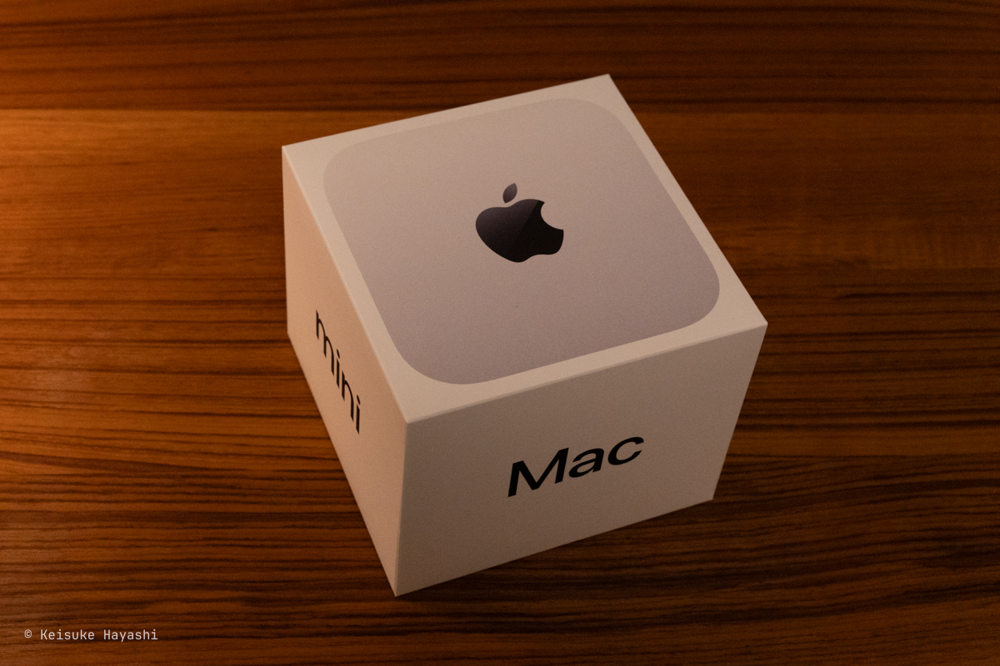
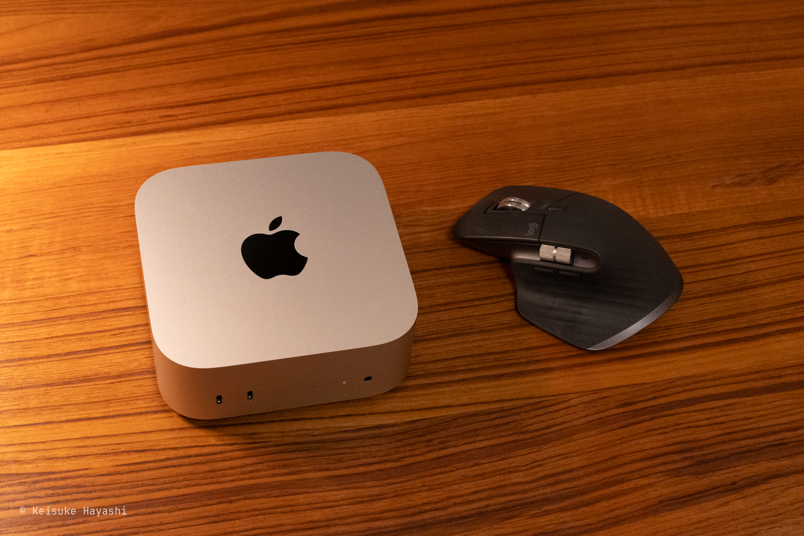
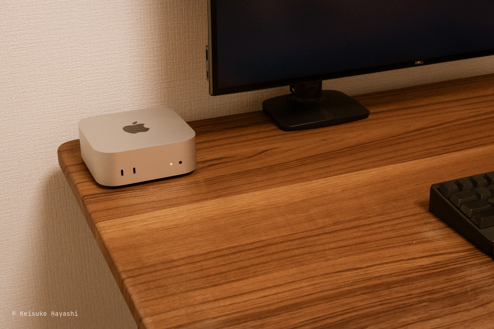
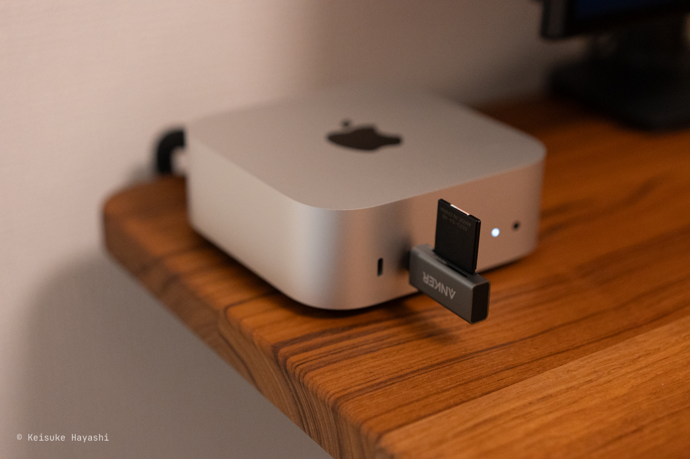

先日M4チップが搭載されたMac miniを購入したので所感を書いていく。

## Mac miniのスペック

今回購入したMac miniのスペック ↓

- チップ: Apple M4チップ
- メモリ: 24GBユニファイドメモリ
- ストレージ: 512GB
- 価格: 約148,000円

デフォルトだとメモリは16GBだが、IDEを開きながら作業するとちょっと心許ないので24GBに変更した。
それ以外は特にオプションを追加していない。

Amazonで購入したため、Apple公式で買うよりも6,000円ほど安く買えた。
分割払いをしなければAmazonで買った方がポイントも付くし、良いかもしれない。

ただ、Amazonには10Gb Ethernetのオプションがなかったため、そこが残念なポイント。
**細かくオプションを付けたい場合はApple Storeで買うべし。**

## もうMac miniで良くないか？

**Mac miniをしばらく使ってみた感想としては、もうMacBookは要らないのでは？というのが正直な感想である。**
もちろん、万人がそうだとは限らないが、一定の人には当てはまると言える。

より具体的に書くと、以下の項目すべてに該当する人はMacBookではなくMac miniの方が向いている。

- 外付けキーボードを愛用している
- 外付けマウスを愛用している
- 外付けディスプレイを1枚以上使用している
- カフェなど、外出先で作業しない
- 仕事用のノートPCはある

むしろ、今まで使いもしない内蔵キーボードとトラックパッド、Retinaディスプレイにこだわる必要はなかった。
それらが削られたおかげで、このスペックとしてはかなり安価にデスクトップPCを購入できる。

ちなみに現在、最も安価なMacBook Proは248,800円である。
しかも、16GBユニファイドメモリで、ストレージは512GB、ディスプレイは14インチと中途半端なスペック。
昨今の目まぐるしいPCの進化を考えると、**外付けできるものは長く使い、PCは数年で買い替える方が得策**だと考える。

何より、Mac miniの良いところは、その可愛らしい佇まい。
MacBookはいかにして目立たないように収納するかを考えていたが、Mac miniはそのままデスク上にあっても許せる（とはいえ、より良い収納方法があれば採用する予定）。

## Mac miniにあると便利な周辺機器

Mac miniは極限まで（というと言い過ぎかもしれないが）無駄を削ぎ落としているため、必要とあらば自前で周辺機器を用意しなければならない。

### SDカードリーダー

[AnkerのUSB Type-C対応SDカードリーダー](https://amzn.to/3RBh8MJ)である。
**Mac miniにはSDカードの差し込み口はないため、こういったコンパクトなカードリーダーは必須。**
撮影した写真を移動させる際に重宝している。

### iPhone MagSafeマウント

MacBookにあってMac miniにないものとしては、内蔵カメラがある。
基本的に仕事はリモートなので、急にミーティングが入り、Webカメラが必要になることがある（とはいえ、最近は顔を出さなくても良くなっているが、仕事によっては顔出しは必須だろう）。
そんなときのために、外付けのWebカメラが必要になる。

わざわざ、そのためにカメラを買うのは気が引けていたときにiPhoneがWebカメラとして使えることを知った。
そこで購入したのが [BelkinのiPhone MagSafeマウント](https://amzn.to/3FVodFr)である。

これを使えばiPhoneが簡単にWebカメラになる。
そして、**iPhoneのカメラはMacBookの内蔵カメラよりも、はるかに高画質である。**
良い時代になったものだ。

### Apple Watch

MacBookにはTouch IDが搭載されているが、Mac miniにはそれがない。
**毎回パスワードを入力するのは面倒臭いので、Apple Watchを使ってMac miniのロックを解除している。**

基本的にスリープ状態から復帰するときは、Apple Watchのロック解除で済むので、パスワードを入力することはほとんどない（まれに、パスワードの入力が求められる。条件は不明）。

## さいごに

まだ試していないが、iPadをメインディスプレイとして使えるっぽいので試してみたい。
それが不具合なく簡単にできれば、本格的にノートPCの代替になりそう（周辺機器を持ち運ばなければならない面倒臭さは置いておいて）。
