Mac miniを購入した話は、こちらの記事にまとめてある。

https://kkhys.me/blog/posts/b1r3zrr

さて、今回のテーマはMacの設定についてである。
工場出荷時のまま使いこなす猛者もいるが、多くの人は自分なりの設定があるはずだ。
せっかくの新マシン。
ここで一度、自分の設定をまとめておくことにした。

**自分のベストな設定方法が固まっているのであれば、Time Machineを使って、そっくりそのまま移行すればそれで済む話。**
ただ、意外と設定を全部見る機会は少ないし、非効率的だが、一からPCをセットアップしていくのは楽しい。
以前は知らなかった機能にも今回出会えたので、PCを購入するたびにセットアップし直すのも悪くない。

とはいえ、完璧に便利な環境を作り上げたつもりはない。
今回はこれだけ設定すればひとまず快適に使える、というレベルにはなっているはずだ。

なお、Macの設定はOSのバージョンによって変わるので、あくまで参考程度に。

そして何より大事なのは、すべてを鵜呑みにしないこと。
自分に必要なものだけを選んでカスタマイズしてほしい。

## 設定する上での思想

- できるだけデフォルトの設定を維持する
- 少しでも不要だと感じたものは削除する
- 組み込みの機能で対応できるなら、それを優先する
- 可能ならGUIではなくCLIから設定する

## システム設定関連

### 1. ファイアウォールを設定

ファイアウォールは外部ネットワークからの通信を制御し、不要なアクセスをブロックする。
特に公共のWi-Fiを使う場合や、セキュリティリスクが不明なネットワークに接続する際は有効にしておいたほうが良い。
オンにして困ることは今までなかったので、**深く考えずにオンにしておくのが無難。**

```shell
sudo /usr/libexec/ApplicationFirewall/socketfilterfw --setglobalstate on
```

### 2. Spotlight

SpotlightはMacの検索機能で、アプリケーションやファイルを素早く見つけるのに便利。
ただ、デフォルトのままだと検索結果に不要な項目が多いため、必要なものだけが表示されるように設定する。

自分の場合はアプリケーションのみを表示するようにしている。
また、Appleの検索機能の改善に協力する必要はないのでオフにする。

- システム設定 → Spotlight
  - 検索結果: 「アプリケーション」のみを選択
  - Appleの検索機能の改善に協力: 「オフ」に設定

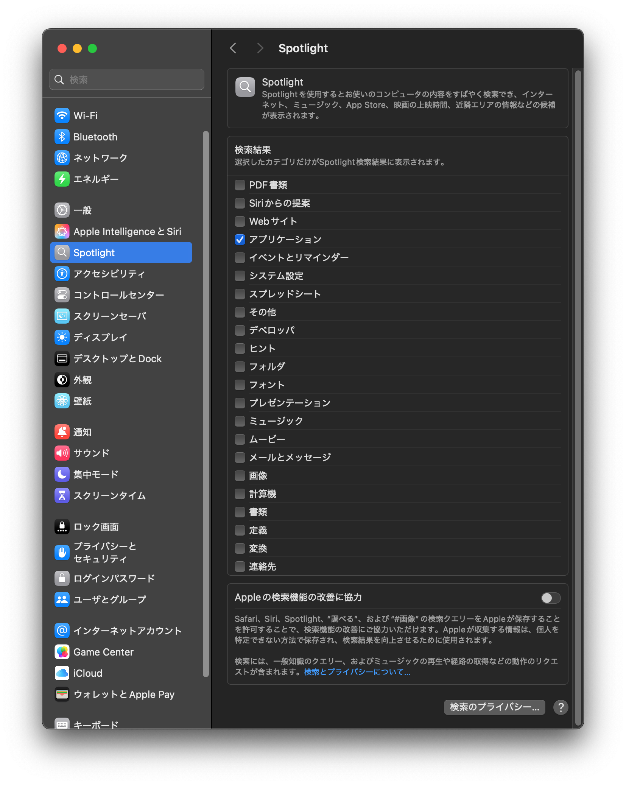

Spotlightの代わりに [Alfred](https://www.alfredapp.com) や [Raycast](https://www.raycast.com) をランチャーとして使用するのもアリ。
調べた感じだとRaycastが良さそうなので、今度試してみる予定。

### 3. Mission Control

**デスクトップやDockの設定は作業効率に大きく影響するため、使いながら自分に合うように調整するのがおすすめ。**
自分はアプリを基本的にフルスクリーンで使うことが多いため、Mission Controlをよく活用している。

Mission Controlを使うことで目的のアプリをすぐに見つけられるようになり、作業効率が上がる。
また、仮想デスクトップ（Spaces）を使えば、プロジェクトごとに作業スペースを分けることができ、整理しやすくなる。

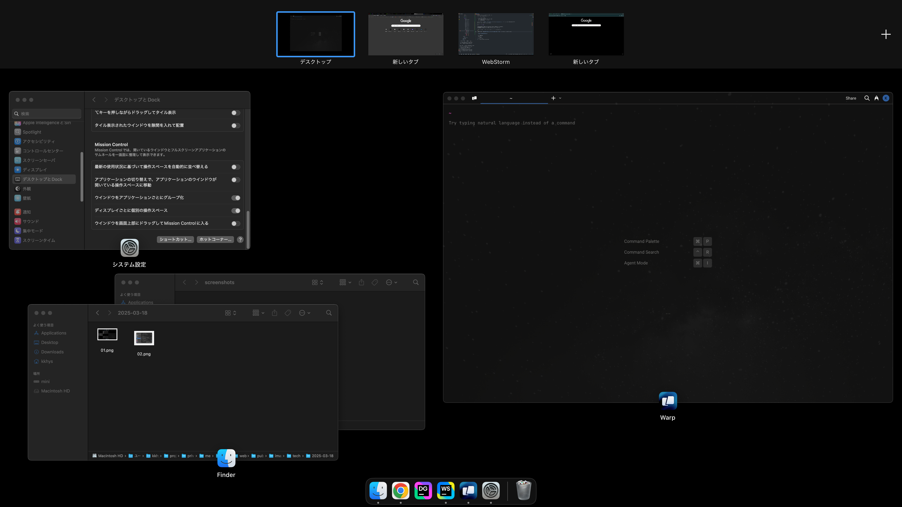

Mission Controlの設定では、以下の項目を変更している。

- システム設定 → デスクトップとDock
  - 最新の使用状況に基づいて操作スペースを自動的に並び替える: 「オフ」に設定
    - 勝手に並び替えられると、使いたいアプリを見失う原因になるため
  - ウインドウをアプリケーションごとにグループ化: 「オン」に設定
    - 複数のフォルダを開いているときなどに整理されて便利
  - ディスプレイごとに個別の操作スペース
    - マルチディスプレイを使う場合、それぞれに独立した操作スペースがあったほうが快適

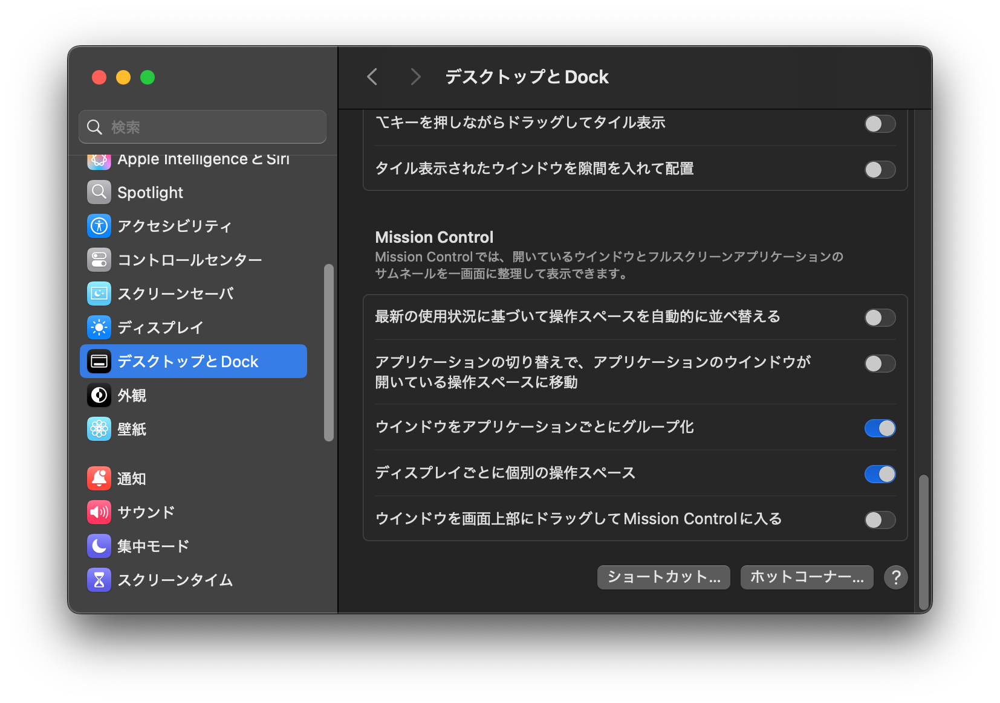

### 4. ホットコーナー

ホットコーナーを設定し、右上にカーソルを持っていくとLaunchpadが表示されるようにしている。

Launchpadは以下のような画面で、アプリ一覧を表示できる。

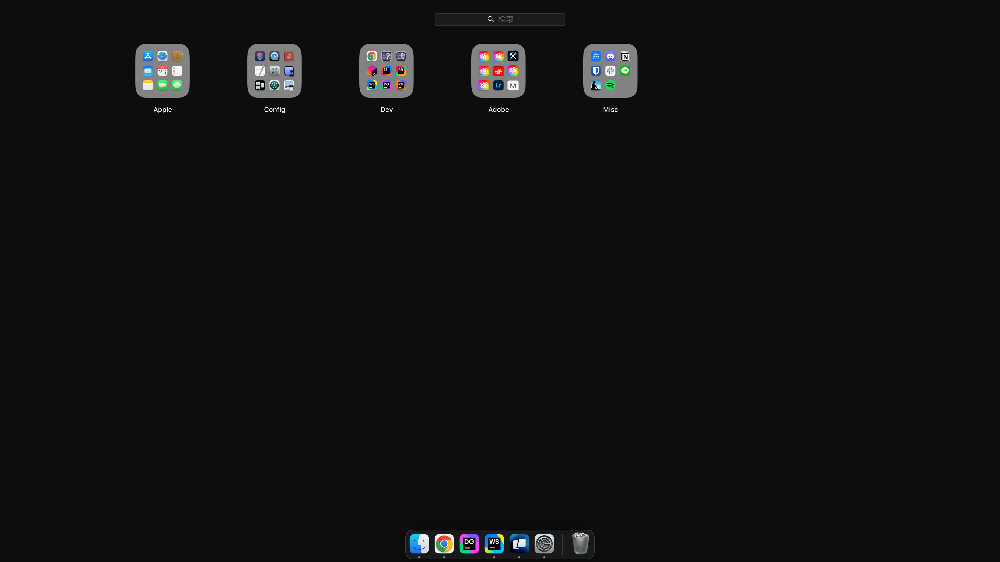

ホットコーナーにはクイックメモやスリープ機能を割り当てることもできるが、**右上以外に設定すると誤って触れてしまうことが多いため、右上のみにしている。**

- システム設定 → デスクトップとDock → ホットコーナー
  - 右上: 「Launchpad」を選択
  - 他のホットコーナーは「オフ」に設定

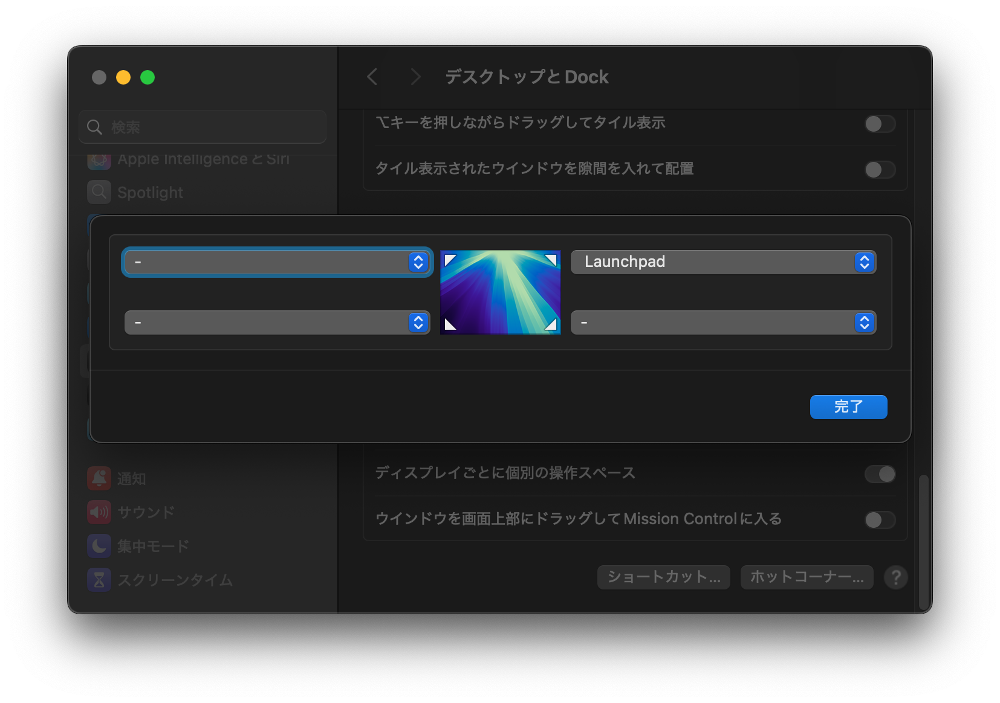

### 5. スクロールバーを常に表示

スクロールバーはデフォルトで必要なときにのみ表示されるが、常に表示するように設定している。
こうすることで、環境ごとのスクロールバーの表示の違いを気にせず作業を進められる（[参考](https://ics.media/entry/230206/#macos%E3%81%A7%E5%88%B6%E4%BD%9C%E3%81%99%E3%82%8B%E6%99%82%E3%81%AF%E3%80%81%E3%82%AF%E3%83%A9%E3%82%B7%E3%83%83%E3%82%AF%E3%82%B9%E3%82%AF%E3%83%AD%E3%83%BC%E3%83%AB%E3%83%90%E3%83%BC%E3%82%92%E5%B8%B8%E3%81%AB%E8%A1%A8%E7%A4%BA%E3%81%97%E3%82%88%E3%81%86)）。

```shell
defaults write NSGlobalDomain AppleShowScrollBars -string "Always"
```

### 6. キーボード

**タイピングを極めるには、キーのリピート速度は最速、リピート入力の認識時間は最短が鉄則。**
指先が追いつかないような設定ではストレスがたまるだけなので、ここは妥協しない。

また、キーボードショートカットは多ければ便利というわけではない。
誤操作を防ぐために、本当に必要なものだけを厳選して設定している。

- システム設定 → キーボード
  - キーのリピート速度: 最も速く設定
  - リピート入力認識までの時間: 最も短く選択

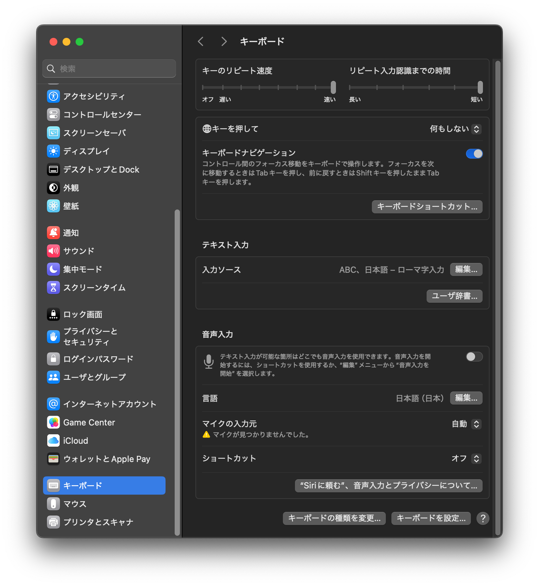

## その他のMac設定関連

### 7. Finder設定

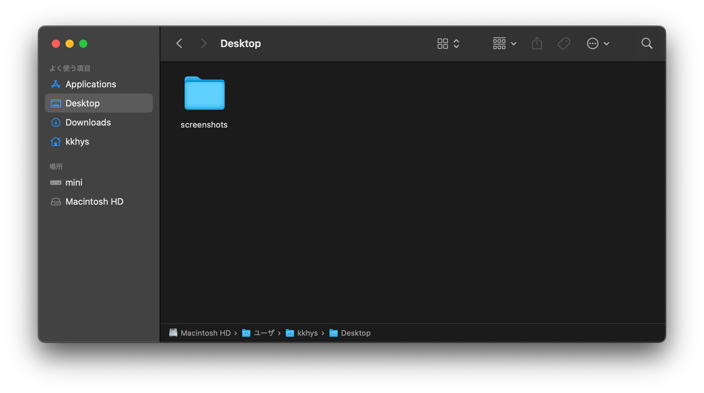

Finderはパスバーがあると便利なので、以下のコマンドを実行して常時表示させる。

```shell
defaults write com.apple.finder ShowPathbar -bool true
```

### 8. Finderアプリを終了可能にする

Finderアプリは通常、終了できない仕様だが、それが何とも落ち着かない。
開いている必要がないときくらい自分の意思で閉じられたほうが精神衛生上良い。
そこで、Finderを終了可能にする設定を採用している。

もちろん、Finderは開きっぱなしでも支障なく設計されているのだろう。
しかし、選択の自由があること自体が心の余裕につながる。

```shell
defaults write com.apple.finder QuitMenuItem -bool false

killall Finder
```

### 9. ファイル拡張子

ファイルの正体を一目で分かるようにするため、ファイル拡張子は常に表示する設定にしている。
`jpg`か`png`かといった違いは、瞬時に判断したい。

```shell
defaults write NSGlobalDomain AppleShowAllExtensions -bool true

killall Finder
```

### 10. スクリーンショット

スクリーンショットでは以下の設定を行なっている。

```shell
# スクリーンショットのファイル名をカスタマイズ
# この場合、スクリーンショットのファイル名の冒頭が "screenshot" になる
defaults write com.apple.screencapture name "screenshot"

# スクリーンショットの保存先のディレクトリを変更
defaults write com.apple.screencapture location /Users/kkhys/Desktop/screenshots

# スクリーンショットを撮った後、右下隅に表示される「サムネイルプレビュー」を無効化
defaults write com.apple.screencapture show-thumbnail -bool false

# 上記の変更を反映させる
killall SystemUIServer
```

### 11. キーのリピート入力を有効化

Vimで上下左右に移動するときなど、キーのリピート入力は必須である。
デフォルトでは、キーのリピート入力が無効になっているが、以下のコマンドを実行することで有効化できる。

```shell
defaults write -g ApplePressAndHoldEnabled -bool false
```

### 12. Macデフォルトのディレクトリ名を英語表示にする

Macのホームディレクトリにあるディレクトリ（「アプリケーション」や「デスクトップ」）が日本語表記になっているのは好ましくないため、英語表記に変更する。
以下のコマンドを実行することで、英語表記に変更できる。
くれぐれも直接ディレクトリ名を変更しないように。

```shell
rm ~/Applications/.localized

rm ~/Documents/.localized

rm ~/Downloads/.localized

rm ~/Desktop/.localized

rm ~/Public/.localized

rm ~/Pictures/.localized

rm ~/Music/.localized

rm ~/Movies/.localized

rm ~/Library/.localized
```

### 13. ミュージックアプリが勝手に起動しないようにする

AirPodsの再生アクションを行った際に、ミュージックアプリが勝手に起動するのはストレスになるため、以下のコマンドを実行して無効化する。

```shell
launchctl disable gui/"$(id -u)"/com.apple.rcd
```

再起動することで上記の設定は有効になる。

（本当はミュージックアプリごと消したいのだが）

## インタフェース関連

### 14. Karabiner-Elements

[Karabiner-Elements](https://karabiner-elements.pqrs.org) を使って、[HHKB Professional HYBRID Type-S](https://amzn.to/4liZ0F9) のキーボードをカスタマイズしている。

特に重要な設定:
- 左右のコマンドキー（`⌘`）単体押しで、左は英数・右はかな切り替え
- `⌘+Q`を2回連続で押さないとアプリが閉じないようにする保護機能

**高速でタイピングしているときに、誤って`⌘+Q`を押してしまい、保存していないデータを失った経験から、この2連打設定は非常に役立っている。**
多少の不便さはあるが、データ損失を防ぐため、設定する価値は十分にある。

以下のルールセットをインストールすることで簡単に設定可能。

https://ke-complex-modifications.pqrs.org/#ei-kana-cmd

### 15. Logi Options+

高機能なマウス [Logicool MX Master 3s](https://amzn.to/4i2JYAk) を活用するために、専用ソフトウェアの [Logi Options+](https://www.logicool.co.jp/ja-jp/software/logi-options-plus.html) を導入している。

このソフトウェアの最大の魅力は、マウスのジェスチャーボタンをカスタマイズして、Mission Controlを直感的に操作できる点だ。
デスクトップの切り替えや複数のウィンドウを一覧表示する機能が、マウスの動きだけで実行できるため、作業効率が格段に向上する。

マウスの持つ本来の可能性を最大限に引き出すために、このソフトウェアの導入は必須。

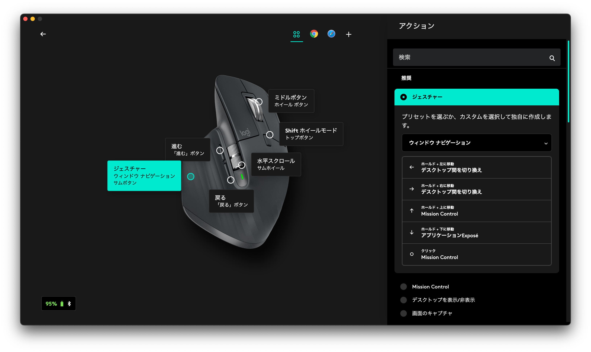

## 開発関連

ここから先はエンジニア向けの設定なので一般の方はスルーしてもらっても問題ない。

### 16. Command Line Toolsのインストール

まずはこれがないと始まらない。

```shell
xcode-select --install
```

ちなみに、**XcodeをインストールするならCommand Line Toolsのインストールはいらない**（同梱されているため）。

### 17. Homebrewのインストール

[Homebrew](https://brew.sh) は、Macのパッケージマネージャであり、さまざまなソフトウェアを簡単にインストールできるため、非常に便利である。
以下のコマンドを実行することでインストールは完了する。

```shell
/bin/bash -c "$(curl -fsSL https://raw.githubusercontent.com/Homebrew/install/HEAD/install.sh)"
```

**個人的には`cask`を使用してGUIアプリをインストールするのはやめた方が良いと思っている。**
毎回CLIから全てのアプリを一括でアップグレードするなら楽だが、意外と面倒で忘れてしまいがちである。

そんなときにGUIアプリのアップデート通知からアプリをアップデートすると、アプリによってはバグが発生することがある。
そうなると、けっこう面倒なことになる。

### 18. Vimのインストール

VimはMacにデフォルトでインストールされているが、バージョンが古いため、Homebrewでインストールし直したほうが良い。

```shell
brew install vim
```

### 19. Gitのインストール

Gitも同様にMacデフォルトのバージョンは古いため、 Homebrewでインストールし直す。

```shell
brew install git
```

### 20. zshの設定

`.zshrc`にお気に入りの設定をインポートしておく。
こういったファイルは`dotfiles`としてGitHubなどに保存しておくと便利である。

一応、私もdotfilesをGitHubに保存している（ただ、あまり更新はしていない）。

https://github.com/kkhys/dotfiles

以下は`.zshrc`の一例。

```text title="~/.zshrc"
# alias
alias ..='cd ..'
alias ...='cd ../..'
alias l='less'
# alias ls='exa'
alias la='ls -aF'
alias ll='ls -l'
alias lla='ls -alF'
alias l.='ls -d .[a-zA-Z]*'
alias v="vim"
alias g="git"
alias dc='docker compose'
alias de='docker exec'
alias pn='pnpm'
alias b='bun'

HISTFILE=$ZDOTDIR/.zsh-history
HISTSIZE=2000
SAVEHIST=2000

setopt inc_append_history
setopt share_history
setopt AUTO_CD
setopt AUTO_PARAM_KEYS

export LANG=ja_JP.UTF-8
export LC_CTYPE=ja_JP.UTF-8
```

### 21. SSHの設定

SSHは、GitHubやGitLabなどのリモートリポジトリやVPSサーバにアクセスするために必要である。
SSH公開鍵と秘密鍵を移行元のMacからエクスポートして、移行先のMacにインポートする（くれぐれも安全に）。

`.ssh/config`などの設定も同様にインポートしておくと便利。

以下は`.ssh/config`の一例。

```text title="~/.ssh/config"
Include ~/.ssh/hosts

ServerAliveInterval 60
ServerAliveCountMax 5
```

```text title="~/.ssh/hosts"
Host github
  Hostname github.com
  User git
  Port 22
  AddKeysToAgent yes
  UseKeychain yes
  IdentityFile ~/.ssh/id_ed25519_github
  IdentitiesOnly yes

Host vps
  Hostname xxx
  User xxx
  Port 22
  IdentityFile ~/.ssh/id_ed25519_xxx
```

### 22. Gitの設定

`.gitconfig`も移行元のPCもしくはdotfilesからインポートしておく。

以下はその一例。

```text title="~/.gitconfig"
[commit]
	gpgsign = true

[color]
	status = auto
	diff = auto
	branch = auto
	interactive = auto
	grep = auto
	ui = auto

[alias]
	a = "!git status --short | peco | awk '{print $2}' | xargs git add"
	d = diff
	co = checkout
	ci = commit
	ca = commit -a
	ps = "!git push origin $(git rev-parse --abbrev-ref HEAD)"
	pl = "!git pull origin $(git rev-parse --abbrev-ref HEAD)"
	st = status
	br = branch
	ba = branch -a
	bm = branch --merged
	bn = branch --no-merged
	df = "!git hist | peco | awk '{print $2}' | xargs -I {} git diff {}^ {}"
	hist = log --pretty=format:\"%Cgreen%h %Creset%cd %Cblue[%cn] %Creset%s%C(yellow)%d%C(reset)\" --graph --date=relative --decorate --all
	llog = log --graph --name-status --pretty=format:\"%C(red)%h %C(reset)(%cd) %C(green)%an %Creset%s %C(yellow)%d%Creset\" --date=relative
	open = "!hub browse"
	type = cat-file -t
	dump = cat-file -p
	find = "!f() { git log --pretty=format:\"%h %cd [%cn] %s%d\" --date=relative -S'pretty' -S\"$@\" | peco | awk '{print $1}' | xargs -I {} git diff {}^ {}; }; f"

[core]
	quotepath = false
	autocrlf = input
	ignorecase = false

[credential]
	helper = osxkeychain

[push]
	default = current

[pull]
	ff = only
	rebase = false

[merge]
	ff = false

[gpg]
	program = /opt/homebrew/bin/gpg

[filter "lfs"]
	clean = git-lfs clean -- %f
	smudge = git-lfs smudge -- %f
	process = git-lfs filter-process
	required = true

[url "https://"]
	insteadOf = git://
```

### 23. GPGの設定

Gitコミットの署名にGPGを使用しているため、移行元のPCからGPG公開鍵 / 秘密鍵をエクスポートして、移行先のPCにインポートする。

以下は移行元のPCで実行する。

```shell
# GPG 鍵の一覧を表示
# 表示された keyid をメモしておく
gpg --list-secret-keys --keyid-format LONG

# GPG 公開鍵のエクスポート
gpg --export {keyid} > pub.key

# GPG 秘密鍵のエクスポート
gpg --export-secret-keys {keyid} > sec.key
```

以下は移行先のPCで実行する。

```shell
# macOS で GPG を使うためのセットアップ
# pinentry-mac がないとパスワード入力を行えないので注意
brew install gnupg pinentry-mac

# GPG 公開鍵のインポート
gpg --import pub.key

# GPG 秘密鍵のインポート
gpg --import sec.key

# 鍵の信頼度を設定する
# 5 を選択すれば OK
gpg --edit-key {keyid} trust quit
```

以上の設定を行うことで、コミット時にGPGを使用した署名が可能になる。

### 24. お好みの等幅フォントをインストール

こだわりのあるエンジニアであれば、お気に入りの等幅フォント（monospaced font）があるはずである。
私は [JetBrains Mono](https://www.jetbrains.com/ja-jp/lp/mono) を愛用している。

~~このブログのコードブロックにもJetBrains Monoを使用しているし、~~ IDEやターミナル系のアプリでも使用している。
この段階でインストールして、MacのFont Bookに登録しておくと後々便利である。

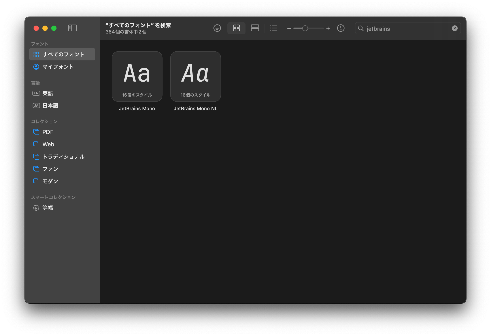

### 25. お好みのターミナルエミュレータをインストール

以前はターミナルエミュレータに [Alacritty](https://alacritty.org) を使っていたが、最近は [Warp](https://warp.dev) を使用している。
Warpの良いところは、プラグインを追加しなくてもデフォルトで必要な機能が揃っている点。
AIによる補完機能もあるが、あまり使っていない。

Alacrittyでは見た目のカスタマイズに [Starship](https://starship.rs) を使っていたが、Warpではデフォルトのテーマをそのまま使用。
デフォルトでも十分に美しく、特に変更する必要はないと感じている。

また、以前はZshプラグインマネージャとして [Sheldon](https://sheldon.cli.rs) を使い、[zsh-autosuggestions](https://github.com/zsh-users/zsh-autosuggestions) のようなプラグインを追加していたが、Warpではこれらも不要。

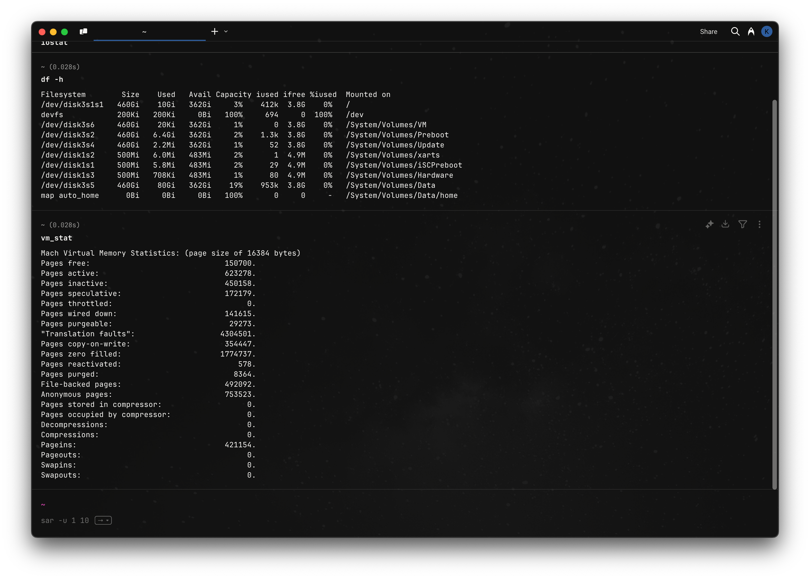

他にも機能が豊富で、これまでのターミナルエミュレータとは一線を画す存在。

### 26. JetBrains Toolbox Appをインストール

現在はJetBrains製のIDEを使用しているため [JetBrains Toolbox App](https://www.jetbrains.com/ja-jp/toolbox-app) をインストール。
JetBrains Toolbox AppからIntelliJ IDEAやWebStormをインストールする。

### 27. VSCodeとCursorのインストール

JetBrains製のIDEを使っているが、昨今のAI補完機能の進化にJetBrainsが追いつけていない印象がある。

そのため、[VSCode](https://code.visualstudio.com) や [Cursor](https://cursor.so) へ乗り換えるべく徐々に慣らしているところ。
やはり、[Cline](https://github.com/cline/cline) や [Roo Code](https://github.com/RooVetGit/Roo-Code) のようなAIコーディングアシスタントは活用していきたい。

ただ、JVM系言語の開発ではIntelliJ IDEAが依然として優位なため、併用している。

### 28. Dockerのインストール

[Docker](https://www.docker.com/ja-jp) は大抵のプロジェクトで必要になるため、あらかじめインストールしておく。

### 29. Xcodeのインストール

[Xcode](https://apps.apple.com/jp/app/xcode/id497799835?mt=12) は必要になったときに入れると時間がかかりすぎるため、この段階でインストールしておく。

### 30. iStat Menus

[iStat Menus](https://bjango.com/mac/istatmenus) は、MacのCPUやメモリ、ディスクの使用状況を監視するためのアプリ。
Mac標準ではメニューバーにCPU使用率やメモリ使用量を表示できないため、iStat Menusを使ってこれらの情報を可視化している。

アクティビティモニタを開かずに詳細な情報を確認できるのは便利。

価格は約2,000円だが、買い切りなので長く使うなら十分に元が取れる。
試用期間が14日間あるため、まずは試してみるのもあり。

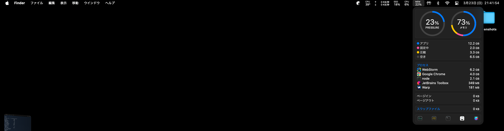

### 31. そのほか

各プログラミング言語と、それをインストールするためのパッケージマネージャは移り変わりが激しいため、ここでは省略する。

Node.jsに関しては、以前は [nodenv](https://github.com/nodenv/nodenv) を使っていたが、最近は [Volta](https://volta.sh) や [Proto](https://github.com/moonrepo/proto) が人気のようだ。
このように、各言語のパッケージマネージャは流行り廃りがあるため、最新の情報を調べてからインストールするのが良い。

## アプリ関連

あとはお好みのアプリをインストールすれば完了。

以下は私がインストールしているアプリの一部である。

- Chrome
- Bitwarden
- Adobe Creative Cloud
- Lightroom
- AppCleaner
- Spotify
- LINE
- Kindle
- Prime Video
- Slack
- Notion
- Discord

## さいごに

設定項目をすべてまとめようとしたが、さすがに大変だったので重要そうなところだけ整理した。
**Appleがすべての設定をCLIから変更できるように整備してくれたら、もっと楽になるのだが。**

文中にも書いたが、以前Macをセットアップしたときよりも便利な機能が増えていて、毎回新しい発見がある。
システムアップデートのたびにリリースノートを確認し、継続的に新機能を取り入れていきたい。

## 2024-04-12追記

https://macos-defaults.com

上記のサイトに、macOSの設定を変更するためのコマンドがまとめられている。便利。
