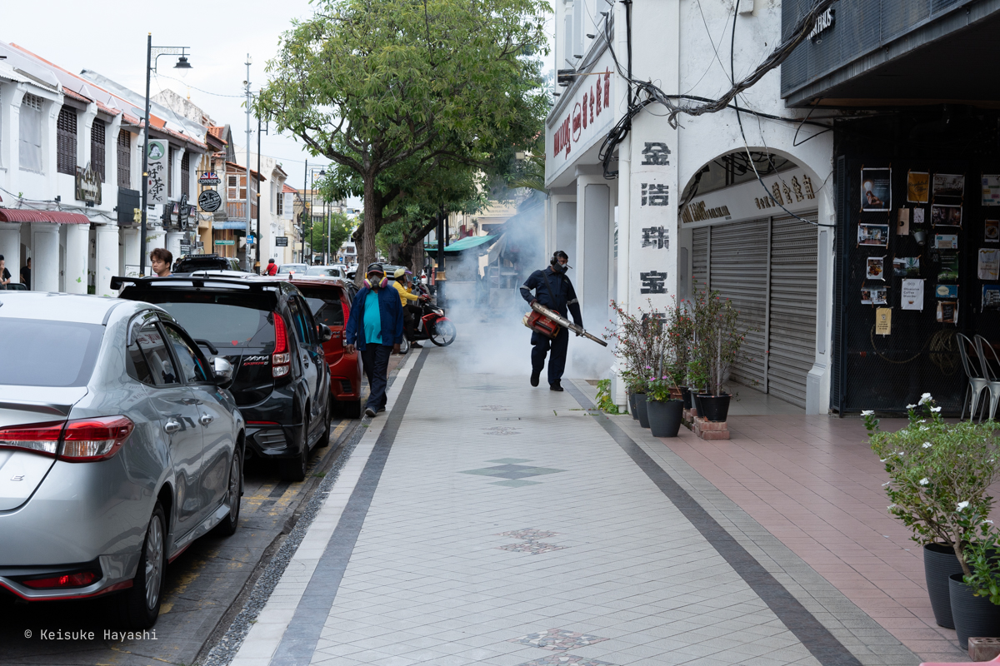

会社を辞めることが決まり、使い道のなかった有給休暇が1カ月ほど手元に転がり込んできた。
そこで思い立ったのがマレーシア旅行である。

時は5月上旬。
実はその時点では転職先は決まっていない。
つまり、無職になることが確定した状態での海外旅行である。
後に転職先が決まったから良いものの、当時の自分は経済観念というものを一時的に放棄していたらしい。

マレーシアについての予備知識はほぼゼロ。
時として無知が最高の調味料になることもある。
結果的にカオスで興味深い国だったので、この体験を記録に残すことにした。

## 旅程概要

7日間という限られた時間の中で、以下のような軌跡を描いた。

- 1日目: 深夜便で羽田空港からクアラルンプールへ。移動という名の修行
- 2日目: クアラルンプールからランカウイ島へ。リッツカールトンでのんびり
- 3日目: ランカウイ島からペナン島へ。屋台で庶民の味覚に触れる
- 4日目: ペナン島観光。要塞と点心と殺虫剤に包まれた一日
- 5日目: ペナン島からクアラルンプールへ。ツインタワーの噴水ショーという観光の王道を歩む
- 6日目: クアラルンプール観光。バトゥ洞窟で猿と対峙し、ブルーモスクで挫折を味わう
- 7日目: クアラルンプールから羽田空港へ。現実への帰還

## 1日目: 深夜便という試練

### 睡眠データが語る地獄

お金と時間を節約すべく、深夜便という魔の選択肢を選んだ。
勢いでチケットを購入したのは良いが、やはり深夜便は人間のバイオリズムを無視した拷問器具である。

Apple Watchが記録した睡眠データは目を覆いたくなるレベルだった。

- 睡眠時間: 3時間44分（1:58 - 6:40）
- 覚醒: 58分
- レム: 10分
- コア: 3時間34分
- 深い: 0分

体力が必要な海外旅行の初日にこの睡眠状況は、免疫力低下による全行程破綻のリスクを孕んでいる。
普段から短時間睡眠に慣れる訓練をしておくべきだったかもしれない。

### 格安航空の巧妙な商法

今回の旅行では5回の航空機移動をしたが、すべてAirAsiaを使った。
選択基準は単純明快、とにかく安いからである。

しかしこの「最安値」には見事な罠が仕掛けられていた。

預け手荷物がフライト料金に一切含まれていないのである。
羽田空港のチェックインカウンターでこの事実に気づいたため、すべてのフライトで追加料金を支払う羽目になったorz

この手法は航空業界に限らず、あらゆる業界で見られる現象だ。
消費者は常に警戒心を持って取引に臨む必要があるという、疲れる時代である。

## 2日目: ランカウイという名の楽園

### 東南アジアの洗礼

羽田を23:50に出発し、クアラルンプールに6:10着。
そのまま乗り継いでランカウイ島へ。
出発時間の9時35分まで、朝食を摂りながら時間を潰していた。

余談だが、クアラルンプール空港は成田空港の約10倍の広さを誇る巨大な施設である。
使う航空会社によっては乗り継ぎ時間を3時間以上空けないと危険らしい。
こんな重要情報を知らずにチケットを取った自分は、無知という幸運に守られていた。

クアラルンプールからランカウイまでは1時間5分のフライト。

ランカウイ空港に到着すると小雨が降っていた。
せっかくリゾート地に来たというのに、空模様は歓迎ムードではない。
しかし、この程度の雨で意気消沈するようでは、東南アジアを楽しむことはできない。

### リッツカールトン・ランカウイへ

荷物を預けるために、まだチェックインの時間ではないが、宿泊予定のリッツカールトンへタクシーで向かった。
約10分という近距離だが、東南アジアではお馴染みのGrabを利用した。
テクノロジーによって観光地でのボッタクリという古典的な儀式から解放されるのは、素晴らしい進歩である。

ホテルに着くとコンシェルジュと対話する機会があったため、観光について色々と相談してみた。
残念なことに、この時間になると雨が強まってきており、観光するには微妙な状況になっていた。

スカイブリッジに行くか迷っていたところ、コンシェルジュが電話で問い合わせてくれた。
結果は雨による臨時休業。
マレーシアの気候はちょうど雨季に入ったあたりなので、こうした自然の気まぐれは織り込み済みであるべきだったのかもしれない。
計画とは、自然の前では無力である。

とはいえ、このホテルはけっこう広い。
1日中滞在しても暇になることはなさそうだ。
気を取り直して、どこにも行かずにホテルステイを満喫することにした。
これを怠惰と呼ぶのか、それとも贅沢と称するのか。

### アルコールという逃避装置

とりあえずHorizon Lounge & Barでアルコールを注入する。
旅先での昼酒は、日常からの逃避を物理的に実感させてくれる装置である。

フレンチフライが絶品だった。
世界中どこでもフレンチフライは裏切らない。
ジャガイモと油と塩という単純な組み合わせが生む普遍的な美味さは、人類の偉大な発明の一つである。

13時を回ったころ、本来のチェックイン時刻である15時よりも早く部屋の準備ができたとの連絡。
こうした小さなサプライズが旅の満足度を格段に押し上げる。

ホテルの敷地は広大なので、バリの時と同様にカートに乗って移動する（[バリの旅行記も参照](/blog/posts/b1v00e8#h19j65y)）。

### 猿との邂逅

部屋はレインフォレストビューというタイプで、外の景色は熱帯雨林と海が広がっている。

バルコニーに猿が出現することがあるから注意するようにと言われていたが、雨の影響もあってか、チェックアウトまでにこの部屋で猿の姿を見ることはなかった。
正直なところ、猿を観察するためにこのホテルに来たようなものだから、ちょっと期待外れであった。

ペプシが冷蔵庫にカッコよく収納されていたのは、些細ながらも印象的だった。

### ついに猿との邂逅

仮眠をとってから外に出ると、雨は上がって晴れ間がのぞいていた。
そこで、昼食をとったHorizon Lounge & Barの隣にある大人専用インフィニティプールに向かった。

プールにはバーも併設されており、かなり良い雰囲気。
プールサイドの後ろにはジャングルが広がっているのだが、そこからガサガサと音がするので目を凝らしてみると、可愛らしい猿がこちらを見ていた。

見慣れない種類の猿である。
調べるとダスキールトン（シロマブタザル）という猿らしい。
残念ながら日本の動物園には存在しないそうだ。

### 海と伝統舞踊

18時からプライベートビーチで現地の伝統的な踊りが披露されるとのことで足を運んだ。

<video controls src="https://assets.kkhys.me/videos/2025-06-20/01.mp4" title="波音と打楽器が織りなす原始的な協奏曲" />

踊り自体にはさほど興味がないが、打楽器の音が心地よく、原始的リズムが疲れた神経を癒してくれる。
人間の脳は意外に古い記憶を保持しているのかもしれない。

### 実は今日が誕生日

夕食はThe Beach GrillでDining Beyondというプランを予約していた。
ビーチの上で夕陽を見ながら食事をできる面白いプランである。
雨が降ったら室内に案内されることになっていたので、晴れて本当に良かった。

メインテーブルとは別にビーズソファも用意されており、まずはそこでアルコールを摂取する。
そして、好きなタイミングで食事を開始できるシステム。

<video controls src="https://assets.kkhys.me/videos/2025-06-20/02.mp4" title="海の景色とシャンパン" />

料理の一部を紹介する。

偶然この日が誕生日だった。
異国でバースデーソングを歌われるという、気恥ずかしい体験をした。

本来であれば食後に焚き火を見ながらゆっくり過ごす予定だった。
ただ、昼過ぎまで雨が降っていたせいで羽虫が大量発生しており、日没後にライトの周りに集まってしまい、急遽テラス席に移動を余儀なくされたのが残念だった（一応火を付けて雰囲気だけ味合わせてもらった）。

## 3日目: ランカウイ島からペナン島へ

### 午前中はホテルステイを満喫

朝食はホテル内のLangkawi Kitchenで済ませた。
ジャングルに囲まれた空間で朝食を楽しむことができる。
ビュッフェだけではなく、アラカルトを注文できたのは良かったところ。

中にはかなり辛い料理も含まれているので注意が必要。
ただ、マレーシア料理を食べれて良かった。
ホテルのマレーシア料理は洗練されている。
どちらかというと、先にマレーシアの屋台や地元に根ざした店で食べてからホテルの料理を食べるほうが順序としては正しかったかも。

部屋に戻ってからは昨日飲みきれずに持ち帰ったワインをバルコニーで飲む。
あまりワインは詳しくないが、美味しかった。

アルコール摂取後、チェックアウト時刻の14時まで大人専用プールで過ごすことにした。
昨日とは打って変わって日差しが痛いくらい晴れていて、絶好のプール日和だった。
東南アジアの気候の変化は実に劇的である。

<video controls src="https://assets.kkhys.me/videos/2025-06-20/03.mp4" title="カメラを落とさないように気を遣って撮影" />

そんなこんなでのんびりしているとあっという間にチェックアウトの時間に。
荷物をまとめてGrabを呼んで、ランカウイ空港へと向かう。

### 美食の街、ペナンへ

次の目的地はペナン島。
ランカウイ16:15発、ペナン17:20着。
1時間足らずの短時間フライトである。

ペナンには知人がいるため、コンドミニアム宿泊と空港送迎をお願いした。
こういった部分で宿泊費が浮くのはありがたい。

ペナンは話に聞いていたが、渋滞がひどい。
到着することにはお腹が空いて夕食が待ち遠しかった。

夕食は [Red Garden](https://maps.app.goo.gl/YK93anVvYMCkTtG6A) というホーカーセンター（屋台が集合した施設）でとることにした。
ここでは席についていると、ドリンクの注文を取りにお店の人が来てくれる。
ただ、いくら待っても来ないので直接オーダーしたが。

また、面白いシステムとして、屋台で注文すると席に料理を届けてくれる。
支払いは席で行う。

マレーシアはタイガービールが有名らしく、どこの飲食店に行ってもほぼ必ず置いている（ギネスもよく置いてあるイメージ）。
味はスーパードライをさらに薄くしたような味。
それだけ聞くとあまり美味しくなさそうだが、なぜかマレーシアで飲むと美味しく感じる。
この暑さと相性が良いのだろう。

しかし、マレーシアでは、人口の約65％ がイスラム教徒。
つまり大半の人間がお酒を飲まないため、酒税はかなり高めに設定されている。
このタイガービールの大瓶も1つあたり21 RMだから、大体700円ぐらいする。
食べ物よりも全然高い。

サテー（マレーシア版焼き鳥）なども味わった。
ビールとの相性が良く美味だった。

## 4日目: ペナン観光

### 朝食はコピティアムで

朝食は [Pulau Tikus Wet Market](https://maps.app.goo.gl/DCp4pzuXAo42BAau5) 近くの [Swee Kong Coffee Shop](https://maps.app.goo.gl/MS9KDMiJdxAeVEP5A) という地元感満載のコピティアム（中国系のコーヒーショップ）で済ませた。

土鍋で作るペナン郷土料理のアポンマニス（パンケーキの一種）を目当てに来店したが、売り切れで食べられなかった。
代わりにチャークイティアオと豚まんを注文。
これがまた美味しかった。
さすが、ペナンは美食の街と言われるだけある。

Grabの運転手も言っていたが、マレーシアではペナンが一番食べ物が美味しいらしい。
ただ、海は汚いとのことw
観光地の魅力には大抵何かしらのトレードオフが存在する。

### 植民地時代の遺産

腹ごしらえも済んだところで、ペナン観光を開始する。
まずは18世紀のイギリス統治時代に作られた要塞である[コーンウォリス要塞](https://maps.app.goo.gl/ivbwnShjt3bsJd997)に行った。

敷地内は緑が綺麗に整備されており、海をバックにした砲台と灯台、弾薬庫はあまり他の場所では見られない光景だと思う。
しかし、見どころはそれぐらいで、歴史に興味がない人にとってはとても退屈な場所になり得るので注意。
また、ちょうど改修工事中だったらしく、施設の半分ぐらいしか見学できなかった。
入場料を半額にすべきである。

### カフェで昼食

コーンウォリス要塞から500mほど歩き、[Norm](https://maps.app.goo.gl/DoUZKaShTwNJABUXA) というカフェで昼食をとった。
倉庫のような外観をしており、ぱっと見では分からないので周りの人に着いていってたどり着くことができた。

店の真ん中に木が生えているようなお洒落な店内で、出された料理と酸味のあるコーヒーも美味しかった。
まるで日本にいるかのような感覚になる。
おすすめしたいけど、ある意味ではおすすめしたくない店。
グローバル化によってカフェ文化が世界中で均質化されている現象の一例である。

日中は34℃ ぐらいまで気温が上がり、結構疲れたので、この時点で一旦宿泊している部屋に戻って休憩した。
一年中この気候というのがすごい。
冬が恋しくなってくる。

### ストリートアートを見学

夕方になってから体力も回復したので出発。
ペナンはストリートアートが有名なので、ちょっとだけ回って見てみた。

単なる壁画ではなく、実物のオブジェクトと組み合わせているのが面白い。

これもオブジェクトと組み合わせた壁画。
ジョージタウンを歩いているだけで面白い壁画にいくつも遭遇したので、ただ散歩しているだけでも楽しい街。
アートによる都市の魅力向上は、観光政策の成功例の1つだと実感した。

### モスキート・フォギングという衝撃

そういうわけで当てもなくぶらぶら歩いていると横目に入った通りが一面真っ白だった。
何かの見間違いかと思って再度見ると、確かに真っ白な煙が火事ではないかと思うぐらいに一面に広がっている。
よく見ると防護服を着た人が煙を吹き出しながらこちらに向かってくる。

後々調べると、モスキート・フォギングというらしい。
デング熱を媒介する蚊を駆除にするために実施しているとのことだが、異様な光景だったので、今回の旅で最も興奮したかもしれない。
飲食店だろうが、雑貨屋だろうが、店の中に人がいても何事もなく噴射していて衝撃的だった。
日本では決して見られない光景。

なお、モスキート・フォギングは定期的に行われているが、デング熱に感染した人が発生した場所でも行われるそうなので、結構危ない状況だったのかも。

### 飲茶で小腹を満たす

そんなえげつない光景を見たが、夕方だしお腹が空いてきた。
そして、ジョージタウンには美味しいお店がたくさんある。
ということで、モスキート・フォギングの対象外となっているであろうエリアまで移動して、[大東酒楼](https://maps.app.goo.gl/LbT2kFZQ4rnv7rSM7)という点心が食べられる店に行った。

おばちゃんたちが蒸気を出し続ける点心が満載されたワゴンで巡回しているので、気に入ったものがあれば取ってもらい、注文用紙に印をつけて、最後に精算するシステム。

1つの点心の値段は大体200円ぐらい。
リーズナブルにいろんな種類の点心を楽しめる。
特にエッグタルトが美味しかったのでおすすめ。
この業務フローの効率性は見事なものである。

その後はペナン島屈指のショッピングモールである[ガーニープラザ](https://maps.app.goo.gl/dQ6vszTwNQAckZkz5)で地元の食材を見て楽しんだ。

### 1日の最後はホーカーセンター

そして、1日の最後はペナンでは最大級のホーカーセンターである[ガーニードライブ](https://maps.app.goo.gl/QtRfKBJzcJy7tFmG6)へ。
日本の祭りを思い出す雰囲気。
地元民で賑わっている。

テーブルに着席すると各テーブルに紐付けられた屋台の人が注文を取りに来るので、何かしらの注文が必要。
テーブルだけ借りることは不可能らしい。
合理的なシステムである。
国によって屋台のシステムが異なるのは興味深い。

ペナン式ホッケンミーを食す。
エビ出汁のピリ辛汁そば。
可もなく不可もない味。

4日目はこれで終了。

## 5日目: ペナン島からクアラルンプールへ

### 朝から点心

朝食は[富二代](https://maps.app.goo.gl/6NpXo4jTPC3V8TVB7)という点心の名店へ。
朝っぱらから点心を食べられるというのは、なかなかに贅沢な話である。
プリプリの海老餃子が口の中で踊る。

### クランジェッティーを歩く

腹ごしらえも済んだので水上集落（クランジェッティー）の見学に向かった。
同じ名字を持つ一族ごとに桟橋で生活していたらしく、今回は最大の規模を誇る[姓周橋](https://maps.app.goo.gl/sWnwFsNZKyNabRPs7)を訪問。

元々は土地を購入する十分なお金がなかった人々が住む場所として水上に作られたクランジェッティーだが、ジョージタウンがユネスコの世界遺産に登録されてからは観光客が集まる場所になったという面白い経緯がある。
そして、ここには現在でも実際に生活している人もいる。

派手な観光地よりも、こういう生活の匂いが残る場所の方が断然面白い。
民家を覗くと夕食の準備をしている人や、お祈りしている人が見える。

### ヒンドゥー寺院を見学

ペナン観光の最後に、リトルインディア地区の[スリマハマリアマン寺院へ](https://maps.app.goo.gl/1a7AnJhziDB2fnmR6)。
ペナン最古のヒンドゥー教寺院である。

内部に入るには靴を脱ぐ必要があるので、靴下持参をお勧めする。
あまり清潔とは言えない環境だからだ。
内部は撮影禁止であった。
地元の人が真剣にお祈りしており、独特の空気がある。

### クアラルンプールへの移動

ペナン観光は終了。

ペナン空港へ行き、再びクアラルンプール空港へ。
空港からクアラルンプール市内へはKLIA Express（電車）を利用した。
空いていて乗り心地も良かったのでタクシーを使うよりもおすすめ。
約30分ほどでKLセントラル駅に到着する。

そこからはタクシーで今回2泊する予定のウェスティン・クアラルンプールへ行った。
Grabは使わずに、KLセントラル駅のタクシーカウンターで配車してもらった。
定額制の先払いなので安心。

部屋はレジデンスタイプで、キッチンや書斎まで付いていた。
正直、旅にそれらの設備は使わないだろうから必要ない。
長期滞在者向けの部屋なのだろうが、そういう生活には憧れる。

夕食はクラブラウンジで済ませた。
屋台のローカルフードから一転、胃が安堵の溜息をついた。

夜はKLCC公園へ噴水ショーを見に行った。
ペトロナスツインタワーの目の前にある公園である。
ブキッ・ビンタン（ホテルがある場所の地名・日本の渋谷みたいな雰囲気）から屋根付きの長い歩道橋があって、それに沿って歩けば到着する。
約15分の道のり。

ショーは10分ほど。
音楽に合わせてカラフルな噴水が踊る。
派手で、観光客ウケしそうな内容である。

5日目、完了。

## 6日目: クアラルンプール観光

## バトゥ洞窟へ

朝食後、Grabを呼んでヒンドゥー教の聖地[バトゥ洞窟](https://maps.app.goo.gl/gQGWpTwZ9uqWR3bz5)へ向かった。

まず驚くのは大量の猿である。
それと同時に大量の鳩、大量の人間。
独特の匂いが辺り一面に漂う。
猿が人間から食べ物を奪い、それを追いかける人間、喧嘩する猿。
完全にカオスである。

目の前にそびえるカラフルな階段。
2018年8月に寺院側が無許可で塗り替えたらしい。
文化遺産をカラフルにするという発想は、日本人には理解し難い。
だが面白い。

思っていたより急勾配で、段数も多い（272段）。
蒸し暑さの中で登るには、それなりの体力が必要だ。

様々な国籍の老若男女が聖地の洞窟を目指して登っていく。
それを猿が見ている。
裸足で登る人もいる。
おそらくヒンドゥー教徒だろう。

階段を登り切った先の洞窟内の寺院は神秘的な雰囲気である。
4億年前の石灰岩でできた洞窟だという。
コウモリが多く、独特の匂いがする。

だが、とにかく暑くて汗が止まらない。
ここに長時間いるのは危険と判断し、すぐに階段を下った。

<video controls src="https://assets.kkhys.me/videos/2025-06-20/04.mp4" title="猿とともに階段を下る" />

この時点で1日分の体力を使ったかもしれない。

### 閉ざされたブルーモスク

それからは[スルタン・サラフディン・アブドゥル・アジズ・モスク（ブルーモスク）](https://maps.app.goo.gl/WLcW4zqnPX9SVzXLA)へ行った。
世界で4番目の規模を誇る巨大なモスクである。

ところが、非常に残念なことに、金曜日の午後は礼拝のため見学できないとのことであった。

旅は無計画が楽しいのは確かだが、こういう要所は押さえておくべきだった。
さすがにここまで鈍感にはなれない。

半分計画、半分無計画。
このバランスをどう調整すれば最も旅を充実させられるのか。

### ムルデカ広場へ

疲れていたのでGrabで移動しながら休憩。

[ムルデカ広場](https://maps.app.goo.gl/gQ3BmAocEu3HLK738)へ。
広場愛好家としては必ず行っておきたかった場所だ。

マレーシア国旗が初めて掲げられた歴史的な場所らしい。
ムルデカはマレー語で独立を意味する。

<video controls src="https://assets.kkhys.me/videos/2025-06-20/05.mp4" title="芝生は綺麗に整備されている" />

ただし、広場は芝生なので広場感がない。
むしろサッカー場のようだ。
やはり広場はコンクリートに限る。

雨の多い地域だから水はけを考えると芝生一択なのだろう。
実際、芝生はぬかるんでおり、サンダルが泥まみれになった。

### ベトナム料理を食す

ホテルに帰還後、夕食のため再び外出。
2日連続でクラブラウンジは芸がない。

ブキッ・ビンタン周辺を散策し、良さげな店を探すことにした。

<video controls src="https://assets.kkhys.me/videos/2025-06-20/06.mp4" title="クアラルンプール最大の屋台街アロー通り" />

歩いていると客引きに「アニキ！」とか「[ちょっと待って、ちょっと待って、お兄さん！](https://youtu.be/N4Z46GxZtd4?si=pERZDDQMUd0vUmd1)」などと、どこで覚えたのか分からない日本語で声をかけられる。
そもそも、よく日本人だと分かったものだ。

結局、[Sao Nam](https://maps.app.goo.gl/19XVBfAKxc2HnPXq5) というベトナム料理屋に行った。
ミシュランのビブグルマンにも選ばれている名店だという。
店内はベトナム戦争のプロパガンダポスターがたくさんあって、共産主義感があって良い雰囲気。

料理はどれも美味しかった。
全体的にヘルシーである。
1つ1つのボリュームがすごいので、大人数でシェアしながら食べると良いかもしれない。

### 旅の最後はマッサージ

1日の最後はマッサージで身体の疲れを癒す。
Sao Namのすぐ隣にある [Tropical Spa](https://maps.app.goo.gl/JEnRniFDCdoPtSjq7) へ。

60分のフットマッサージを受けた。
フットマッサージといってもほぼ全身のマッサージである。

身体が凝っているのか、めちゃくちゃ痛かった。
タイ式マッサージの要素も入っているため、身体をボキボキ鳴らされる。
人体のどこからあんな音が出ているのか不思議だ。

ふと思った。
マッサージは施術中の気持ち良さのために受けるのか、疲労回復のために受けるのか。
前者なら施術中に寝たらもったいないし、後者なら極論すれば全身麻酔でも良い。
まあ、考える必要もない。両方だ。

施術後は明らかに身体が軽くなったのを感じた。
辛いジンジャーティーが五臓六腑に染み渡る。

これにて6日目終了。

## 7日目（最終日）: 日本へ

最終日はどこにも行かず、ゆっくり起きて、ゆっくり朝食を摂り、ゆっくり帰国の準備をした。
帰国した今はもっと活動すれば良かったと思うが、その当時はかなり疲れていた。

帰りの便は14:30発。
GrabでKLセントラル駅に行き、行きと同様にKLIA Expressでクアラルンプール空港へ。
22:35に羽田空港着。
行きとは違って、機内で寝る必要がないのは気が楽だった。
Kindleで本を読んでいるとあっという間に日本だった。

搭乗した機体には座席にモニターが付いていなかったので、本やタブレットを持参しないと退屈な時間を過ごすことになる。
もっとも、モニターが付いていてもフライトマップしかつけないが。

## 後日談

バリの時もそうだったが、数日後に下痢が発生してしばらく続いた。
食中毒ならマレーシアにいる時になっていたはずだが、原因は不明である。
辛いものをたくさん食べたから胃腸が弱ったのか。
旅行中は問題ないにしても、帰国後の胃腸調整ルーティンを確立して同じことは避けたい。
