去年もデスク環境に関する記事を書いたが、あれからあっという間に 1 年が経過してしまった。

https://kkhys.me/blog/posts/b1v6tlh

当時は「これぞ完璧な作業空間」などと思い込んでいたが、引越しという現代の通過儀礼を経験してみると、案外そうでもなかった。
完璧だと思い込んでいたものの大半が、実は思い込みに過ぎなかったのである。
モノの本質を見極めたい人には、住所変更という強制リセットは案外有効だったりする。

実際にやってみると、驚くほど無駄なものに囲まれて生きていることがわかる。
そこで今回は、真に必要なものだけで構成した新しい作業環境について書き記していきたい。

## デスクの全体像

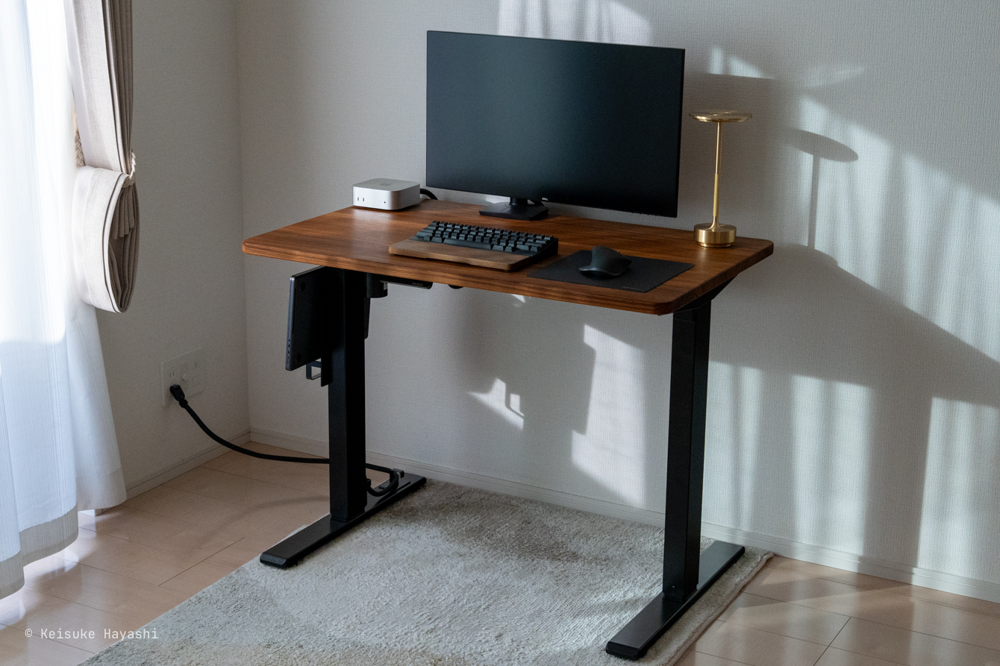

デスク環境を構築する際に心がけたのは、以下の 3 つの原則である。

1. 人力で運搬可能であること
2. 日常的に触れないアイテムは排除すること
3. 着脱可能なパーツのみで構成すること

1 については、総重量約 35kg という数値が示すとおり、日常的にトレーニングを行っている人であれば 1 人で移動させることが可能である。
テーブルの端を両手で掴めば持ち上がるので、部屋の配置換えや清掃時に重宝する。
何より、空間全体をコンパクトにまとめることで、部屋に圧迫感が生まれない。

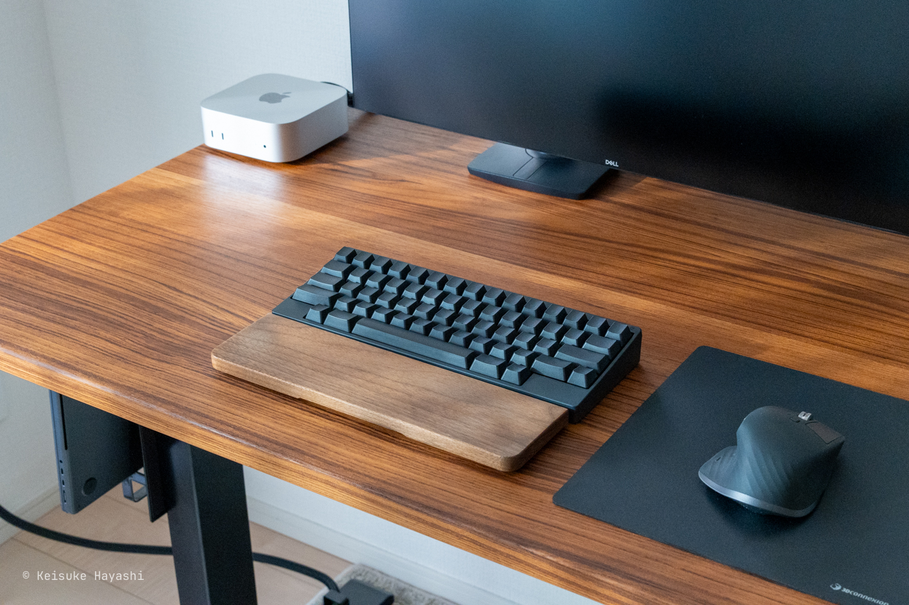

2 については、本当に必要なアイテムのみを配置することで、作業空間が整理され、集中力が向上する効果を狙っている。
デスク環境の構築にハマると、あれこれガジェットが欲しくなるものだが、実際に必要なものは意外と少ない。
不要なものに慣れてしまうと、その依存関係を断つのが面倒になってしまう。
あくまでも身軽に。
アイテムに支配されない生き方を目指したい。

3 については、着脱可能なアイテムを選ぶことで、別のものに交換しやすくなったり、メンテナンス性が向上する。
急な転居があっても問題ないし、必要に応じて即座に別の作業環境へ移行できる。

## 最低限必要なモノ

### 昇降デスク｜自作

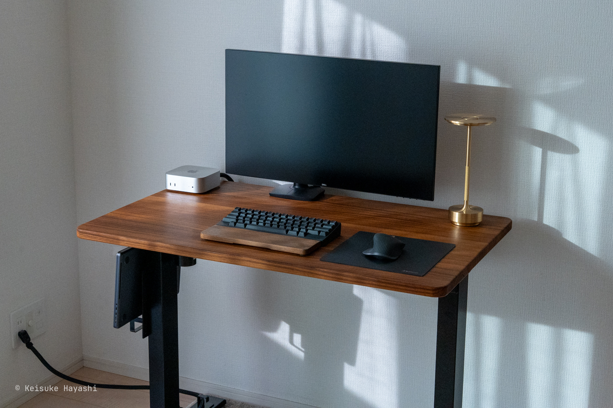

昇降デスクは昨年、転居を契機に新たに自作した。
その際の詳細な記録は以下にまとめてある。

https://kkhys.me/blog/posts/b1tnt9a

天板は[マルトクショップ](https://shop.woodworks-marutoku.com)でオーダーした、チーク無垢材である。
昇降デスクの脚は [Flexispot](https://www.flexispot.jp) の E7 というモデルを採用している。

やはり 1 日の大半を過ごす場所だからこそ、自分の手で組み立てるという行為には意味がある。
特に木材選びによって、作業空間の雰囲気は劇的に変わるので、こだわる価値がある。

そして、終日座り続けるという行為は、どう考えても身体に良いはずがない。
デスクワーカーにとって昇降機能は must だと考えている。
今は良くても、将来の自分が恐ろしい。

大体 70% 程度はスタンディングで作業している。
カーフレイズも混ぜながら（ステッパーを併用しても良いかもしれない）。

### 外部モニター｜Dell U2720QM

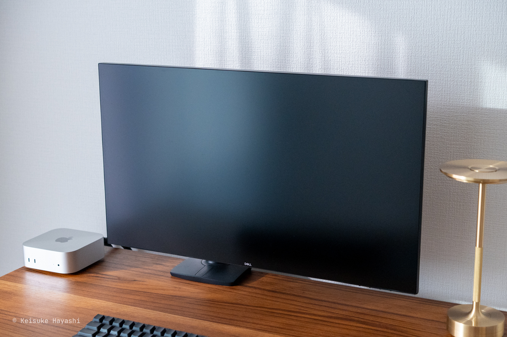

モニタは 2021 年から Dell の [U2720QM](https://amzn.to/4hY2gTm) を継続して使用している。
4K 解像度かつ 27 インチ、IPS パネル搭載で、プログラミング用途としては十分すぎる性能である。
特に不具合が発生しない限り、買い替える予定はない。
仮に買い替えるとしたら [IPS Black モデル](https://amzn.to/467dKS8)あたりだろうか。
最終的な憧れは [Apple Studio Display](https://amzn.to/3G20hAE) である。

昨年まではデュアルディスプレイ構成だったが、今年からシングル構成に変更した。
結局のところ、人間の身体構造上、同時に見られる画面は 1 つだけである。
複数画面を見る際に首や身体を動かす必要があるが、その動作の蓄積が身体の歪みを生む可能性があり、あまり好ましくないと判断した。
結果的にシングル構成にして困ることは一切なく、むしろ集中力は向上したと感じている。

### モニターアーム｜Ergotron MXV

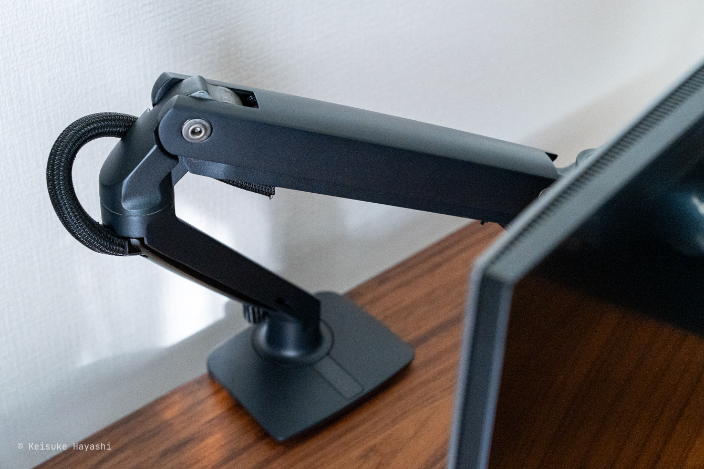

モニタアームも従来通り [Ergotron MXV](https://amzn.to/4i2rWOU) を使用している。
見た目だけのために Herman Miller の [Flo Monitor Arm](https://amzn.to/3ZHooLw) への買い替えを検討し続けているが、踏ん切りがつかずにいる。

### ワークチェア｜Herman Miller Sayl Chair

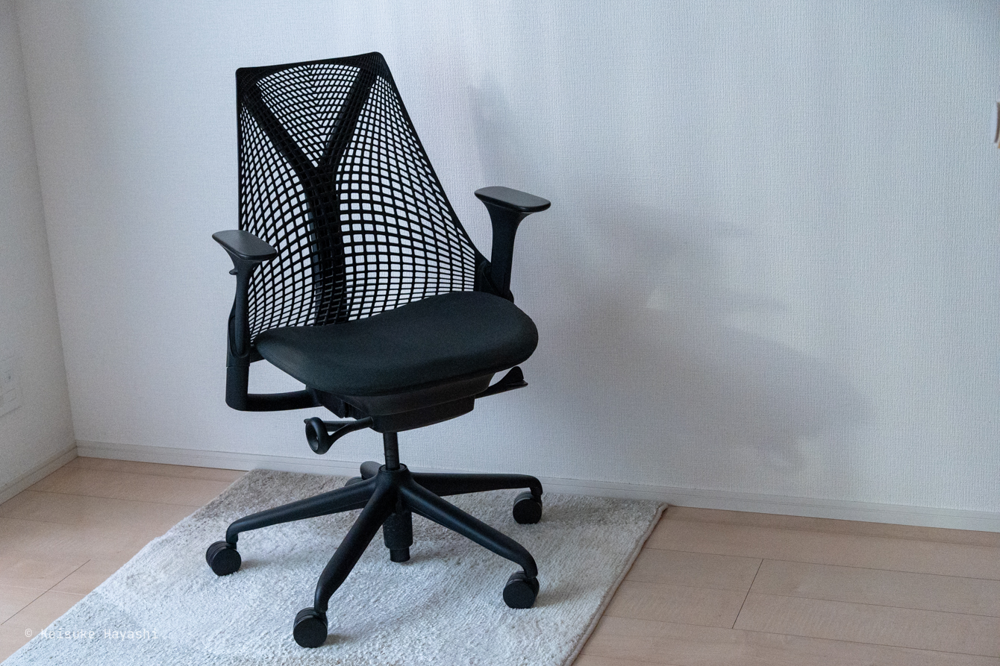

ワークチェアは Herman Miller の [Sayl Chair](https://amzn.to/4kSgI1s) を引き続き愛用している。
ただし、昨年頃から座っている時に腰部の不快感を覚えるようになった。

椅子の適合性の問題なのか、座り方に問題があるのか。
現在は新しい椅子の検討を進めているところである。
この椅子は実物に座らず、ネット上の画像のみで購入を決めたため、今度はきちんと店頭で試座してから購入したいと考えている。

### ラグ｜unico MOSTE

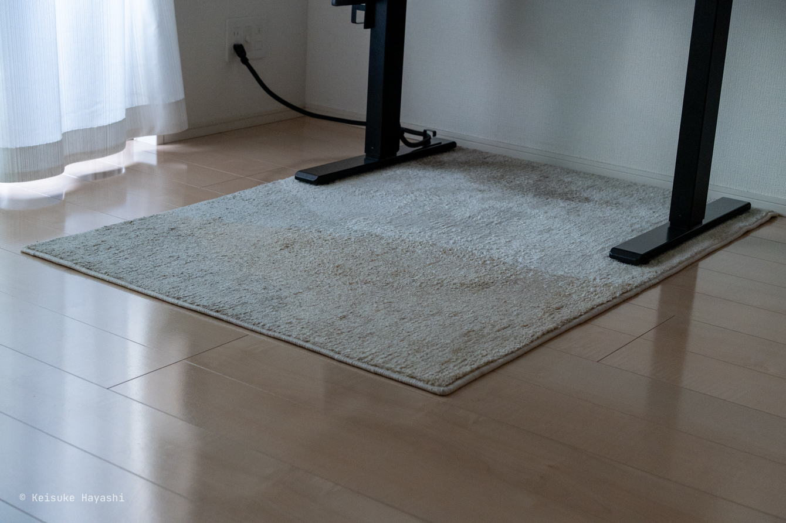

作業中は裸足で過ごすことが多いため、足元の快適性を重視してラグを敷いている。
ちなみに裸足で過ごすことで脳が活性化するという研究結果もあるので、裸足は推奨される（[ソース](https://journals.sagepub.com/doi/abs/10.1177/0031512516640391)）。

また、椅子のキャスターによる床面への損傷を防ぐ効果もある。

### キーボード｜HHKB Professional HYBRID Type-S

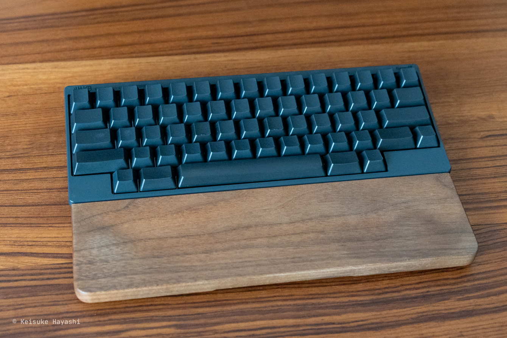

2021 年にエンジニアになって以来、[HHKB Professional HYBRID Type-S](https://amzn.to/4libqwN) を使い続けている。
最高の相棒と呼べる存在である。
[Studio](https://amzn.to/4lifptl) よりもシンプルなこちらの方が好みに合う。

バード電子製の[パームレスト](https://amzn.to/4cjO6e9)を併用している。

### マウス｜ Logicool MX Master 3s

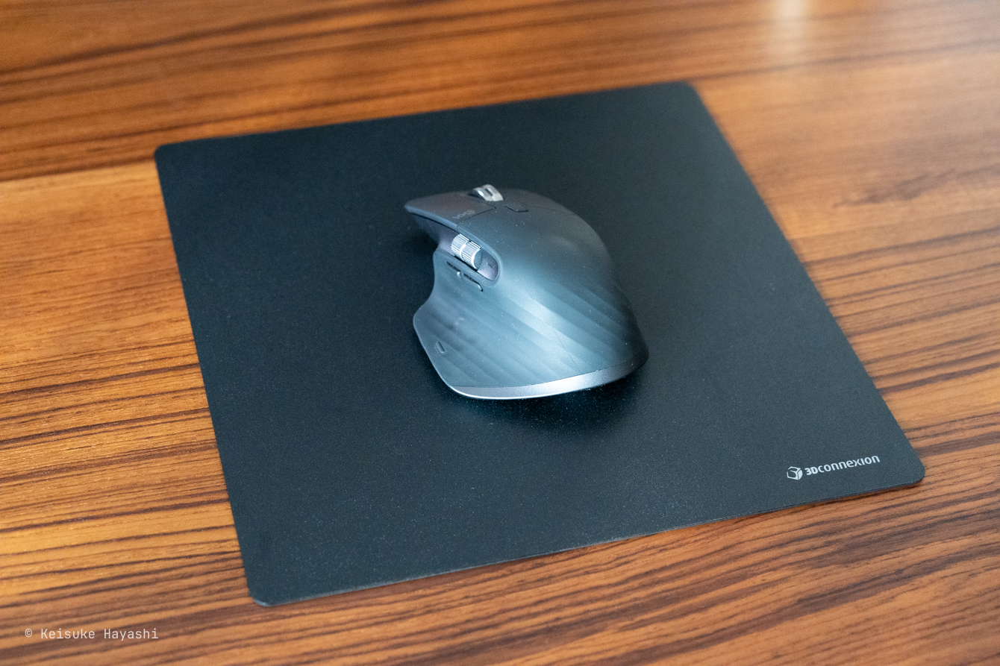

マウスは [MX Master 3s](https://amzn.to/4i6GHA6) を使用している。
エンジニアになって以来、MX Master 3 シリーズを愛用し続けている。
横スクロール機能と各ボタンへのアクション割り当て機能が気に入っている。

そして、マウスパッドは [3Dconnexion](https://amzn.to/4lhaY1N) 製のものを使用している。
これによってマウスの滑りが向上し、手首への負担が軽減される。

### デスクトップ PC｜Mac mini

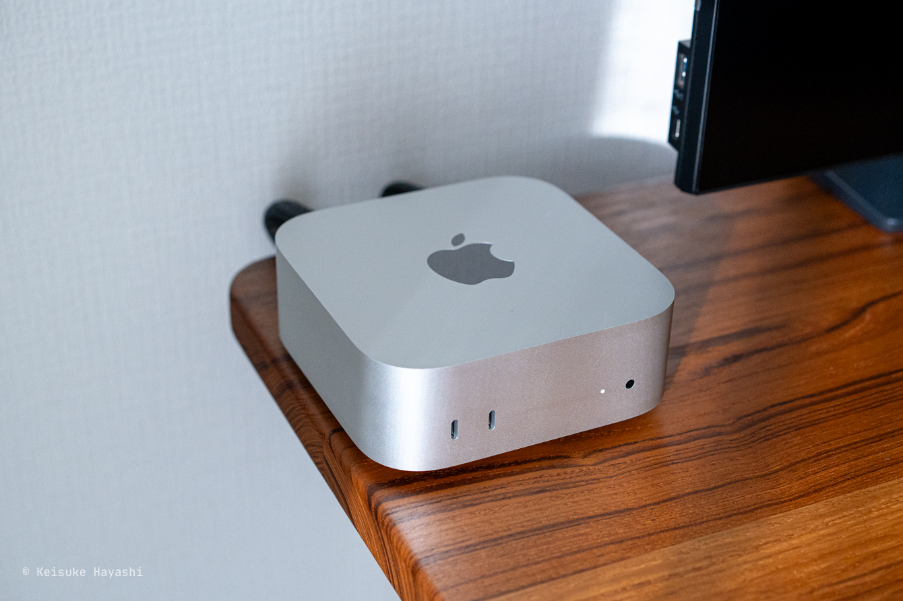

デスクトップ PC は巨大な自作 PC から [Mac mini](https://amzn.to/4ehsyzJ) に乗り換えた。
詳しくは以下の記事を参照。

https://kkhys.me/blog/posts/b1ppkfs

https://kkhys.me/blog/posts/b1r3zrr

デザインが映えるので、あえて机の上に置いている。
最近は Final Cut Pro を使った動画編集をするようになったのだが、動作はサクサクで何の問題もない。
プログラミングは言わずもがな。

### ノート PC｜MacBook M3 Pro

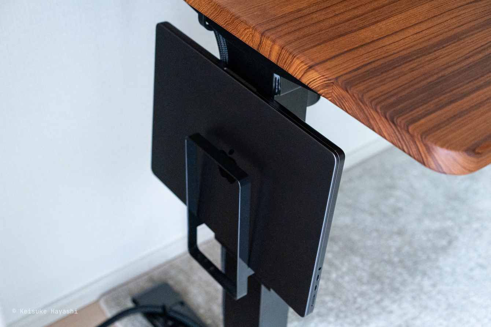

プライベートでは Mac mini を、仕事では MacBook を使用するという運用である。
ここで注目したいのは、デスク横のノート PC スタンドである。

本来の用途とは異なるが、[山崎実業のマグネットバスルーム風呂椅子ホルダー](https://amzn.to/3EaomnN)を使用。
強力なマグネットを昇降デスクの脚部に貼り付けている。
強い力を加えても剥がれることはなく（耐荷重 2kg）、必要に応じて簡単に取り外せるため重宝している。

## 配線整理に必要なモノ

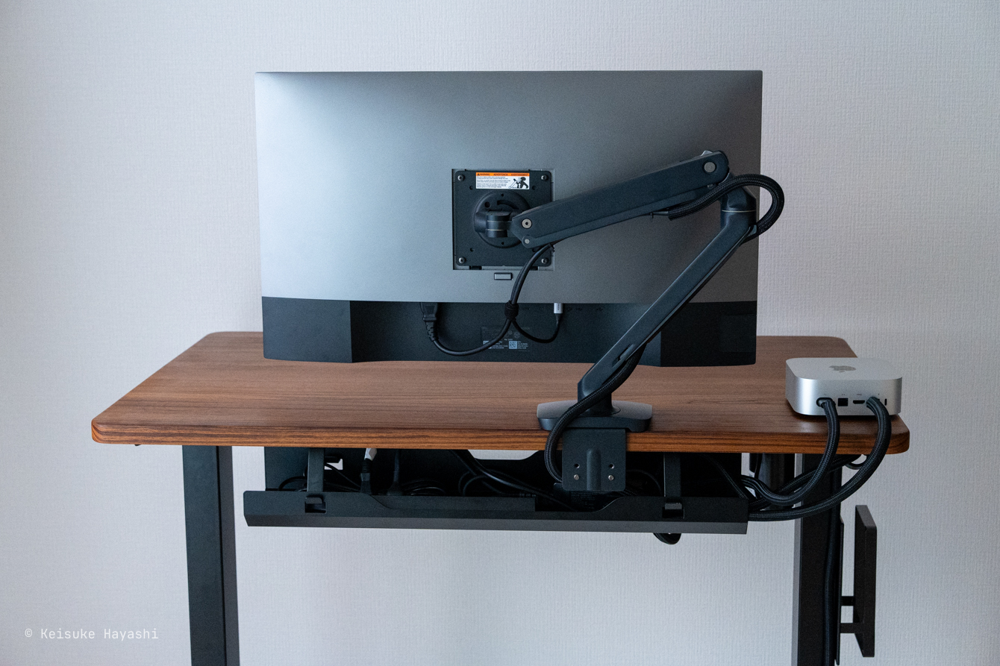

デスクの後方は壁面なので、配線を美しく整理する必要性は低い。
ただ、どのようにすれば美しく収まるかを試行錯誤すること自体が楽しく、気がつけば整理されていた。

### ケーブルトレー｜サンワダイレクト 200-CT001BK

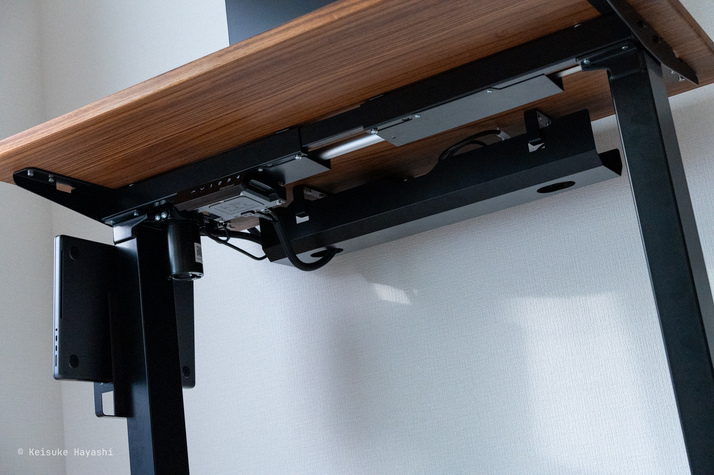

天板の裏面には[サンワダイレクトのケーブルトレー](https://amzn.to/42l1muu)を取り付けている。
メッシュ式やワイヤー式とは異なり、完全に遮蔽できる点が優れている。
取り外しも可能である。

### 電源タップ｜エレコム T-KM01-2620BK

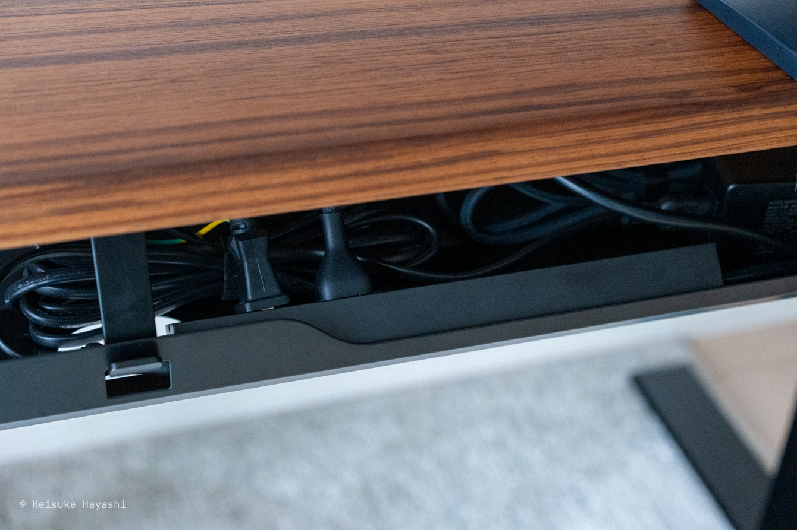

電源タップは[エレコム](https://amzn.to/3E4H6Fp)製を使用している。
スリムなデザインが魅力的である。
マグネット付きのため、ケーブルトレーに固定できる点も評価できる。

### ケーブルカバー｜PLUSDEN

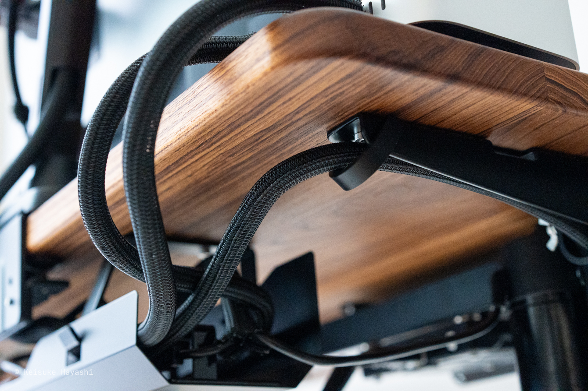

デスクから視認できる範囲のケーブルは全て[ケーブルカバー](https://amzn.to/4lgD10D)で覆うと、なぜか洗練された印象になる。
さらに[ミニクランプ](https://amzn.to/45AjrYF)でケーブルを隠すようにデスク内側に固定すると、よりスタイリッシュな印象になる。

## あると便利なモノ

### ポータブル照明｜Ambientec TURN

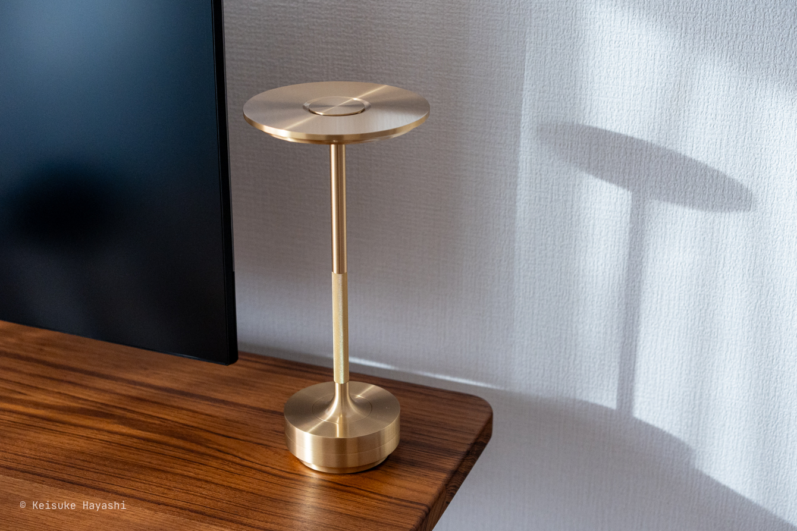

暗くなった際に手元を照らしたい場面がある。
そんな時に Ambientec の [TURN](https://ambientec.co.jp/products/turn-brass) という金属製の蝋燭で照明を確保する。
室内を完全に暗くして、この照明のみを頼りに Kindle で読書すると、極めて高い集中力を得られる。

### iPhone MagSafe マウント｜Belkin

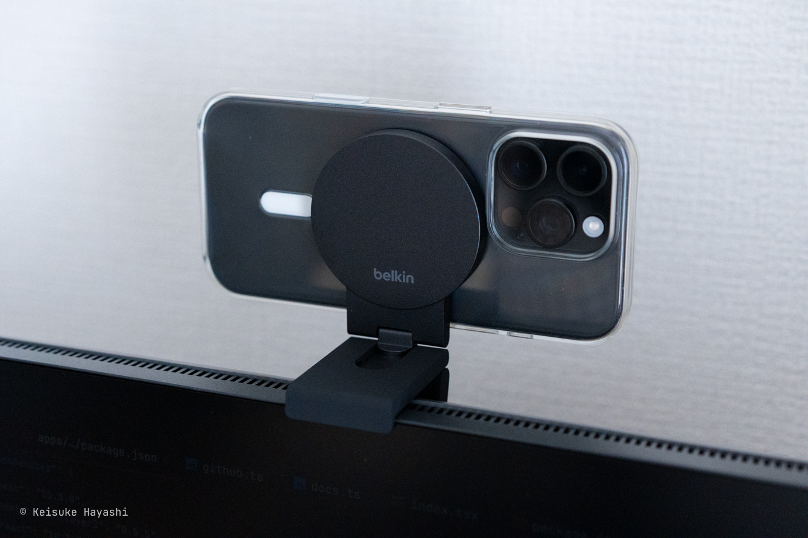

iPhone を所有していれば、わざわざ Web カメラを購入する必要はなく、iPhone が最高のカメラとして機能する。
その iPhone を固定するために Belkin の [MagSafe マウント](https://amzn.to/3T4daNC)を使用している。
折りたたみ可能なので、使用しない時は昇降デスクの脚部に貼り付けて保管している。

### コースター｜山崎実業

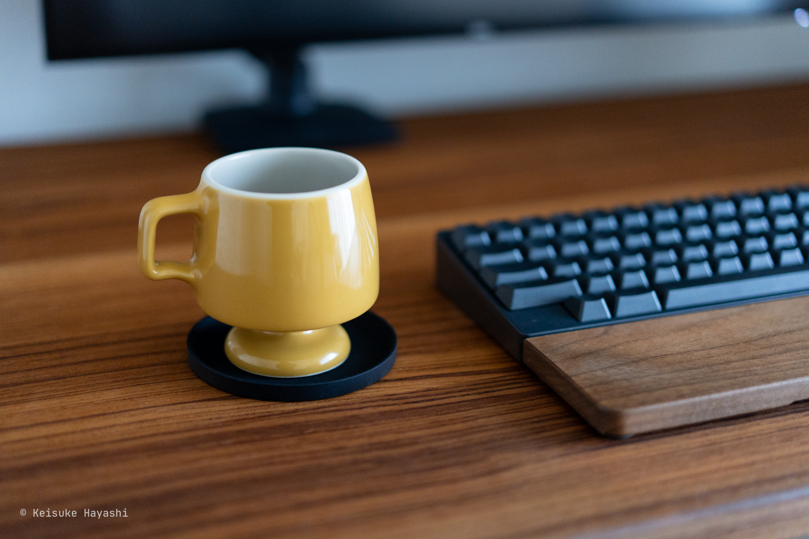

チーク無垢材に水滴が落下するとシミになってしまう。
オイルでメンテナンスすればシミはある程度除去できるが、除去不可能なほど濡れてしまうと不可逆的である。

そこで、コップを置く際は[山崎実業のコースター](https://amzn.to/4eejlZ3)の上に配置している。
ゴム製で趣はないが、滑りにくく、洗浄しやすいのが利点である。
ただし、より良いコースターを探索中なので、来年には変更されている可能性がある。

ちなみに、このマグカップは vanilla 家具の[ゴブレットマグ](https://vanilla-kagu.com/c/015original/gd7412)。

### 充電器｜Belkin Qi2 3-in-1 折りたたみ式充電パッド

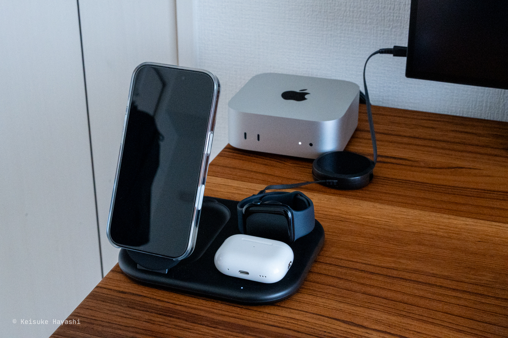

充電器は Belkin の [Qi2 3-in-1 折りたたみ式充電パッド](https://amzn.to/3G1AhW4) を使用している。
この充電器は旅行にもそのまま持参できるほどコンパクトな点が気に入っている。

背後に見える巻き取り式の Type-C ケーブルは[オウルテック](https://amzn.to/3HNx0KF)製である。

### 空気清浄機｜Dyson BP02 WS

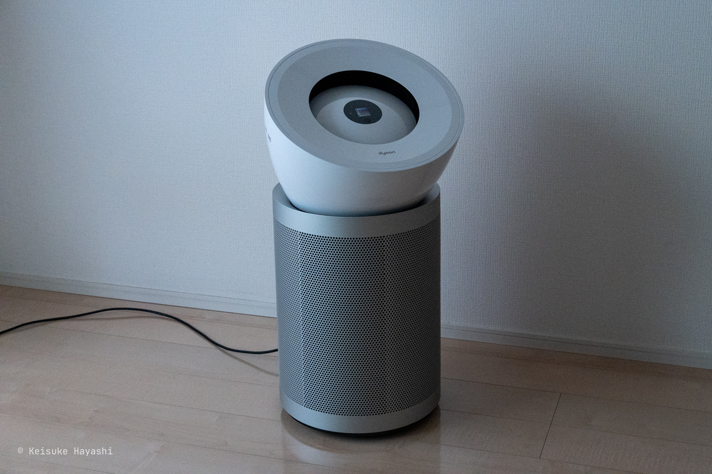

やはり作業を行う上では、空気の品質は見逃せない要素である。
良質な空気を吸入することが良好な集中力を生み出すことにつながる。
僕は花粉症持ちなので、特に花粉シーズンでは空気清浄機の有無で状況が全く異なる。

そこで、Dyson の [BP02 WS](https://amzn.to/4efOBGV)を使用している。
60 分で 79 畳分の空気を清浄する能力があり、明らかにオーバースペックだが、それが良い。

定期的な換気により CO2 濃度を下げることは重要だが、同時に室内の空気を循環させることも重要である（CO2 は空気より重いため、床付近に蓄積してしまう）。
良質な空気をたくさん吸入して、良質なアウトプットを生み出したい。

## さいごに

結局のところ、人間が本当に必要とするものは驚くほど少ない。
現代社会は無数の選択肢を提示してくるが、その大半は錯覚である。
真に価値のあるものを見極める能力こそが、現代人に求められる最重要スキルかもしれない。

この作業環境は、そんな現代版の茶室として機能している。
無駄を削ぎ落とし、本質だけを残す。
そこに美しさと機能性が生まれる。

来年もまた変化しているだろうが、それはそれで良い。
変化こそが唯一の不変である。
