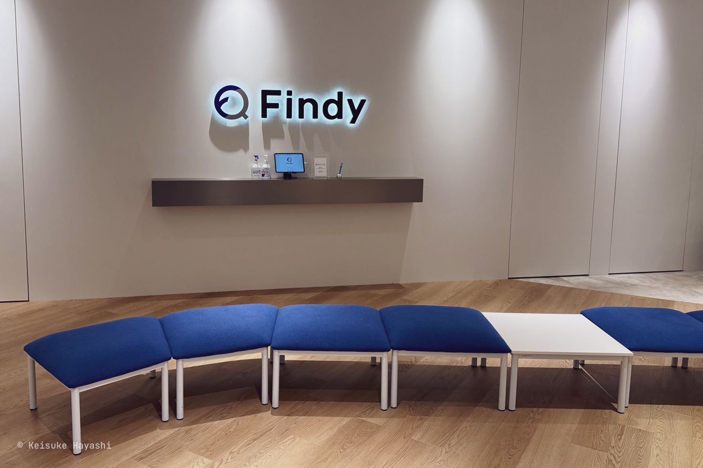
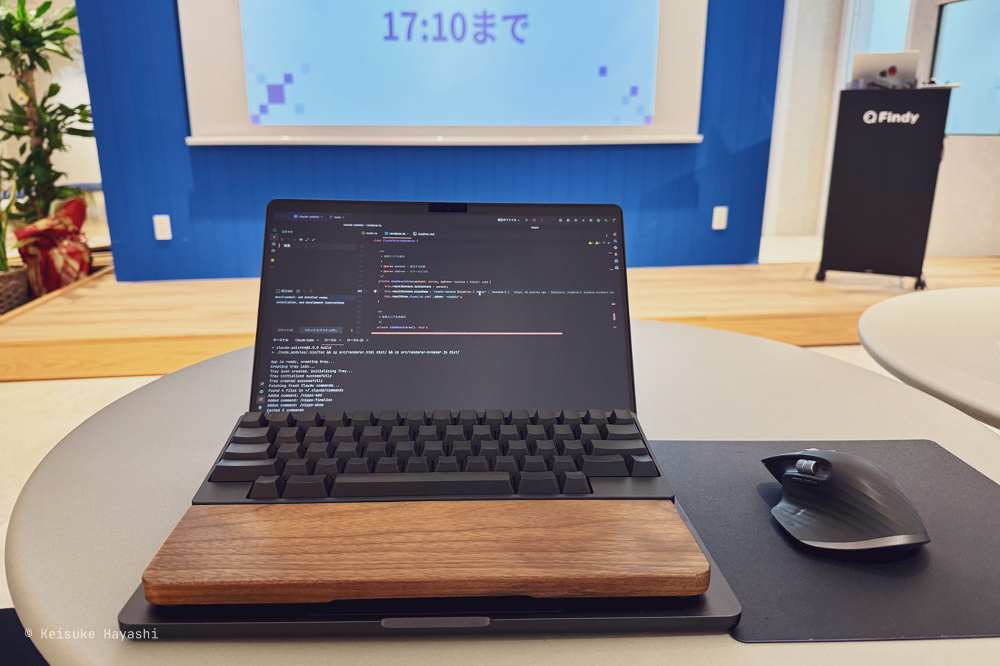
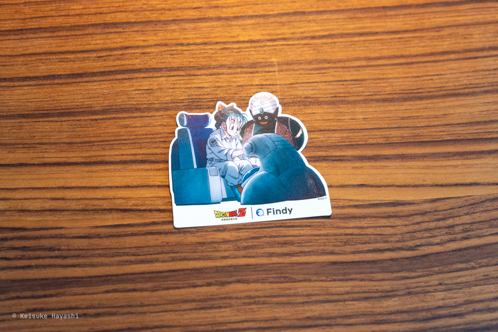

先日、初ハッカソンを体験してきたので、その時のメモをまとめてみようと思います。

## ハッカソンに参加するきっかけ

ハッカソン[^1]には今まで一度も参加したことがなくて、いつかは参加したいと思っていた。

[^1]: ハッカソン（Hackathon）は、「ハック（Hack）」と「マラソン（Marathon）」を組み合わせた造語で、短期間で集中的にソフトウェア開発やアイデア創出を行うイベントのこと。

そんなタイミングでちょうど [Connpass](https://connpass.com) にハッカソンの募集がされていたので申し込んでみたというのが参加のきっかけである。

参加したハッカソンは [ゆる VibeCoding ハッカソン](https://findy.connpass.com/event/360376) というタイトル通り、初めて参加するハッカソンとしては敷居が低そうだと感じたのも申し込むきっかけになった。

ところが、申し込み時点では既に定員 50 人に対して 60 番目の補欠という有様。
もう少し早く動くべきだったと反省していたら、開催当日にキャンセルが続出して繰り上がり当選となった。
こういうオフラインイベントでは当日の欠席者が一定数出るのが常らしい。
とりあえず申し込んでみることが大事かもしれない。

## 会場の Findy へ

主催者は [Findy](https://findy-code.io) という IT / Web エンジニア向け転職サービスを運営する会社である。
大崎のオフィス街にある。

事前に[オフィスへの行き方](https://careers.findy.co.jp/access/av-osaki)が共有されていたものの、迷子になってもおかしくない立地だった。
実際、この分かりにくさをネタにしてハッカソンのプロダクトを作った参加者もいたのは面白かった。

## ハッカソンのルール

オープニングではドラゴンボールのブルマを起用した [CM](https://www.youtube.com/watch?v=1GDmGaUI8-c) の紹介があったりした（ブルマを選ぶところにセンスを感じる）。
オフィスは相当に綺麗で、CM の放映まで始めるとは、Findy の勢いを感じずにはいられない。

で、早速ハッカソンが始まった訳だが、ルールはシンプル。

- Vibe Cording[^2] で 1 人 1 つのプロダクトを完成させる
- 制限時間は約 3 時間

[^2]: 人間が音声やテキストで自然言語による指示を出し、AI が主体となってコードを書く協働的なコーディング手法。
開発者と LLM（大規模言語モデル）がペアプログラマーのように会話形式でソフトウェアを作成する。

ハッカソンといえばチームで開発するものだと勝手に思い込んでいたので面食らった。
確かに、Vibe Cording でチーム開発となると最終的な統合作業を考えると現実的ではないのかもしれない。

それでも、周囲との会話は自由なので AI エージェントのことについて話したり、聞こえてくる議論は興味深いものがあった。

## 作ったもの

Claude Code の[カスタムスラッシュコマンド](https://docs.anthropic.com/ja/docs/claude-code/slash-commands#%E3%82%AB%E3%82%B9%E3%82%BF%E3%83%A0%E3%82%B9%E3%83%A9%E3%83%83%E3%82%B7%E3%83%A5%E3%82%B3%E3%83%9E%E3%83%B3%E3%83%89)を macOS メニューバーから実行できる [Electron](https://www.electronjs.org/ja) 製デスクトップアプリを制作した。
Electron は初体験である。

制作の動機は単純で、Claude Code をコーディング以外のちょっとしたタスク実行にも使いたいが、その度にターミナルに移動するのが煩わしいからである。
どこからでも実行可能なアプリがあれば便利だろうと考えた。

対象は `~/.claude/commands/*` に置かれた個人コマンドのみ。
カスタムスラッシュコマンド一覧を取得する公式な方法がないため、ファイルから動的に読み込んでいる。

使用例として、日々の日報作成がある。
以下の記事を参考に Claude Code に日報を作らせている。

https://syu-m-5151.hatenablog.com/entry/2025/06/26/220245

`/nippo-add` コマンド実行のためにターミナルに移動する時間を短縮できる。

日報以外にも Claude Code 経由で何らかの加工をしてメモを保存したい場合に活用できそうである。
制作したプロダクトのコードは以下のリポジトリにある。

https://github.com/kkhys/claude-palette

Claude Code はコーディングだけでなく、日常業務やプライベートにも活用できるというところまで伝えたかったが時間が足りなかった。
MCP と組み合わせればエンジニア以外にも活用の幅が広がるのは間違いないので、そのハードルを下げるプロダクトは今後登場するだろう。

開発途中で Claude Pro の使用上限に達してしまい焦った。
代わりに [Junie](https://www.jetbrains.com/ja-jp/junie) を使って開発を再開した。

このプロダクト自体が Claude Code を使用するため、最後にデモを見せられなかったのは残念だった。

## 他の人の作品

開発締切後、1 人 5 分程度の発表時間が設けられた。
特に印象的だった作品を記録しておく。

- QR コード読み取り + スマホを振る動作で、会場のスクリーンにリアルタイムで花火を打ち上げる参加型エンターテインメントアプリ（Supabase の Realtime API を使っていた）
- 物件写真を AI でリノベーションし、reveal slider で改装前後を比較できる不動産サイト向けアプリ
- CLI 上でバーチャル猫を育成・世話できる、ペット飼育シミュレーションアプリ
- 待ち時間・混雑状況を AI 分析し、ディズニーランドの最適回遊ルートを視覚的マップで提案するアプリ

上記以外も実際にリリースすればバズりそうなアイデアばかりで面白かった。
それをクオリティ高く仕上げているのを見て、感心するばかりである。

## 技術的に気になったこと

発表では制作プロセスや技術選定の方法について解説する参加者も多く、非常に参考になった。
気になった点や試してみたい技術は以下の通りである。

- Claude Code を活用している人が体感 8 割程度
- GitHub Copilot Coding Agent で Issue を複数立てて並列開発を進める手法
- Gemini Nano を使った AI 検索機能
- [Bolt](https://bolt.new) で UI を作成し、それを元にコーディングする方法
- Claude Code で `--resume` を使って特定のセッションを再開する（会話を分岐させる）技術
- t-wada 駆動開発（人名で開発方法を指定。例：Eric Evans の DDD）
- Gemini Cli の `/corgi` コマンド（イースターエッグ）
- AI エージェントにスライドを作らせる手法（[Marp](https://marp.app) や [Slidev](https://ja.sli.dev) などを使用）。シンプルに HTML でスライドを作るのも良さそう（JS でアニメーション制作可能）

## 個人的な反省点

- Claude Pro では全く足りない（使い方に改善の余地あり）。月額 $100 は高いが、Max プランへの加入を検討すべきか（ハッカソンには Max プランでも上限に達している人もいたが）
- Vibe Cording では待ち時間を作らないことが重要だと実感。そのために要件定義をしっかり詰める必要がある
- 要件を複数に分解し、並列処理で実行させる方法の習得は必須
- ハッカソンでは「映える」プロダクトの受けが良い。今回制作したプロダクトは地味すぎた
- 自己紹介スライドはどこでも使えるので用意しておくべき

## さいごに

発表と表彰式終了後はピザとお酒での懇親会があった。
ただし、時間が押していて 30 分程度しかなかったのは残念である。

Findy はクラフトビールも製造しており（[ファインディオリジナル IPA](https://design.findy.co.jp/projects/findy-original-ipa)）、早い者勝ちで飲むことができたが、争奪戦に敗れてしまった。
今度こそは開発生産性 IPA を飲みたいので、Findy のイベントがあれば、また参加しようと思う。
