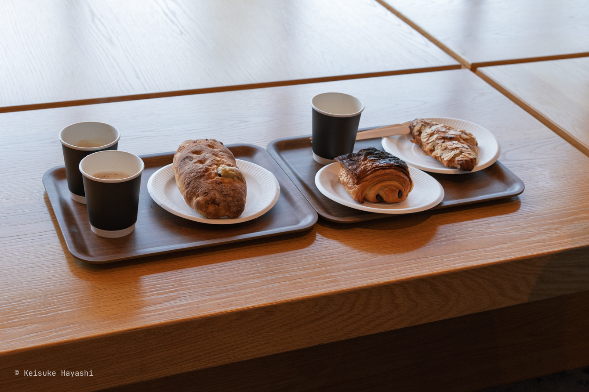

お盆休みがない代わりに、9月末までは自由に夏季休暇を数日取得できるタイプの会社に勤めている。
その制度を利用して、この酷暑から逃れるべく8月末に北海道に2泊3日で逃避していたのでその記録を残していく。

## 平日の羽田空港

休日の人が多い時間帯は避けたかったため、平日の早朝に羽田空港に向かった。
しかし、その目論見は外れ、電車や空港は結構な人で賑わっていた。
空港に行くのは土日休みのサラリーマンや学生というイメージがあったが、ビジネスマンや外国人旅行者はそれと同じぐらい平日も多い。

今回、旭川空港に向かう機体はボーイング [767-300ER（763）](https://www.jal.co.jp/jp/ja/aircraft/conf/763.html)。

7:50に出発して、9:25に旭川空港に到着。
定刻通り。

## 誰も知らないセブンスターの木

空港でレンタカーを借りて、まず向かったのはセブンスターの木。
天気はあまり良くない。空港では小雨が降っていたが、すぐに止んだ。

北海道に来るのは初めてだったが、運転していて目に付くのは道路脇の地面を指す矢印付きポールである。
「[固定式視線誘導柱](https://ja.wikipedia.org/wiki/%E7%9F%A2%E7%BE%BD%E6%A0%B9)」というのが正式名称らしい（矢羽根とも呼ばれる）。
雪が積もったときに路肩の境界を示すことが目的。
逆に、それだけ雪が積もって道がわからなくなる降雪量が怖い。

さて、話を戻すとセブンスターの木は1976年にセブンスターの観光たばこ[^1]のパッケージに採用されたことから、そう呼ばれるようになったらしい。

[^1]: タバコを吸わないから「観光たばこ」とは何ぞやと思って調べてみたら、記念行事などの際にパッケージに特別なデザインを施して、期間限定で販売されたたばこのことらしい（[ソース](https://www.tabashio.jp/exhibition/2022/2205may/index.html)）。
1993年に観光たばこは終了しているから、セブンスターの木といってもピンとこない人が多いかもしれない。そもそも、セブンスターの木が印刷されたパッケージをWeb検索で探してもヒットしないことから本当にパッケージとして採用されたのか疑っている

1本だけ木が立っているだけなのだが、バスが何台も停まれるような駐車場が整備されていて、北海道のスケールの大きさを感じた。

## 明日のパンを補充

この日宿泊するホテルは明日朝の朝食なしにしていたので、この段階でパンを購入しておくことにした。
訪れたのは美瑛町にある [bi.ble](https://bi-ble.jp)。
ベーカリーの他にフレンチレストランや宿泊施設も併設されている。

機会があればコース料理も食べてみたい（人気らしいので予約した方が良さそう）。

## そびえるケンとメリーの木

再び木を見に。
木にストーリーがあって観光名所になっているのは個人的にすごく面白いなと感じる。
この木がたくさんの木に囲まれて林や森の一部になっていたら、ここまで注目されることはなかっただろうに、人間社会にも投影可能な示唆を含んでいる。

さて、この木は「ケンとメリーの木」と呼ばれている。
1972年に放映されていた日産スカイラインのCMに登場するカップル「ケンとメリー」が名前の由来である（現在でもYouTubeで当時のCMを観れる）。

セブンスターの木はカシワで、ケンとメリーの木はポプラ。
どちらも良い。

## 観光客としてのランチ

昼食は [フェルム ラ・テール美瑛](https://www.laterre.com/fermebiei/)にて。
レストランに行くまで少し歩くが、途中の景色が素晴らしかった。
パン屋も併設されているので、パンを買ってベンチでゆっくり食べるのも良さそう。

本州ではあまり見ない蛾を見かけた。
クスサンというらしい。
日本全国に分布しているが、明らかに北海道に来てからは見る頻度が多い。
調べると今年は富良野地域で大量発生しているらしい。

昼間はまだ少ないが、夜になると道路の全ての電灯に数十匹が群がっていて驚くことになる。
特に道路工事のバルーンライトの周辺にはクスサンが山のように積もっていて、ある意味、今回の旅行で最も衝撃的だった。

さて、蛾の話からランチの話に戻そう。
ランチは基本的にコース料理しかない。
割と値段も張るので、観光客向けのメニューという印象。
メニューは季節によって変わるっぽいが、基本的にはビーフ、チキン、ポークの3種類のいずれかを選べる。

今回選んだのは「北海道産鶏のサルティンボッカ」のコース。

まずは自家製パンとクリーム、とうもろこしのスープが登場。

メインメニューのサルティンボッカ。
サルティンボッカとは仔牛肉・鶏肉・豚肉などに、生ハムとセージをのせて焼いたイタリア料理のことである。
肉はもちろん、個人的には野菜が美味しかった。

最後に食後のコーヒーとプリン。
このプリンは美瑛産のジャージー牛乳、北海道産の卵の黄身だけを使い、オーガニックシュガー、そしてバニラビーンズの4つの素材だけで作られているとのことで今も食べたいぐらい美味しかった。
今思えば売店で購入して、自宅に発送しても良かったかも。

## 2時間だけの旭山動物園

旭山動物園に到着したのは13:30。
16時にジンギスカンを予約していたので移動時間を含めると15:30までしか動物園を散策できない。
よって2時間を効率よく使って周る必要があった。

結論から言うと、旭川動物園はそこまで大きくないので一通りは周れた。
ただ、行動展示や飼育員さんが書いた蘊蓄などが面白かったので1日かけて周るプランでも全然良かったなと思っている（時間があればの話だけれど）。

個人的に一番好きな動物がカバなので、動物園に行ったら必ずカバを真っ先に観にいく。
旭川動物園には3匹のカバがいる。
お父さんの百吉、お母さんの旭子、その娘の凪子。

旭川動物園では約3 mの屋内水槽があり、水中のカバを見られるのがポイント。
屋内には旭子と凪子が延々と泳いでいた。
カバの泳ぎを間近で見られて感動。

旭川動物園では餌やり（もぐもぐタイム）のスケジュールがあらかじめ決められている。
また、飼育スタッフの解説の時間（なるほどガイド）も設けられているので調査した上で訪問した方が絶対楽しい。

他にもチンパンジーやヒグマ、オオカミなどの展示も動物本来の動きを確認できるような作りがされていて良かった。
全体的な特徴として、動物が本気を出せば逃げ出せるんじゃないかと思うような檻が多くて、チンパンジーのエリアはちょっと緊張感があった。

## 行列のできるジンギスカンの名店へ

16時からジンギスカンを食べに、旭川の[旭川成吉思汗 大黒屋（本店）](https://daikoku-jgs.com)へ。
「成吉思汗」でジンギスカンと読むらしい。
16時は夕食にしては早い時間だが、この時間しか空いてなかった。
それくらい人気のお店。

しかも、店に到着してから予約の人で行列ができていて驚いた。
予約しているならギリギリに行けば良いのではと思うが、それだけ早く食べたいのだろう。
ちなみに、店内はかなり広くて（2階もある）、行列の最後尾でもすんなりと入店できた。

メニューはどれもリーズナブル。
肉が分厚くカットされており、食べ応えがあった。
店員が間違えて持ってきたスイートブレッドをもったいないからと食べたのだが、食感がトロトロで独特の甘さがあって面白かった。

ちなみに、東京だと新橋や新宿駅東口にも店舗があるらしい。
せっかく旭川に来て食べたのだから、北海道の店舗の方が新鮮で美味しいと思いたい。
味を比べるためにも東京の大黒屋は行ってみたい。

## ホテルへ向けてひたすら運転

食後は宿泊先のホテル（[フェアフィールド・バイ・マリオット 北海道南富良野](https://www.marriott.com/ja/hotels/ctsfm-fairfield-hokkaido-minamifurano/overview)）に向けてひたすら道を南へ下る。
Google Mapsで見た限りでは、すぐに着きそうなのに実際は旭川から南富良野まで90kmほど離れていた。
北海道の地図は距離感がバグる。

90分運転してようやく到着。
走行した道路は信号が少なめで、常時高速道路に乗っているような感覚だった。
とにかく飛ばす車が多い。
それと前述したクスサンが大量発生しており、そのおかげで眠くならずに済んだ。

フェアフィールドらしく部屋やロビーは簡素な造り。
大浴場はないので、近くの温泉に行こうと考えていたが、調べると富良野周辺には全然温泉がないことがわかった。
頭の片隅に北海道は温泉が豊富に湧き出るイメージがこびりついていたが、実際は場所によるらしい。

## 2日目の朝

昨夜は外の様子が見えなかったが、朝になってみるとこんな感じ。
昨夜は雨が降ったのか、辺り一面が霧に包まれている。

ホテルのロビーにコーヒーメーカーやらトースターがあったので、昨日bi.bleで購入したパンを温めて朝食とした。
外にはテラス席があったのだが、あいにく小雨が降っていたため、室内で食べることに。

## 道の駅南ふらの

フェアフィールドは道の駅に併設されているという特徴がある。
なので、チェックアウト後は道の駅南ふらのへ。
併設繋がりで言うと、mont-bellも道の駅に併設されていることが多い気がする。

道の駅に入ると熊の剥製がお出迎え。
ヒグマとツキノワグマの剥製である。
体の大きさはもちろんだが、鋭い爪や牙を見ると闘ったら絶対に敵わない相手だなと改めて思った。

## 熊を警戒しつつダム湖を散策

近くに巨大なダム湖があるとのことなので寄ってみた。
かなやま湖というらしい。
ダム湖と言われなければ気づかないぐらい自然に溶け込んでいる。
キャンプ地としても有名らしく、実際小雨が降る中でも数組のキャンパーがテントを張っていた。

ただ、先ほど道の駅で見たように、熊の出没情報が出ている中でキャンプをする勇気はまだ僕にはない（FYR: [熊出没情報](https://www.town.minamifurano.hokkaido.jp/kurashi-info/bear)）。
キャンプをする以前に、散策するだけでも周りに熊がいないかが気になって少し怖かった。
ちなみに、冬は湖が凍結するらしく、ワカサギ釣りを湖上で楽しむことができる。

## 受付番号をもらえるレストラン

富良野周辺はとにかく観光客が多い。
道行く車は「わ」ナンバーばかりだし、レストランに行くと大体どこも満員で行列待ち。
列に並んで待っている時間ほど無駄なものはないと思っているので、待ちながらでも時間を潰せるところが良いということで [富良野チーズ工房](http://www.furano-cheese.jp)へ。

ピッツァ工房でピザを注文すると40分待ちとのこと。
その間はチーズ工房でお土産を購入して発送手続きまで済ませたり、チーズに関する展示を見たりしていた。
すると放送で受付番号が呼ばれていたのでピザを受け取った。

注文したのは「ふらのチーズスペシャル」というチーズ工房オリジナルのチーズとマッシュルームが散りばめられたピザ。
北海道民のソウルドリンクとして知られるガラナと共に。

## 牛と電気柵

放牧されている牛を見たかったので [美瑛放牧酪農場](https://biei-farm.co.jp)へ。
タイミングによっては放牧される牛の行進を見ることができるこの牧場。
あいにく、牛たちは放牧を終えたのか、これから行くのかは分からないが、こちらを見つつずっと待機している。
隣の牛が堂々と糞尿を垂れ流しても微動だにしない牛に姿に思うところがあった。

丘へと登っていく。周囲には電気柵が張り巡らされている。
小さい頃に近所の牧場で感電した思い出が蘇る。
電気柵は感電して初めてその恐ろしさがわかるから、牛たちも一度は感電しているはず。
実際、電気を知らない牛に対しては電気柵を覚えさせるトレーニングがされているらしい（FYR: [電気柵について](https://farmage.co.jp/products/electric-fence)）。

丘の頂上まで行くと、遠くの方に放牧されている牛を見れた。
途中に電気柵があるので隣の牧場の牛だろうか。
こんな大自然の中で暮らせる牛は牛界の中で最も幸せな部類かもしれない。
そりゃ美味しい牛乳が採れるなと。

## 花というより異質な絵画

北海道に来たならスケールの大きい花畑を見たかった。
そこで[四季彩の丘](https://www.shikisainooka.jp)に行くことに。

風景に溶け込んでしまうような花の集合体はなんとも異質だった。
花というよりも目の前の景色がペンキで塗られたような感じ。
自然界ではこのように規則正しく花が咲き誇ることはないので、天然有機化合物と人工物が混ざり合ったような違和感を楽しめた。

## 車をジェットコースターとして

さて、今日の観光はこれくらいにしてホテルに向かうのだが、途中に[ジェットコースターの路](https://www.visit-hokkaido.jp/spot/detail_10167.html)と呼ばれる観光名所があるので寄ってみた。
望遠レンズの圧縮効果でジェットコースターのような上り坂が撮影できるポイントである。
北海道はとにかく直線道路が長いのが特徴だが、坂がある地域でも綺麗な直線になるのが面白い。

## スープカレーを求めた末に

北海道にせっかく来たので現地のスープカレーを食べたいと思い、[カレーのふらのや](https://tabelog.com/hokkaido/A0104/A010403/1016743)へ。
意気揚々と乗り込んでみたものの、店のドアには完売の看板がぶら下がっていた。

仕方なく、他の店舗を探す。
カレーの口になっていたので、良さげなカレー店を探していると[唯我独尊](https://tabelog.com/hokkaido/A0104/A010403/1000063)が目に留まった。
かなりの人気店らしいが、到着したのが20時ごろだったため、すんなりと入店できた。

北海道にスープカレーを食べに来たのに、結果的に都会のこだわり系カレー屋が裸足で逃げ出すような独特なカレー屋に来てしまった。

まずはビール。
富良野地麦酒のペールエールを注文したのだが、あいにく売り切れていた。
ビールはピルスナーしかないらしく、「それで」と注文。

注文したカレーはこちら。
ベーシックな自家製ソーセージカレーである。
ご飯はねっとりしている。
カレールーはスパイスが効いていて辛めで美味しい。
肉肉しいソーセージもビールとの相性が抜群だった。
というか、カレーとビールってよく合うよなあ。

ちなみに、ルーのおかわりはご飯があるかぎり無料というルール。
ご飯（ナン）のおかわり無料はよく見るけど、ルーのおかわりし放題はなかなか珍しい（だが、最近は米の値段も高いのでご飯のおかわり無料は廃れていきそう）。

スープカレーは食べられなかったけど、唯一無二のカレーを食べれてスープカレーのことは忘れてしまっていた。

## スキー場の目の前のホテルへ

今晩泊まるホテルは[フェニックスウエスト](https://www.fenixwestbookings.com)。
外資系のホテルらしく、電話でいろいろ問い合わせても日本語が話せるスタッフがおらず英語で応対しないといけなかった。
地方のホテルでは外国人のスタッフが増えたなあと改めて思った。

このホテルだが、富良野スキー場の目の前にある。
スキーの季節であれば最高のロケーションだろう。

そういった背景もあり、長期滞在する人向けなのかキッチンが完備されており、自炊erには嬉しい環境。
もちろん、大浴場はない。

## 最終日のスタート

次の日の朝。あたりが明るくなったのでカーテンを開けるとスキー場の全景が露わに。
スキー場でキャンプができる特別な日だったらしく、テントが複数建っていた。

コンビニのおにぎりを頬張って出発。

## 地図にはない場所

マルセイバターサンドで知られるお菓子メーカー六花亭。
その店舗兼カフェがある[カンパーナ六花亭](https://www.rokkatei.co.jp/facilities/%E3%82%AB%E3%83%B3%E3%83%91%E3%83%BC%E3%83%8A%E5%85%AD%E8%8A%B1%E4%BA%AD-5)に行く途中に、一際目を引くひまわり畑を見つけたので寄ってみた。
地図には載っていない知る人ぞ知るひまわり畑。

ひまわりの花は太陽を追いかけると聞いたことがあるけど、それは間違いらしい（[ソース](https://biome.co.jp/biome_blog_129)）。
実は東を向いていることが多いとのこと。
太陽を追いかける方がロマンチックに思えるけど、それは勝手に人間が後付けで決めたことなのだろう。

## お土産の聖地

ひまわり畑からすぐ近くにカンパーナ六花亭がある。
建物の周りにはブドウがたくさん実っていた。
採れたてのブドウも販売されていた。
このブドウを使ったワインも売られており、六花亭がブドウに注力しているのは意外な感じを受けた。

富良野盆地を眺めながら六花亭のお菓子を食べることができる。
バターサンドぐらいしか知らなかったけど、見たことのないお菓子が勢揃いで、お土産を買うには良いスポットだと思う。

## 不思議な青い池

観光地として大人気の青い池へ。
入ったら死んでしまいそうな、体に悪そうな青い色なのはなぜ。
それは、温泉から流れ出たアルミニウムなどの成分を含んだ水が川の水と混ざり合うことでコロイド（微粒子）を生み出し、それが太陽光に反射することで光が散乱しているからである。

意外と青い池の規模は小さく、少し歩いただけで見終わってしまった。
駐車場のキャパは大きいのでひっきりなしに観光客が訪れて帰っていくという回転の良さ。

ちなみにIT関係者であれば知っている人も多いと思うが、2012年にmacOSの壁紙の1つに青い池が採用されたことで世界的に有名になったらしく、それまでは知る人ぞ知るスポットだったそうだ（FYR: [その壁紙](https://500px.com/photo/8667352/blue-pond-the-wallpaper-for-apple-inc.-by-kent-shiraishi)）。

## 近くの道の駅で昼食

北海道最後の食事は青い池の近くにある[道の駅 びえい｢白金ビルケ｣](https://hokkaido-michinoeki.jp/michinoeki/16028)で済ますことに。
ハンバーガーは野菜が新鮮で美味しかった。
美瑛で採れた野菜が使われているそうだ。

## 帰路に就く

旭川空港へ行く途中に再びbi.bleに寄って明日東京で食べるパンを補充。
明日の朝に北海道を思い出すためのトリガー。
最後に親子の木を目に焼き付けて帰った。

## さいごに

夏の北海道はとにかく快適だった。
最高気温は20度ほどしかなく、東京は40度近くだったため、倍近く違うことになる。

これではクーラーがないと過ごせないようなところに住み続けているのがバカバカしく感じてしまう。
逆にいえば、北海道の冬は暖房がないと生きていけないだろうけど。

つまりは、夏は北海道などの避暑地に、冬は南国などの避寒地に住めるぐらいの財力と時間的余裕とフットワークの軽さがあればなあと思った北海道旅行だった。
