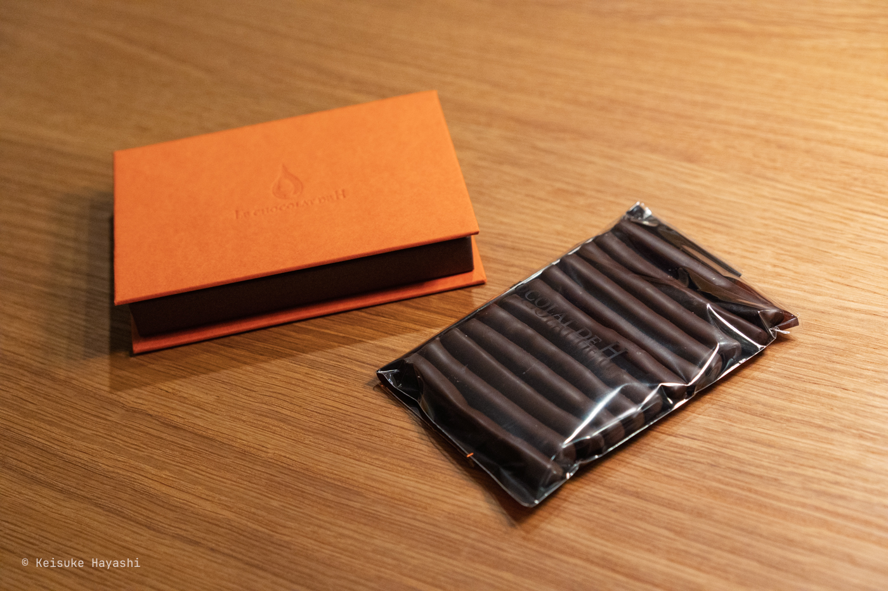
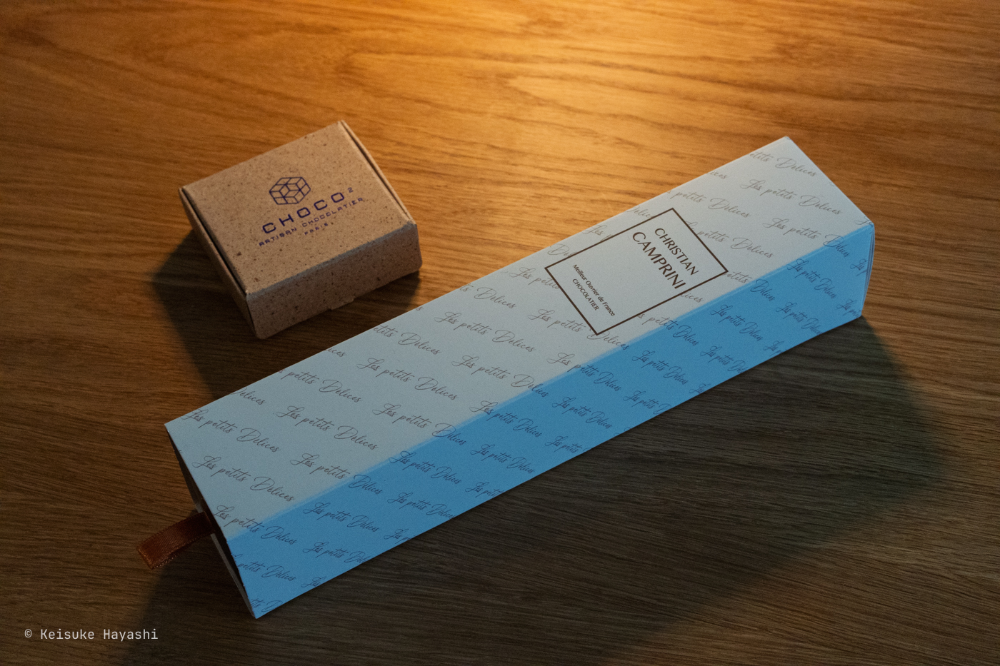
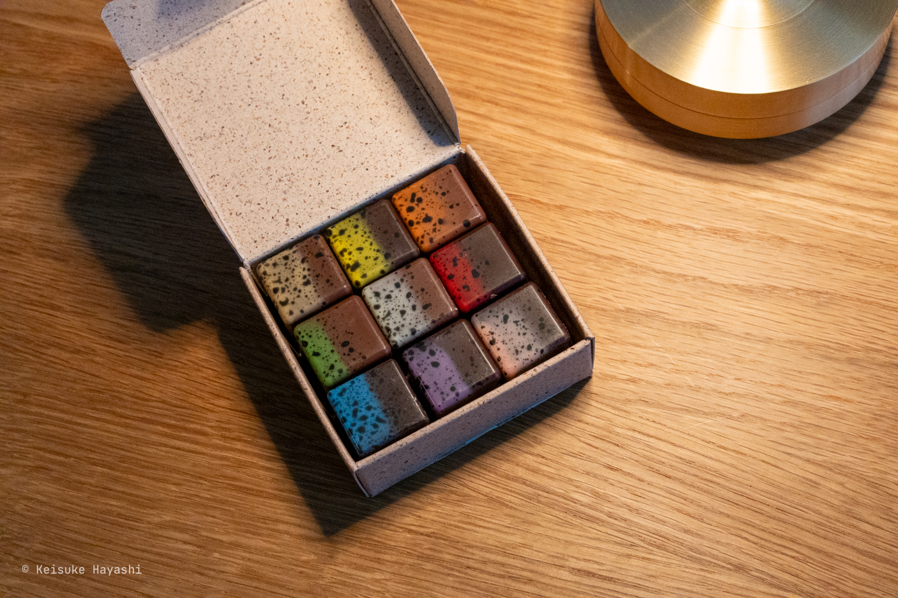

今年もありがたいことにチョコレートをもらった。

- [バレンタインデー2025](/blog/posts/b1x6nt3)
- [バレンタインデー2024](/blog/posts/b18vcqd)

チョコレートは前提となる情報がある状態とない状態では感じる味も全く変わってくる。
まずは何の情報もない状態で食べた後に、そのチョコレートの背景情報を調べると二度楽しめる。

まずは[LE CHOCOLAT DE H](https://www.lcdh.jp)のオランジェット。
オランジェットとは、砂糖漬けにした柑橘類の皮を、チョコレートでコーティングしたフランス発祥の伝統的なお菓子のこと。

カカオは70%で甘さは控えめ。オレンジピールが少し苦くて後味爽やか。

それにしても、昔はあんなにたくさん食べられたチョコレートも、今では少しずつしか食べられない。

続いて[Christian Camprini](https://christiancamprini.fr)のサブレキャラメルカフェ。
箱の中が仕切られており、ダークチョコレートとミルクチョコレートが交互に置かれている。

Christian Campriniという人は2004年にM.O.F.（国家最優秀職人章）を取得している。
日本で言うとM.O.F.は人間国宝に相当するほどすごいことらしい。

そして、M.O.F.を取得した者のみがコックコートの襟にトリコロールカラーを使用できると、法律で認められているそう。
確かに、サロン・デュ・ショコラに来ているパティシエの中にはトリコロールカラーの白い服を着ている人がたまにいるけど、そういうことだったのか。

チョコレートに話を戻すと、サブレとのことだが想像していたサブレとは全く違う食感。
ザクザクというよりもシャリシャリしている。
キャラメルクリームは滑らかな舌触りなので両者の差分が面白い。

ここ数年、いろんなチョコレートを食べてきたけどトップレベルに好きかもしれない。

最後は去年も食べた[CHOCO 2](https://choco-au-carre.fr)のショコラアソート。
まず見た目がルービックキューブみたいで可愛い。

そして、毎回のことだが、どの色がどの味なのかをネット上で探すのが大変。

| 色 | テイスト |
| --- | --- |
| ブラウン | 2種のゴマのプラリネ |
| イエロー | トウモロコシのプラリネ |
| オレンジ | カシューナッツのプラリネ |
| グリーン | マルチシリアルのプラリネ |
| ホワイト | コーヒーとヘーゼルナッツのプラリネ |
| レッド | アーモンドのプラリネ |
| ブルー | バニラとピーカンナッツのプラリネ |
| パープル | コリアンダーとヘーゼルナッツのプラリネ |
| ピンク | ライスパフとアーモンドのプラリネ |

いずれもプラリネ。
CHOCO 2はカカオに合わない食材はないのではと思わせてくれるような気づきを与えてくれる。
正方形のチョコレートというシステムも面白い。

来年もチョコレートをもらえるように頑張りたい。
