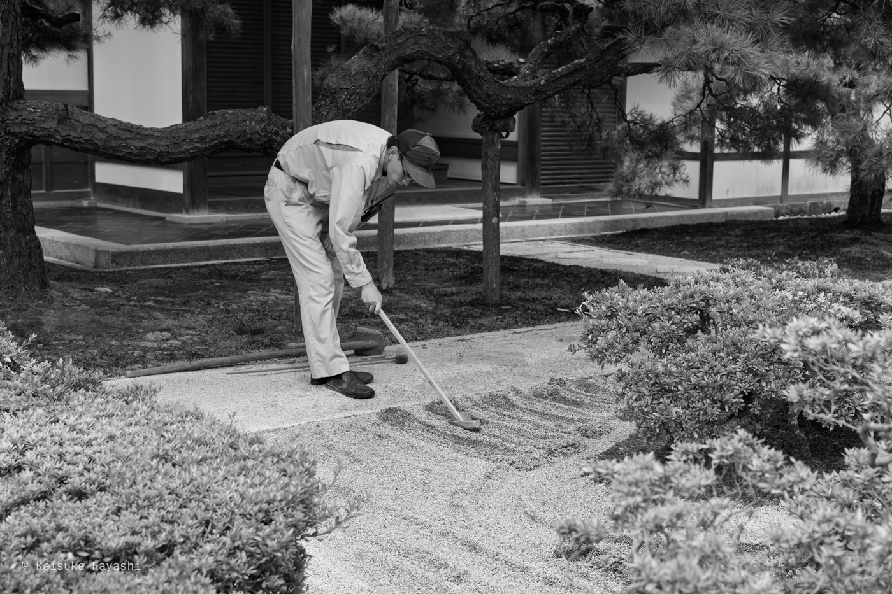

何度目かわからないが個人ホームページをがっつり書き直した。

https://github.com/kkhys/me/releases/tag/2026.02.14

ホームページにはWordPress → Gatsby → Next.js → Astroと色んなフレームワークを使ってきたが、Astroを使い続けるという点はこれからもしばらくは変わらないと思う[^1]。

[^1]: Astroは機能を増やすためのフレームワークというより、最終的に何も載せない状態に向かって設計できるフレームワークという点が気に入っているため

今回何が変わったかというとReactを廃止して、成果物に含まれるJavaScriptをほぼ削除したという点[^2]。
Tailwindも剥がして素のCSSで書き直した。

[^2]: 画像をぼかして表示するスクリプトなどは依然として残っているが、いずれもVanilla JSで実装しており軽量。JavaScriptがなくても問題なく動くようにプログレッシブエンハンスメントな設計にしている

ここ数年、いろんな人の個人ホームページを見てきたが、やっぱりJavaScriptやCSSは少ないほどクールだと思う。
メンテナンスコストが下がるので、その分の時間を記事の執筆などの本質的な作業に分配できる。

今までは勉強のためとか実験のためとか言いながらログイン機能やお問い合わせフォームを実装したが、それらを管理するのは想像以上に面倒。
[Umami](https://umami.is)にはイベントをトラッキングする機能があったので計測してみたが、驚くほど使われることはない。

[達人プログラマー](https://amzn.asia/d/0hY4QlD6)には「ソフトウェアは建築というよりもガーデニングに近い」と書かれている。
つまり、何も手入れをしなければソフトウェアはすぐに枯れ果ててしまう。
手入れの手間を考えると、ライブラリは少なければ少ないほどよい。

枯山水には引き算の美学がある。
何を追加すべきかよりも何を減らすべきかというのを常に考えたい。
