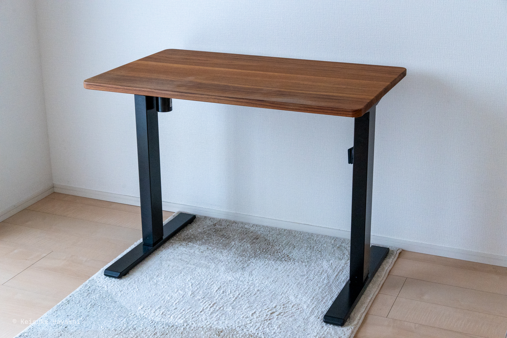
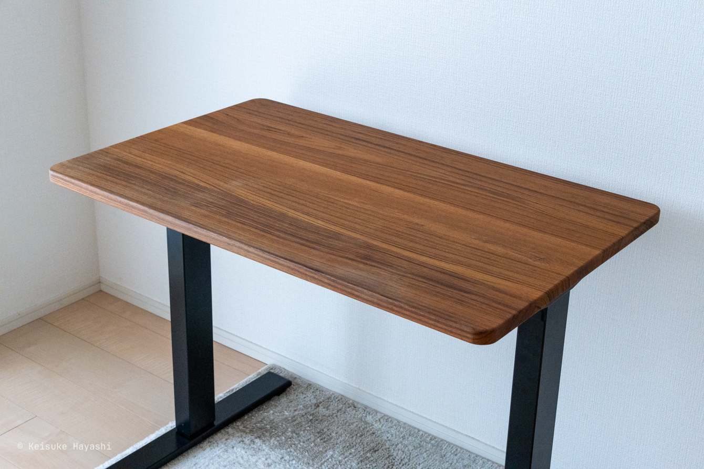
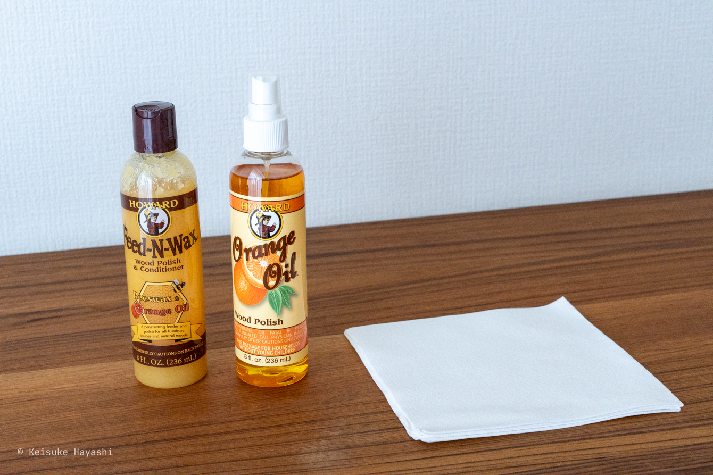
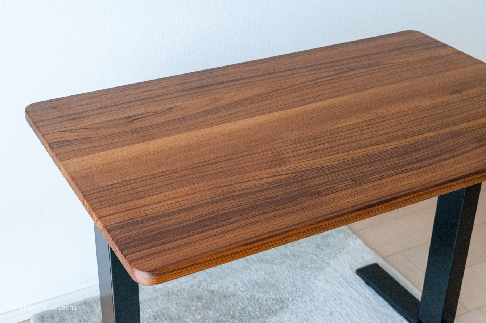
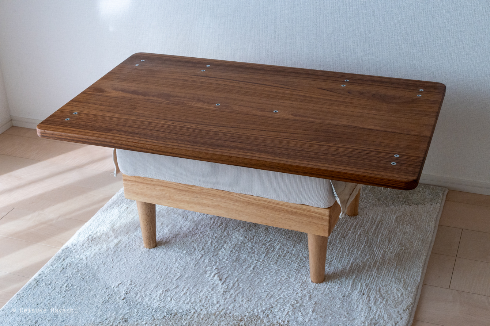
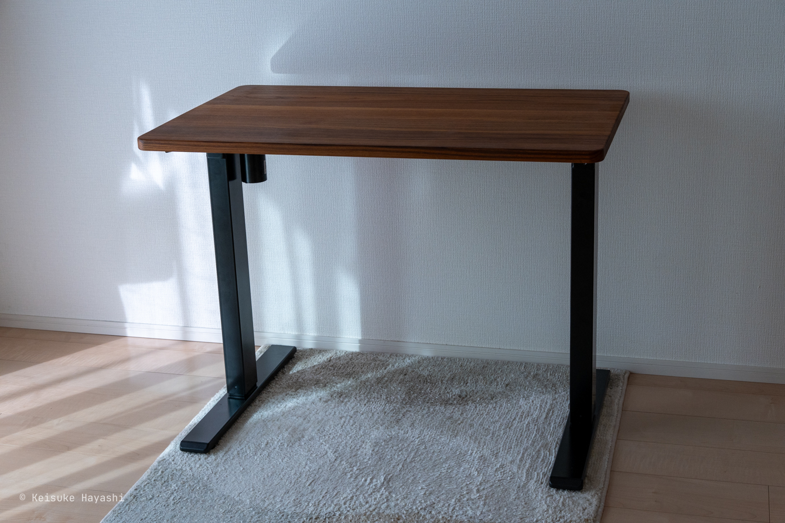

自作デスクを製作してから1年ほど経過したのでオイルメンテナンスをすることにした。

https://kkhys.me/blog/posts/b1tnt9a

ちょっと間隔が空きすぎたかなと思ったけど、チーク材は木自体に天然の油分が多いので年1回くらいのオイルメンテナンスで十分らしい。
多くても半年に1回とのこと。

ほぼ毎日この机を使って作業している。
キーボードやマウスを動かすときに机の手前の部分に連続して触れることになるため、その部分だけ白く擦れてしまっている。

このような日常の蓄積によって生まれる痕跡は個人的に大好物なのだが、それは日頃のメンテナンスがされているという前提があってこそ。
今のままでは経年変化というよりもただの劣化でしかない。

オイルメンテナンスに使うのは以下の三種の神器。

- [HOWARD Orange Oil](https://amzn.asia/d/0gLvho0F)
- [HOWARD Feed-N-Wax](https://amzn.asia/d/078ftQYh)
- [クレシア ワイプオール X70](https://amzn.asia/d/0fRONLyG)

オレンジオイルは汚れ落としとして使う。
オレンジの良い香りがする。
また、これを塗っただけでも木材がしっとりするので、木の乾燥を防ぐには十分な効果がありそう。

Feed-N-Waxはミツロウ・カルナバのワックス。
表面に保護膜を作り、木材を乾燥や劣化から守る。

いずれのオイルもワイプオールを使って丁寧に刷り込む。

まずは上面のみ。
白くなっている箇所がなくなった。
木材が喜んでいる。

続いてデスクの下面にオイルを塗っていく。
上面だけでも良いかなと思ったが、表裏の吸湿バランスがずれてしまうと反ったりしそうなので下面も面倒だけど塗ることにした。

取り外ししやすいように鬼目ナットを使ってデスクを作ったのは良かったなあとしみじみ思う。
デスクの天板と脚を取り外すのよりもモニターアームを外すのが結構大変だった。

オイルを塗った後はなんとも言えない充足感がある。
マンションに住んでいることもあって、部屋は常に乾燥状態。
半年に1回オイルを塗るのが良さそう。
定期的に経年変化をブログにまとめられたら良いな。
